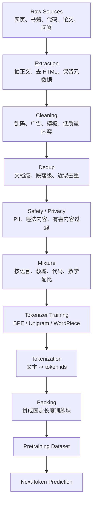
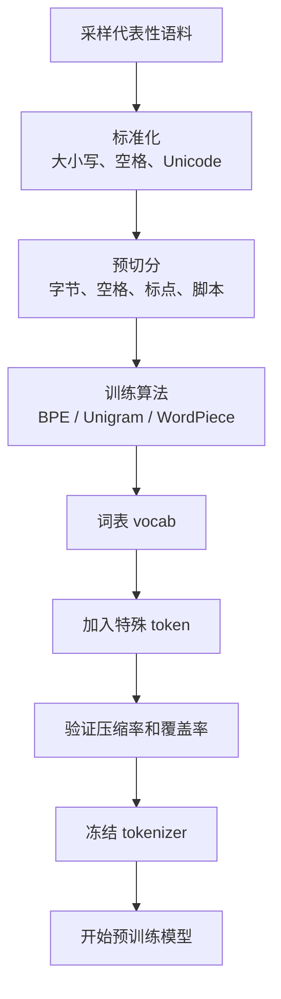

# 数据、Tokenizer 与预训练数据工程入门

LLM 的“出生”不是从 Transformer 开始的。

更早的一步是：

```text
世界上的文本
  ↓
可训练的数据
  ↓
tokenizer
  ↓
token id 序列
  ↓
预训练样本
```

如果这一层没做好，后面的模型结构、训练参数、推理优化都会被拖累。

## 先记住一句话

模型不是直接学习“互联网”。

它学习的是工程处理之后的 token 序列。



这条链路里，每一步都会影响模型最终能力。

## 原始数据从哪里来

常见来源：

| 数据来源 | 能力倾向 | 风险 |
| --- | --- | --- |
| 网页 / Common Crawl | 常识、长尾知识、多语言 | 噪声、广告、重复、隐私 |
| 书籍 | 长文本、叙事、表达 | 版权、领域覆盖不均 |
| 论文 | 学术表达、公式、专业知识 | 格式复杂、引用噪声 |
| 代码 | 编程能力、API 模式 | 许可证、重复仓库、生成代码风险 |
| 问答 / 论坛 | 对话、问题解决 | 质量参差、攻击性内容 |
| 企业文档 | 领域知识、内部流程 | 权限、隐私、泄密 |
| 合成数据 | 指令、推理、格式补齐 | 自我循环、幻觉、风格单一 |

数据来源不是越多越好。

更重要的是：

- 数据是否合法。
- 数据是否高质量。
- 数据是否覆盖目标能力。
- 数据是否重复过多。
- 数据是否包含敏感信息。
- 数据配比是否合理。

## 抽取：先把“页面”变成“文本”

网页不是干净文本。

它通常包含：

- HTML 标签。
- 导航栏。
- 广告。
- 评论区。
- Cookie 弹窗。
- 推荐列表。
- 重复页脚。
- 脚本和样式。

抽取的目标是：

```text
保留正文和必要结构
去掉和语义无关的页面噪声
```

例如原始 HTML：

```html
<nav>首页 | 产品 | 登录</nav>
<article>
  <h1>什么是 KV Cache</h1>
  <p>KV Cache 是推理阶段缓存历史 token 的 K/V...</p>
</article>
<footer>版权所有...</footer>
```

抽取后可能变成：

```json
{
  "source": "web",
  "url": "https://example.com/kv-cache",
  "title": "什么是 KV Cache",
  "text": "什么是 KV Cache\nKV Cache 是推理阶段缓存历史 token 的 K/V..."
}
```

元数据也很重要。

它后面可以用于：

- 去重。
- 质量过滤。
- 数据配比。
- 版权追踪。
- 训练问题回溯。

## 清洗：去掉模型不该反复学习的垃圾

清洗不是“把文本变漂亮”。

清洗是为了减少无用模式进入模型。

常见规则：

| 问题 | 例子 | 处理 |
| --- | --- | --- |
| 乱码 | `好` | 删除或修复编码 |
| 模板页 | 导航、页脚、免责声明重复出现 | 删除模板块 |
| 低信息密度 | 关键词堆砌、广告页 | 过滤 |
| 重复行 | 同一句话重复几百次 | 压缩或删除 |
| 机器翻译垃圾 | 不通顺、混合语言 | 质量打分 |
| 代码噪声 | minified JS、lock file | 过滤或降权 |
| 个人信息 | 邮箱、手机号、地址 | 脱敏或删除 |

新手容易误解：

```text
数据越脏，模型越能适应真实世界。
```

不完全对。

模型确实需要见过真实文本，但大量模板、广告、重复和乱码会浪费训练计算，也可能让模型学会坏格式。

## 去重：减少背诵和浪费

去重很关键。

如果同一篇文章重复出现 1000 次，模型会：

- 浪费训练 token。
- 更容易记住原文。
- 数据分布被扭曲。
- 评测可能被污染。

去重可以分几层：

| 层级 | 作用 |
| --- | --- |
| 精确去重 | 完全相同的文档只留一份 |
| 段落去重 | 同一段在多篇文章中重复，删除重复段 |
| 近似去重 | 内容高度相似但不完全一样 |
| 训练/评测去重 | 避免评测题出现在训练集里 |

近似去重可以理解成：

```text
不是字面完全一样
但整体内容几乎一样
```

比如新闻转载、镜像站、爬虫重复页。

## PII 和安全过滤

PII 是 personally identifiable information，个人身份信息。

常见例子：

- 邮箱。
- 手机号。
- 身份证号。
- 地址。
- 银行卡。
- API key。
- 访问 token。
- 医疗、财务、法律敏感信息。

处理方式有几种：

| 方式 | 说明 |
| --- | --- |
| 删除文档 | 整篇风险太高 |
| 删除片段 | 只移除敏感段落 |
| 脱敏替换 | `138****0000`、`<EMAIL>` |
| 降权 | 数据可用但不适合高比例训练 |
| 隔离 | 放入受控数据集，只给特定模型或任务 |

不要以为“公开网页上有”就一定适合训练。

预训练数据会被模型吸收，后面可能通过生成泄露出来。

## 数据配比：模型能力从这里开始偏向

数据配比就是决定不同数据占多少。

例子：

```json
{
  "web": 0.55,
  "code": 0.15,
  "books": 0.10,
  "academic": 0.10,
  "math": 0.05,
  "qa": 0.05
}
```

如果提高代码比例，模型可能更擅长代码。

但代价可能是：

- 普通对话风格变硬。
- 自然语言能力下降。
- 某些语言覆盖下降。
- 训练成本改变。

数据配比没有万能答案。

它取决于目标：

| 目标模型 | 数据倾向 |
| --- | --- |
| 通用聊天模型 | web、书籍、问答、多语言 |
| 代码模型 | 高质量代码、issue、PR、文档、测试 |
| 数学模型 | 数学题、证明、可验证推理轨迹 |
| 企业领域模型 | 内部文档、流程、FAQ、业务术语 |
| Agent 模型 | 工具调用轨迹、任务执行 trace、错误恢复样本 |

## Tokenizer 到底在做什么

Tokenizer 把文本切成 token，再映射成 id。

例子：

```text
上下文工程很重要
  ↓
["上下文", "工程", "很", "重要"]
  ↓
[5021, 916, 88, 730]
```

真实 tokenizer 不一定这么切。

它可能把中文切成字、词、子词，也可能把代码里的符号单独切开。

常见算法：

| 算法 | 直觉 | 常见位置 |
| --- | --- | --- |
| BPE | 从字符开始，不断合并高频片段 | GPT 系模型常见 |
| WordPiece | 找词表中最长可匹配子词 | BERT 系模型常见 |
| Unigram | 从候选子词集合中保留更优组合 | SentencePiece 常见 |
| Byte-level BPE | 从字节层处理，几乎不怕未知字符 | 多语言、代码常见 |

为什么不直接按词切？

因为真实语言有：

- 新词。
- 拼写错误。
- 多语言。
- emoji。
- 代码符号。
- URL。
- 数学公式。
- 未登录词。

子词 tokenizer 能在词和字符之间折中。

## Tokenizer 会影响什么

Tokenizer 不只是预处理工具。

它影响很多工程问题。

| 影响 | 解释 |
| --- | --- |
| 上下文长度 | 同一段中文或代码被切成多少 token |
| 成本 | API 通常按 token 计费 |
| 训练速度 | token 越多，计算越多 |
| 多语言能力 | 某些语言如果切得太碎会吃亏 |
| 代码能力 | 缩进、符号、长变量名如何切分 |
| 工具调用 | JSON、XML、特殊 token 是否稳定 |
| Chat template | `<|user|>` 等特殊 token 如何编码 |
| 安全 | 特殊字符、混淆文本可能绕过规则 |

例子：

```text
同一句中文
Tokenizer A: 20 tokens
Tokenizer B: 45 tokens
```

这意味着同样的上下文窗口里，A 能放更多内容。

但 token 更少不一定总是更好。

如果切分太粗，也可能影响泛化和组合能力。

## 训练 tokenizer 的流程

训练 tokenizer 和训练模型不是一回事。

Tokenizer 通常先在代表性语料上训练。



为什么要冻结？

因为模型的 embedding 表和 tokenizer 词表绑定。

如果训练到一半随便改 tokenizer，之前学到的 token id 含义就乱了。

## 特殊 token：从普通续写走向聊天和工具

Base model 预训练时可能主要见普通文本。

Chat model 和 Agent model 还需要特殊结构。

常见特殊 token：

```text
<bos>
<eos>
<pad>
<unk>
<|system|>
<|user|>
<|assistant|>
<|tool_call|>
<|tool_result|>
```

它们的作用是让模型区分：

- 一段话是谁说的。
- 对话什么时候结束。
- 工具调用从哪里开始。
- 工具结果从哪里返回。
- 哪些内容是系统规则。

这会和后面的 chat template 连接起来。

例如 messages：

```json
[
  {"role": "system", "content": "你是一个严谨的助手。"},
  {"role": "user", "content": "解释 KV Cache"}
]
```

可能被渲染成：

```text
<|system|>
你是一个严谨的助手。
<|user|>
解释 KV Cache
<|assistant|>
```

然后 tokenizer 再把这段文本变成 token id。

## 预训练样本长什么样

语言模型预训练最核心的样本其实很简单。

假设有一段 token：

```text
[10, 20, 30, 40, 50]
```

训练目标是：

```text
输入位置：10 20 30 40
预测目标：20 30 40 50
```

模型每个位置都在预测下一个 token。

真实训练会把很多文档拼成固定长度 block。

例如 `seq_len = 8`：

```text
doc1: [101, 102, 103]
doc2: [201, 202, 203, 204]
doc3: [301, 302]

packing 后：
[101, 102, 103, <eos>, 201, 202, 203, 204]
[<eos>, 301, 302, <eos>, <pad>, <pad>, <pad>, <pad>]
```

这样 GPU 能高效并行训练。

## Packing 为什么重要

如果不 packing，很多短文档会浪费 padding。

例子：

```text
seq_len = 2048
一条样本只有 200 token
剩下 1848 个位置都是 padding
```

这会浪费大量计算。

Packing 的目标是：

```text
尽量把有效 token 填满训练 block
```

但 packing 也要小心：

- 文档之间要加 `<eos>`。
- 不同来源是否可以混在一起要有策略。
- 对话数据不能随便打乱 role 顺序。
- 代码文件可能要保留文件边界。
- 太激进的 packing 可能让模型学到奇怪跨文档连接。

## 一个最小 JSONL 数据格式

预训练原始文本可以先存成 JSONL：

```json
{"id":"web_001","source":"web","lang":"zh","quality":0.91,"text":"KV Cache 是推理阶段用于缓存..."}
{"id":"code_001","source":"code","lang":"python","quality":0.88,"text":"def add(a, b):\n    return a + b"}
```

后续 tokenization 后可能变成：

```json
{"id":"web_001","input_ids":[101,5021,916,88,730,102]}
{"id":"code_001","input_ids":[101,1342,274,11,312,102]}
```

再经过 packing：

```json
{
  "block_id": "train_000001",
  "input_ids": [101, 5021, 916, 88, 730, 102, 1342, 274],
  "attention_mask": [1, 1, 1, 1, 1, 1, 1, 1]
}
```

训练循环看到的就是这种数字张量。

## 数据质量如何评估

数据质量不能只靠感觉。

可以从几类指标看：

| 指标 | 含义 |
| --- | --- |
| token 数 | 训练规模 |
| 文档数 | 覆盖范围 |
| 语言分布 | 中文、英文、代码等比例 |
| 来源分布 | web、书、论文、代码 |
| 重复率 | 重复内容占比 |
| PII 命中率 | 隐私风险 |
| 平均文档长度 | 是否过短或过长 |
| 质量分分布 | 过滤阈值是否合理 |
| eval contamination | 评测集污染风险 |
| tokenizer fertility | 每个词平均切成多少 token |

`tokenizer fertility` 可以简单理解为：

```text
同样一句话被切得越碎，fertility 越高
```

对某些语言 fertility 太高，说明 tokenizer 对它不友好。

## 数据和能力的因果链

很多模型能力问题，根子在数据。

| 线上问题 | 可能的数据原因 |
| --- | --- |
| 中文回答很短或生硬 | 中文预训练比例不足，或 tokenizer 切得太碎 |
| 代码能力弱 | 高质量代码数据不足 |
| 数学推理弱 | 数学和可验证推理数据不足 |
| 工具调用不稳定 | 后训练里工具轨迹少 |
| 喜欢输出网页模板 | 清洗时模板页没过滤干净 |
| 记忆或背诵严重 | 重复数据太多，去重不足 |
| 容易泄露敏感信息 | PII 过滤不足 |
| API JSON 经常坏 | 结构化格式数据和工具样本不足 |

所以调模型时，不要只盯着 temperature。

有些问题要回到数据层解决。

## 和 RAG、微调、上下文工程的区别

这几件事都和“给模型信息”有关，但层级不同。

| 方法 | 改什么 | 适合 |
| --- | --- | --- |
| 预训练数据 | 改基础能力来源 | 大规模通用能力、领域底色 |
| 后训练数据 | 改行为和格式 | 指令、偏好、工具、安全 |
| 微调数据 | 改特定任务表现 | 企业问答、格式、风格 |
| RAG | 改这一轮看到的资料 | 最新知识、私有知识 |
| 上下文工程 | 改模型此刻看到什么和怎么组织 | Agent、工具、记忆、压缩 |

如果知识频繁变化，优先 RAG。

如果行为格式不稳定，可以考虑 SFT 或 prompt/template。

如果基础能力不足，可能需要更好的预训练或后训练数据。

## 新手最小实践

不用真的训练大模型，也可以做小实验。

1. 准备 100 篇中文技术文章。
2. 用一个现成 tokenizer 统计总 token 数。
3. 找 10 篇 HTML 页面，手动对比抽取前后 token 数。
4. 做一次简单去重，看看重复率。
5. 写规则过滤邮箱、手机号、API key。
6. 把短文档 pack 成固定长度 block。
7. 用 [原生 Python 训练循环入门](python-training-loop.md) 的思路跑一个小模型或伪训练循环。

练完你会明白：

```text
训练不是把一堆文本丢给模型
而是把文本变成可控、可审计、可复现的 token 数据集
```

## 常见误区

### 误区 1：数据越多越好

不是。

低质量数据会浪费计算，甚至污染模型。

### 误区 2：Tokenizer 只是小工具

不是。

Tokenizer 会影响成本、上下文、语言能力、代码能力和 chat template。

### 误区 3：去重只会减少数据

去重减少的是重复噪声，不是有效知识。

高质量去重通常能提高训练效率。

### 误区 4：公开数据就没有隐私问题

不对。

公开网页也可能包含个人信息、密钥或未授权内容。

### 误区 5：RAG 可以替代预训练数据

不能完全替代。

RAG 提供当前资料，预训练提供基础语言、常识和模式能力。

## 下一步

继续读：

- [LLM 生命周期：从数据到线上模型](llm-lifecycle.md)
- [Transformer 入门](transformer-beginner.md)
- [原生 Python 训练循环入门](python-training-loop.md)
- [后训练与对齐入门：SFT、DPO、RLHF、RFT](post-training-alignment.md)
- [LLM API：从 HTTP 到 Transformer](openai-api-beginner.md)

## 参考资料

- [Hugging Face Tokenization algorithms](https://huggingface.co/docs/transformers/en/tokenizer_summary)
- [Hugging Face Tokenizers](https://github.com/huggingface/tokenizers)
- [SentencePiece](https://github.com/google/sentencepiece)
- [The Pile: An 800GB Dataset of Diverse Text for Language Modeling](https://arxiv.org/abs/2101.00027)
- [Dolma: 3 trillion token open corpus for language model pretraining](https://allenai.org/blog/dolma-3-trillion-tokens-open-llm-corpus-9a0ff4b8da64)
