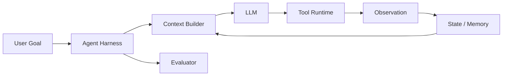

# Harness Engineering：把模型变成可用 Agent 的工程

Harness Engineering 可以先这样理解：

> 模型只是发动机，Harness 是把发动机装进车里的整套工程。

一个 LLM 很强，不代表产品就强。

同一个模型，放到不同 Agent 系统里，表现可能差很多。

原因通常不在模型参数，而在：

- prompt 如何组织。
- 工具如何描述。
- 工具结果如何回填。
- 记忆如何召回。
- 上下文如何压缩。
- loop 如何停止。
- 权限如何控制。
- 错误如何恢复。
- 结果如何评测。

这些组合起来，就是 Harness Engineering。

## Harness 是什么

这里的 harness 可以理解成：

```text
围绕 LLM 的运行壳
```

它把模型包成一个能做事的系统：



模型只负责一次或多次推理。

Harness 负责让推理变成可靠任务执行。

## 为什么 Harness 很重要

想象两个系统用同一个模型。

系统 A：

```text
prompt 混乱
工具描述模糊
工具结果直接塞回上下文
没有权限边界
没有停止条件
失败也不记录
```

系统 B：

```text
prompt 分层清楚
工具 schema 明确
工具结果有摘要和引用
有预算和状态机
有 evaluator
失败会进入 eval dataset
```

同一个模型，系统 B 通常会表现更好。

这就是 PawBench 一类评测强调的点：

```text
Agent Performance = f(Model, Harness)
```

模型能力是上限。

Harness 决定能发挥多少。

## Harness Engineering 包含哪些层

可以分成 9 层。

| 层 | 解决什么 |
| --- | --- |
| Instruction Layer | Agent 的角色、边界、工作方式 |
| Context Layer | 本轮模型应该看到什么 |
| Tool Layer | 工具定义、权限、执行和结果格式 |
| State Layer | 当前任务进度和中间产物 |
| Memory Layer | 长期偏好、项目规则、经验 |
| Loop Layer | 什么时候继续、重试、停止 |
| Runtime Layer | 沙箱、权限、并发、超时、取消 |
| Evaluation Layer | 判断结果好不好 |
| Observability Layer | trace、日志、指标、复盘 |

这些层缺一块，Agent 都容易变弱。

## Instruction Layer

Instruction Layer 决定模型“应该怎么工作”。

它不是只有 system prompt。

通常包括：

- base system prompt。
- developer instructions。
- 任务规则。
- 安全规则。
- 输出格式。
- 工具使用规范。
- 当前运行环境说明。
- 当前权限说明。

一个好的 instruction 层要分级：

```text
稳定规则
  ↓
产品策略
  ↓
工具协议
  ↓
任务说明
  ↓
临时提示
```

不要把所有东西揉成一段大 prompt。

## Context Layer

Context Layer 决定模型“此刻看什么”。

它是上下文工程的核心执行层。

输入可能来自：

- 用户消息。
- 历史对话。
- 当前任务状态。
- 工具结果。
- 文件片段。
- 检索结果。
- 记忆。
- skills。
- 权限信息。

Context Builder 的任务是：

```text
选择
排序
压缩
标注来源
区分指令和资料
控制 token 预算
```

一个常见错误是：

```text
把所有东西都塞进上下文
```

这会带来：

- 成本高。
- 干扰多。
- prompt injection 风险更大。
- prefix cache 命中变差。

## Tool Layer

Tool Layer 不只是函数调用。

它至少包含：

| 部分 | 说明 |
| --- | --- |
| Tool name | 工具名是否清晰 |
| Description | 什么时候使用，什么时候不要用 |
| Schema | 参数结构是否明确 |
| Permission | 是否需要审批 |
| Runtime | 工具在哪里执行 |
| Observation | 结果如何返回给模型 |
| Error model | 失败如何表达 |

坏工具描述：

```text
run command: run a command
```

好工具描述：

```text
run_shell_command:
在当前工作区执行只读或构建测试命令。
不要用于删除文件、读取密钥、访问生产系统。
高风险命令需要审批。
```

工具结果也要设计。

不要把 2MB 日志直接塞回模型。

可以返回：

```json
{
  "status": "failed",
  "exit_code": 1,
  "summary": "AuthServiceTest failed: token expiry boundary condition",
  "important_lines": ["..."],
  "artifact_ref": "tool_result_123.log"
}
```

## State Layer

State 是任务现场，不等于上下文。

系统可以保存很多状态，但每轮只取一部分给模型。

典型状态：

```json
{
  "goal": "修复登录 token 过期判断 bug",
  "phase": "testing",
  "plan": ["定位代码", "修改逻辑", "运行测试"],
  "files_read": ["AuthService.java", "AuthServiceTest.java"],
  "files_changed": ["AuthService.java"],
  "last_error": "AuthServiceTest failed",
  "retry_count": 1
}
```

State Layer 的价值：

- 不依赖模型自己记住所有事。
- 支持恢复任务。
- 支持可观测。
- 支持停止条件。

## Memory Layer

Memory 是跨任务复用的信息。

它不应该由任意 Agent 随便写。

Harness 里应该有 Memory Manager：

```text
memory candidate
  ↓
去重
  ↓
冲突检查
  ↓
权限检查
  ↓
证据检查
  ↓
写入
```

记忆要有 scope：

| Scope | 例子 |
| --- | --- |
| user | 用户喜欢中文、喜欢例子 |
| project | 项目使用 Java 21 |
| team | 团队要求 PR 必须跑集成测试 |
| global | 公司级安全规则 |

不要把低置信度记忆注入 system prompt。

## Loop Layer

Loop Layer 决定 Agent 如何持续行动。

最小 loop：

```text
build context
  ↓
call model
  ↓
run tool
  ↓
update state
  ↓
repeat or stop
```

Loop 工程做不好，Agent 就会：

- 过早结束。
- 一直循环。
- 反复调用同一个工具。
- 遇到失败不会恢复。
- 没有新增信息还继续探索。

Loop Engineering 会单独展开。

## Runtime Layer

Runtime 是硬边界。

Prompt 里写“不要删除文件”不够。

Runtime 要真的限制：

- 文件访问范围。
- Shell 命令权限。
- 网络访问。
- API key。
- 子进程。
- 超时。
- 并发。
- 取消。
- 审计。

Agent 安全不能只靠模型自觉。

## Evaluation Layer

没有 eval，就无法知道 harness 改动有没有变好。

Harness 改动包括：

- prompt 改了。
- 工具描述改了。
- 上下文截断策略改了。
- memory 注入改了。
- loop 停止条件改了。
- 模型换了。

每次改动都应该回答：

```text
成功率变了吗？
失败类型变了吗？
成本变了吗？
延迟变了吗？
安全违规变了吗？
```

## Observability Layer

Agent 必须保存 trace。

至少包括：

- 输入。
- prompt 版本。
- 模型版本。
- 工具调用。
- 工具结果。
- 状态变化。
- 记忆读写。
- 权限决策。
- evaluator 结果。
- token、耗时、成本。

没有 trace，Agent 失败很难调。

## Harness 的版本化

Harness 也要像代码一样版本化。

建议至少记录：

```json
{
  "harness_version": "2026.06.21-001",
  "model": "gpt-5.5",
  "system_prompt_version": "sp_12",
  "tool_schema_version": "tools_08",
  "memory_policy_version": "mem_04",
  "loop_policy_version": "loop_03",
  "eval_set_version": "eval_17"
}
```

否则你无法解释：

```text
为什么今天 Agent 突然变差？
```

## Harness Engineering Checklist

设计一个 Agent harness 时，可以按这个清单检查：

- 任务目标是否被结构化保存？
- prompt 是否分层？
- 工具描述是否清楚？
- 工具 schema 是否足够严格？
- 工具执行是否有权限边界？
- 工具结果是否被摘要和引用？
- 状态是否独立于模型上下文保存？
- 记忆是否有 scope、证据、过期和权限？
- loop 是否有预算、重试和停止条件？
- 是否能取消任务？
- 是否有 evaluator？
- 是否有 trace？
- 每个 harness 改动是否能被 eval 验证？

## 和其他主题的关系

Harness Engineering 处在这些主题之间：

```text
LLM API
  ↓
上下文工程
  ↓
Harness Engineering
  ↓
Agent 安全与 Guardrails
  ↓
Loop Engineering
  ↓
Agent 系统架构
  ↓
Agent 评测
```

也可以这样看：

```text
上下文工程：模型此刻看什么
Agent 安全与 Guardrails：哪些动作能做，哪些必须拦住或审批
Loop Engineering：Agent 如何持续行动
Harness Engineering：把上下文、工具、状态、记忆、循环、评测装成可靠系统
```

## 下一步

继续读：

- [Loop Engineering：Agent 循环、停止条件与恢复](loop-engineering.md)
- [Agent 项目开发实战：上下文、工具、权限和沙箱](agent-runtime-project-development.md)
- [Agent 安全与 Guardrails：权限、注入攻击与运行时边界](agent-security-guardrails.md)
- [大型 Agent 系统架构设计](large-agent-system-architecture.md)
- [Agent 开发入门](agent-development-beginner.md)
- [上下文工程入门](context-engineering-beginner.md)
- [Agent 效果评测框架](agent-evaluation-framework.md)
