# Hy3 Preview 推理优化案例：从算子到系统

这篇是一个生产级推理优化案例。

它整理自腾讯混元 AI Infra 推理团队公开文章：[腾讯混元AI Infra如何优化Hy3 Preview：一次大模型推理性能提升的技术拆解](https://mp.weixin.qq.com/s/miAOHTBZLyuDfNle1jrO0w)。

目标不是复述文章，而是把里面的工程知识放进这套文档的学习路线里：

> 当一个 GQA + MoE、支持 256K 上下文的大模型要在 Hopper 96G 这类硬件上满足线上 SLO，推理系统到底要优化哪些层？

先看总图：


## 这个案例解决什么问题

Hy3 Preview 的特征是：

- GQA + MoE 混合架构。
- 原生支持 256K 长上下文。
- 面向 Agent、Coding 等长上下文和多轮场景。
- 主要部署硬件是 NVIDIA Hopper 96G。

难点不只是“模型大”。

更具体地说，线上推理同时遇到：

| 压力 | 体现 |
| --- | --- |
| 模型权重大 | 显存被权重占用，KV Cache 空间被挤压 |
| 上下文很长 | Prefill 成本和 KV Cache 成本急剧上升 |
| MoE 稀疏结构复杂 | Router、专家选择、Grouped GEMM、专家通信都可能成为瓶颈 |
| 请求长度变化大 | batch 内长短序列混杂，固定调度策略容易长尾 |
| 硬件约束强 | Hopper 相比更新的 Blackwell 平台，在算力、显存和互联上余量更小 |
| 线上 SLO 明确 | TTFT、TPOT、吞吐和成本都要同时达标 |

这类问题不能靠单点优化解决。

它需要从底层 kernel 到系统调度一起改。

## 原文测试条件

原文给出的端到端测试条件如下：

| 项 | 条件 |
| --- | --- |
| 数据 | 5000 条真实请求 |
| 输入长度 | 最大 192K，平均 68K |
| 输出长度 | 最大 64K，平均 0.9K |
| 缓存命中假设 | 理论命中约 80% |
| 机器 | Hopper 架构 96G |
| 约束 | 50ms TPOT，4s TTFT |
| 精度 | W8A8C8 |

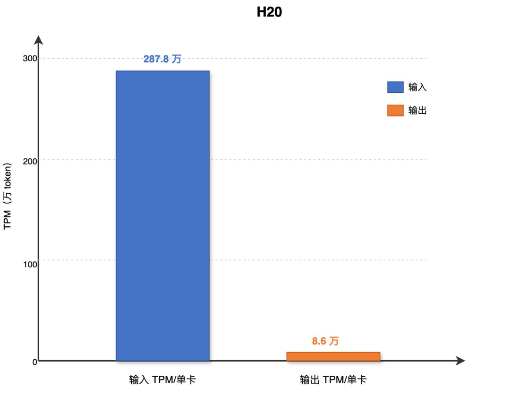

这个测试设置很重要。

如果只测短 prompt、小 batch、单轮 decode，很多长上下文优化看不出价值。Hy3 Preview 的场景是长输入、Agent/Coding 多轮、可复用前缀多、缓存命中高，因此优化重点会明显偏向 Prefill、KV Cache、并行策略和缓存体系。

## 优化总览

文章把优化拆成五大方向：

| 方向 | 解决的问题 |
| --- | --- |
| 算子优化与算子融合 | 降低单层计算、访存、kernel launch 和通信开销 |
| 并行策略 | 让 Prefill 和 Decode 分别使用更适合的并行方式 |
| 多级缓存 | 减少长前缀重复 prefill，缓解 GPU 显存缓存容量不足 |
| MTP 和异步调度 | 减少 speculative / MTP decode 中 CPU-GPU 同步气泡 |
| 量化与稀疏 | 降低权重、激活、KV 和 attention 的显存与计算压力 |

可以把它理解成一条优化链：

```text
减少每个算子的耗时
  ↓
减少算子之间的 HBM 往返和 kernel 启动
  ↓
减少 GPU 之间通信和冗余计算
  ↓
减少重复 prefill
  ↓
减少 CPU 调度空泡
  ↓
减少权重、激活、KV Cache 和 attention 的数据量
```

## 1. Attention 动态调度

长上下文推理里，Attention 很容易产生负载不均衡。

传统 split-kv 往往使用固定拆分策略：

- 长序列希望更大的 split-kv，提高并行度。
- 短序列不需要那么多拆分，否则调度和合并开销变大。
- 一个 batch 里长短请求混在一起时，固定策略很难兼顾。

Hy3 Preview 的方案是把请求拆成统一 Tile 粒度，再按全局 Tile 数量做任务分配。

核心步骤：

1. 把所有请求的 Attention 计算切成 Tile。
2. 根据全局 Tile 总量平衡每个 CTA 的任务规模。
3. 用贪心装桶把 Tile 任务尽量均分。
4. Task Assign 在每次推理前生成任务映射表。
5. 各层 Attention Kernel 按映射表领取任务。
6. Combine Kernel 合并 split-kv 的结果。

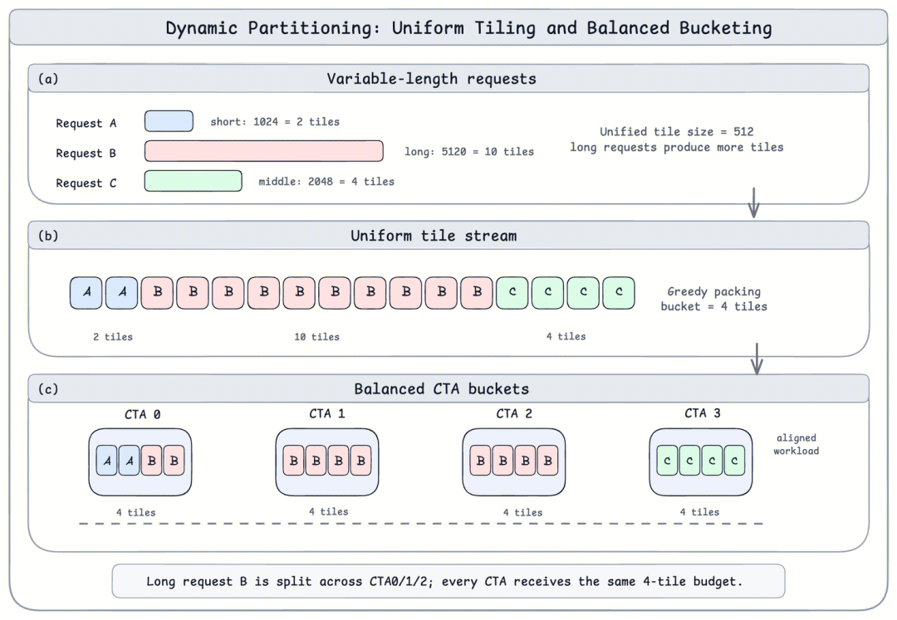

收益：

| 场景 | 加速 |
| --- | --- |
| 单 batch 长文本 | 单算子最高约 2.95x |
| 混合长度 batch | 约 1.59x 到 1.76x |

工程直觉：

> 长上下文场景里，Attention 优化不只是更快的矩阵计算，还要让每个计算单元拿到差不多的活。

## 2. Router GEMM：用双 BF16 近似 FP32

MoE 的 Router 对数值精度很敏感。

问题在于：

- 如果把 FP32 权重直接降到低精度，可能损伤路由质量。
- 如果把激活升到 FP32 或 TF32，会引入类型转换和 CUDA Core 计算开销。
- Router 通常不是大矩阵满血吞吐场景，额外开销更容易变成瓶颈。

Hy3 Preview 使用“双 BF16 重构 FP32”的思路。

离线阶段，把 FP32 权重拆成两部分：

```text
W ≈ W_high + scale × W_low
scale = 1 / 256
```

推理阶段：

1. 激活保持 BF16。
2. 执行两次 BF16 GEMM。
3. 在同一个 kernel 里用两个累加器保存中间结果。
4. Epilogue 里用一次 FFMA 修正得到更高精度输出。
5. 避免 FP32/TF32 路径和多余 HBM 往返。

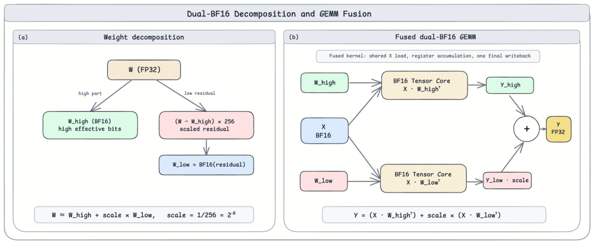

收益：

| 规格 | 加速 |
| --- | --- |
| N=192, K=4096, M=2 到 4096 | 相比 FP32 cuBLAS 约 2.86x 到 3.22x |

工程直觉：

> 对数值敏感路径，不一定只能在“高精度慢”和“低精度损失”之间二选一。也可以用分解和融合，把高精度近似搬到更高吞吐的硬件路径上。

## 3. FusedMoE：把 MoE 链路合成一条流水线

MoE 推理不是一个简单 GEMM。

一次 MoE 层通常包含：

- Router / top-k。
- token 到 expert 的索引构建。
- gather / scatter。
- Gate-Up GEMM。
- 激活函数。
- Down GEMM。
- top-k 加权聚合。
- 专家并行下的通信。

如果每个阶段都单独跑 kernel，并且中间结果反复落 HBM，延迟和带宽都会被吃掉。

Hy3 Preview 的 FusedMoE 把核心阶段合并成更紧凑的执行链路：

| 阶段 | 优化点 |
| --- | --- |
| 路由与索引预处理 | 共享内存分块统计，为每个专家预留连续输出区间 |
| Gate-Up GEMM | 通过路由索引直接读取原始输入，省掉显式 gather |
| 激活量化 + Down GEMM | 按专家维度紧凑写出，保证顺序访存 |
| Top-K 加权聚合 | 推理末端直接完成加权求和，避免额外 HBM 往返 |
| PDL 串联 | 减少 kernel 启动气泡 |

收益：

| 并行配置 | 对比对象 | 加速 |
| --- | --- | --- |
| TP=8 / EP=1 | vLLM CUTLASS、vLLM Triton、SGLang | 约 1.5x 到 1.6x |
| TP=1 / EP=8 | 同类路径 | 约 1.2x 到 1.5x |

工程直觉：

> MoE 的瓶颈经常藏在“路由、搬运、聚合”这些非 GEMM 环节里。只优化专家 GEMM 不够，要把整个专家执行链路当成一个整体。

## 4. Rope + Norm + Hadamard + Quant + Store KV 融合

QKV Projection 之后，常见会接一串 element-wise 操作：

```text
Rope
  ↓
RMSNorm
  ↓
Hadamard
  ↓
Quant
  ↓
Store KV Cache
```

这些操作单个计算量都不大，但会不断启动小 kernel，并反复读写 HBM。Prefill 阶段输入长时，这种带宽浪费会被放大。

Hy3 Preview 把这条链路融合成一个微型流水线 kernel：

- 数据从 HBM 读入后，尽量在寄存器里完成中间变换。
- 写入 KV Cache 前做在线量化。
- 最终只把低比特 KV 写回显存。

收益：

| 优化 | 加速 |
| --- | --- |
| 融合 Rope / Norm / Hadamard / Quant / Store KV | 约 5x |

工程直觉：

> 小算子的主要敌人不是 FLOPs，而是 kernel launch 和 HBM 往返。

## 5. AllReduce + Norm + Add 融合

张量并行会引入跨卡通信。

如果通信、残差 Add、RMSNorm 分开执行，就会出现：

```text
AllReduce
  ↓
写回 HBM
  ↓
Add residual
  ↓
写回 HBM
  ↓
RMSNorm
```

Hy3 Preview 与网络平台团队把通信、残差和归一化融合为：

```text
RMSNorm(AllReduce(x) + residual, weight)
```

实现上提供两类路径：

| 版本 | 适合场景 | 核心机制 |
| --- | --- | --- |
| 高吞吐版本 | 大 token 的 Prefill | NVSwitch 多播 |
| 低延迟版本 | 小 batch Decode | Lamport P2P + PDL 双 kernel 重叠 |

收益：

| 覆盖范围 | 加速 |
| --- | --- |
| 8K 到 32K tokens | 相比 NCCL 和 FlashInfer 同类路径最高约 1.68x |

工程直觉：

> 多卡推理里，通信不是“计算之外的事”。高性能系统会把通信、计算和后处理合并考虑。

## 6. 采样融合

Sampler 经常被低估。

一次采样可能包含：

- 重复惩罚。
- temperature 缩放。
- top-k。
- top-p。
- softmax。
- 随机采样。

传统路径会串起十多个小 kernel。每个 kernel 都可能扫描全词表，重复读取 vocab 级别的数据，CPU-GPU 之间还可能传递重复惩罚掩码。

Hy3 Preview 把采样后处理压缩成少数核心 CUDA kernel，并针对业务场景选择专用路径。

关键点：

| 优化 | 作用 |
| --- | --- |
| 全词表单次加载 | 避免每个阶段都重复读 vocab |
| GPU 内完成惩罚计算 | 减少 CPU-GPU 同步和拷贝 |
| 多 CTA 并行 | 提高小 batch 下的 SM 并发 |
| 局部堆归并 Top-K | Max Top-K <= 64 时减少全词表重复扫描 |
| Top-K + Softmax 融合 | 合并归约和概率计算 |

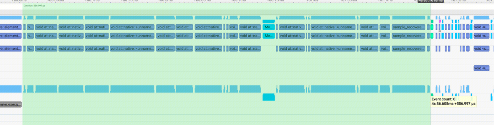

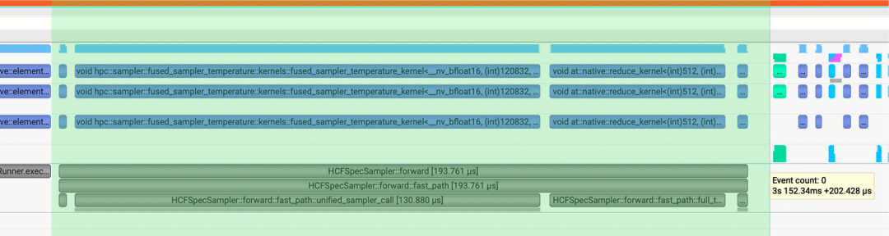

收益：

| 对比对象 | 加速 |
| --- | --- |
| vLLM 采样算子 | 约 5.5x |
| FlashInfer 采样算子 | 约 2.5x |

工程直觉：

> Decode 每步都会采样。单次采样再小，乘以输出 token 数、并发和请求量后，也会成为真实成本。

## 7. GEMM + ReduceScatter 通算融合

Prefill 的 TPSP 并行场景里，GEMM 后面常接 ReduceScatter。

朴素方式是：

```text
GEMM 完整算完
  ↓
写本地 buffer
  ↓
ReduceScatter 通信
```

Hy3 Preview 把 SM 显式分成计算 SM 和通信 SM：

- 计算 SM 负责矩阵乘。
- 通信 SM 负责 ReduceScatter。
- GEMM 每产出一个 Tile，就通知通信 SM 发起对应分片通信。

同时在计算侧引入三级流水：

```text
Load Warp → MMA Warp → Epilogue Warp
```

其中 Epilogue Warp 做 Quant / Scale 等后处理，并触发通信就绪信号。

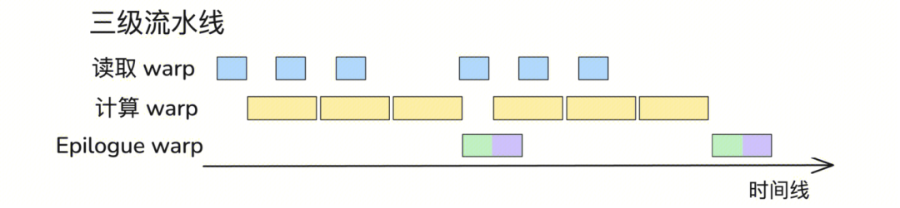

收益：

| 矩阵形状 (M, N, K) | 覆盖率 | 端到端加速 |
| --- | --- | --- |
| (8K, 4096, 1024) | 76.5% | 1.77x |
| (16K, 4096, 1024) | 80.7% | 1.81x |
| (32K, 4096, 1024) | 84.5% | 1.69x |
| (64K, 4096, 1024) | 84.8% | 1.68x |

工程直觉：

> 通算融合的目标不是让通信消失，而是把通信藏进计算时间里。

## 8. Prefill 并行：TPSP

纯 TP8 在 Hy3 Preview 的 Prefill 里有三个问题：

| 问题 | 表现 |
| --- | --- |
| 冗余计算 | Elementwise、Router 等 token-wise 算子在每张卡上重复跑 |
| 通信过重 | AllReduce 在 8 卡间交换全量数据 |
| 算子形状变差 | MoE Grouped GEMM 沿 hidden 维切得太窄，计算效率下降 |

TPSP 的思路是把 Tensor Parallel 和 Sequence Parallel 结合起来。

文章里的组合包括：

- SP 拆分。
- 通算融合。
- 通信量化。
- 并行模式调整。

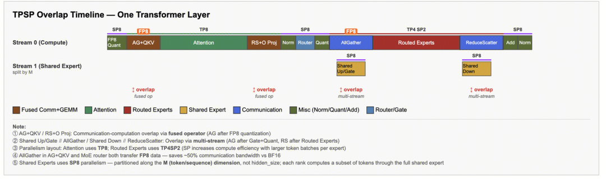

收益：

| 场景 | 优化前 TTFT | 优化后 TTFT | 降幅 |
| --- | --- | --- | --- |
| Prefill 16K | 764 ms | 536 ms | 29.9% |
| Prefill 32K | 1885 ms | 1424 ms | 24.5% |

工程直觉：

> Prefill 是长输入的一次性大计算，重点是减少冗余、保持好算子形状，并把通信压进流水线。

## 9. Decode 并行：Attention DP + MoE EP

Decode 的瓶颈和 Prefill 不一样。

Hy3 Preview 在单机部署时遇到：

- 权重占掉大量显存，KV Cache 空间不足，并发上不去。
- 小 batch 下 MoE Grouped GEMM 算力强度低，更容易 memory-bound。

解决思路是 Attention DP + MoE EP 的跨节点混合并行：

| 组件 | 并行方式 | 目的 |
| --- | --- | --- |
| Attention | DP / DPTP 混合 | 降低长序列负载不均衡，控制通信成本 |
| MoE | EP | 把专家权重分布到更多机器，释放 KV Cache 空间 |
| Grouped GEMM | 跨节点聚合 batch | 提高算力强度，让计算更接近 compute-bound |
| 专家负载均衡 | Async EPLB | 用 NCCL P2P 异步重排专家权重，隐藏通信 |
| Shared expert | 拆分、dispatch、combine 并行 | 让通信和计算重叠 |

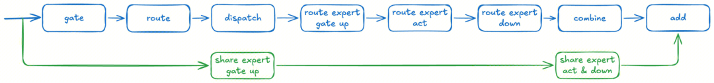

收益：

| 优化 | 端到端吞吐提升 |
| --- | --- |
| Attention DP + MoE EP 混合并行 | 约 15.7% 到 44.7% |

工程直觉：

> Prefill 和 Decode 不该强行用同一种并行策略。Prefill 更像大批量吞吐问题，Decode 更像显存、带宽、通信和小 batch 利用率问题。

## 10. GPU → CPU → KVStore 多级缓存

Agent 和 Coding 请求经常有大量公共前缀：

- system prompt。
- 工具说明。
- 仓库规则。
- 代码上下文。
- 多轮对话历史。

如果每次都重新 prefill，TTFT 和成本都会很高。

单纯依赖 GPU Prefix Cache 会遇到：

| 问题 | 后果 |
| --- | --- |
| GPU 显存容量有限 | 可缓存前缀数量少 |
| 长上下文 KV 很大 | 新请求容易淘汰已有缓存 |
| 缓存被淘汰 | 相同前缀需要重新 prefill |
| 缓存只在单实例内 | 扩缩容、迁移、跨节点调度时无法复用 |

Hy3 Preview 构建了三级缓存：

```text
L1: GPU
  ↓
L2: CPU
  ↓
L3: KVStore
```

调度流程：

1. 请求进入时按 L1 → L2 → L3 查找可复用前缀。
2. 命中后按需加载回 GPU。
3. 对命中部分跳过 Prefill。
4. 新生成的完整 block 异步下沉到 CPU 或 KVStore。
5. 后续请求跨实例复用这些缓存。

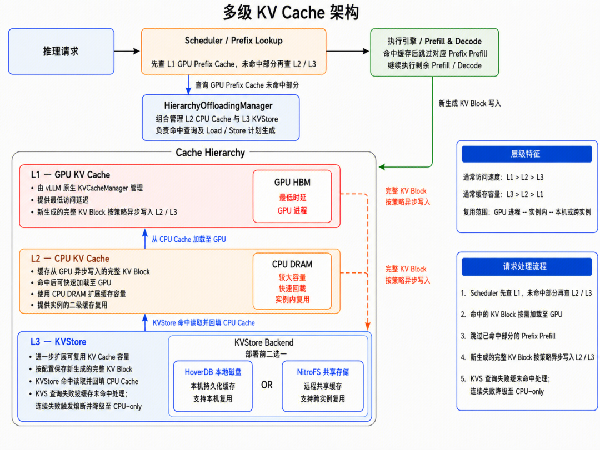

工程直觉：

> 对 Agent/Coding 系统来说，Prefix Cache 不只是 GPU 内部优化，也可以做成跨实例的缓存服务。

这和 [上下文工程](context-engineering.md) 也有关：稳定、分层、顺序固定的 prompt 更容易命中缓存。

## 11. MTP 与异步调度

传统异步调度通常假设：

```text
每轮 decode 稳定生成 1 个 token
```

CPU 可以在 GPU 前向计算时提前准备下一轮输入，从而隐藏 CPU 准备时间。

多层 MTP 或投机解码会打破这个假设。

因为下一轮真实要接收多少 token，要等验证结果出来后才知道。朴素做法会导致：

```text
GPU 验证完成
  ↓
同步结果到 CPU
  ↓
CPU 按真实接收长度准备下一轮
  ↓
下一轮 launch
```

这样 CPU 准备只能和很短的 MTP 层计算重叠，无法充分掩盖。

Hy3 Preview 的思路是：

> CPU 准备阶段先按最大接收长度更新状态并组装输入；真正计算前，再用上一轮验证结果修正关键值。

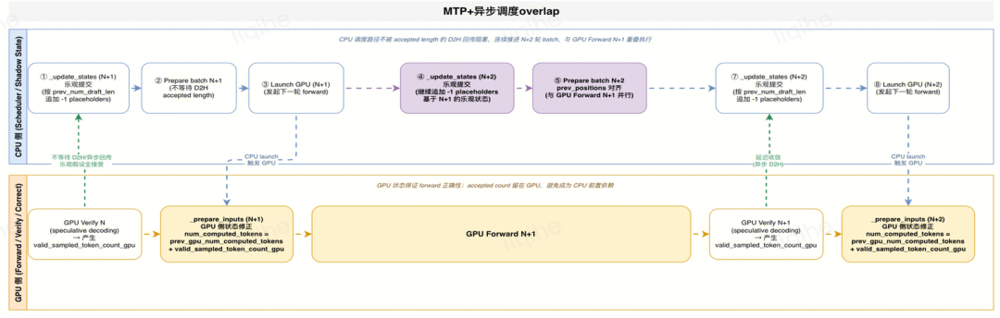

收益：

| 优化 | 收益 |
| --- | --- |
| 减少 decode 间 CPU 气泡 | 约 5ms 到 10ms |
| 端到端性能 | 约 10% 到 20% 提升 |

工程直觉：

> 投机解码的系统瓶颈不只在接受率，也在“验证结果如何回流调度器”。如果 CPU 每步都等真实长度，GPU 再快也会被同步点卡住。

## 12. AngelSlim 量化：GPTQ + Smooth + Hadamard + QAT

Hy3 Preview 的量化目标是压缩显存和带宽，同时尽量保持精度。

原文提到的配置包括：

- Attention FP8。
- W4A8。
- W8A8C8 端到端测试。

直接上低比特量化会遇到两个典型问题：

| 问题 | 影响 |
| --- | --- |
| 权重 4bit 表示过粗 | 权重误差变大 |
| 激活存在离群值 | 量化动态范围被少数通道拉大，主体信息精度下降 |

AngelSlim 的组合方案：

| 技术 | 作用 |
| --- | --- |
| GPTQ 逐层权重重建 | 用 Hessian 逆近似做误差补偿，降低 INT4 权重量化损失 |
| 激活平滑 Smooth | 搜索逐通道平滑因子，压低 activation outlier |
| Hadamard 在线旋转 | 对 Q/K 做正交变换，把离群值打散到更多通道 |
| QAT 轻量微调 | 在训练中模拟量化噪声，只更新量化相关参数 |

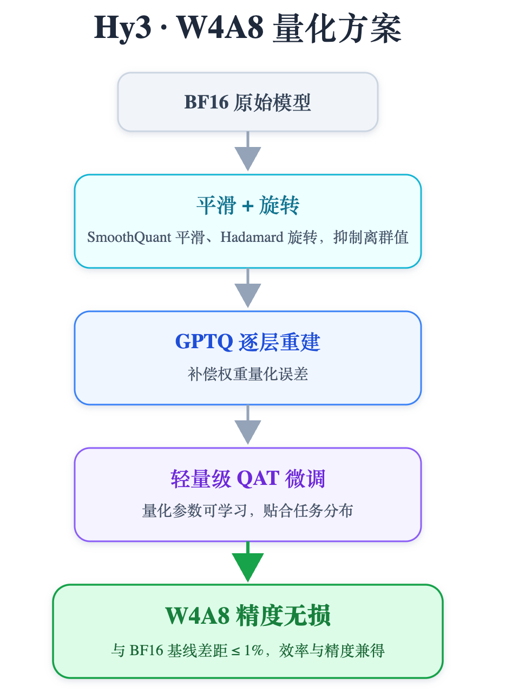

收益：

| 维度 | 结果 |
| --- | --- |
| 精度 | 多领域评测与 BF16 基线持平或差距小于 1% |
| 性能 | 端到端吞吐提升 28%+ |

工程直觉：

> 高质量量化通常不是单个算法，而是权重重建、激活处理、结构变换和轻量校准的组合。

## 13. Stem 稀疏注意力

256K 上下文下，标准自注意力的二次复杂度会让 Prefill 延迟和显存快速上升。

Hy3 Preview 使用 Stem 稀疏注意力和 HPC-BSA 算子，希望在较低计算预算下接近稠密注意力精度。

原文给出的关键数字：

| 项 | 结果 |
| --- | --- |
| 计算预算 | 约使用 25% |
| 128K Prefill | 首字耗时提升约 3.6x |
| 精度 | LongBench v2、CL-bench、SWA 等数据集上接近稠密注意力 |

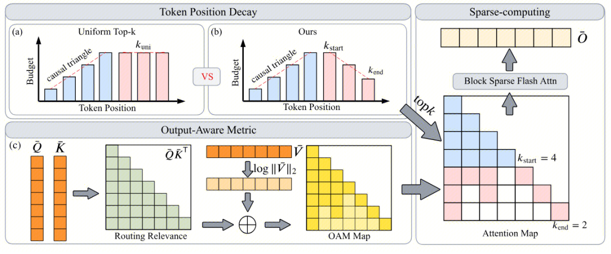

Stem 的两个关键点：

### Token Position-Decay

因果注意力里，越靠前的 token 会影响越多后续位置。

如果头部 token 被错误剪掉，误差会在后续层和后续 token 中放大。尾部 token 的影响更局部，因此可以更激进地裁剪。

做法：

```text
头部 query 使用更大的 top-k 预算
尾部 query 使用更小的 top-k 预算
k 从 k_start 线性衰减到 k_end
k_end = mu * k_start
```

这不是简单地统一减少预算，而是把同样的预算重新分配给更关键的位置。

### Output-Aware Metric

传统稀疏注意力常按注意力分数选择 token：

```text
QK^T
```

但注意力分数只表示“会不会看那里”，不等于“那里贡献的信息量有多大”。如果某个 Value 向量本身模长很小，即使注意力高，对输出也可能贡献有限。

Stem 引入 Value 模长作为信号强度：

```text
M(i, j) = QK^T + beta * max(0, log(||V_j||_2))
```

好处是：

- 选择 token 时同时看路由概率和信息强度。
- 对数变换后可以复用标准 top-k 内核。
- 几乎不引入额外计算开销。

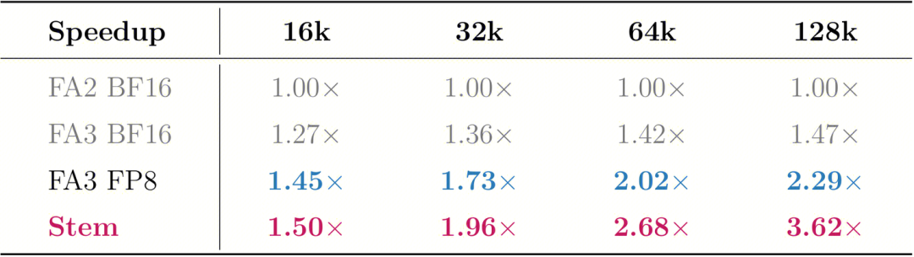

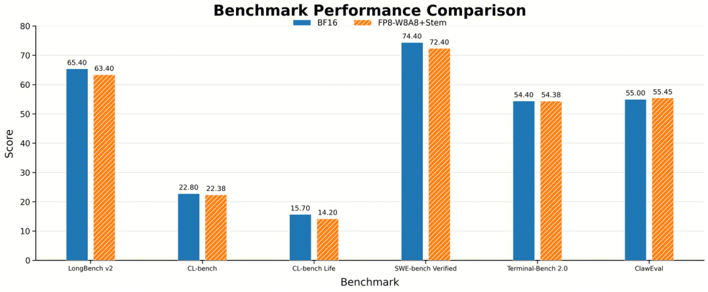

工程直觉：

> 长上下文稀疏化不能只问“哪些位置注意力分数高”，还要问“这些位置真的给输出贡献了多少信息”。

## 14. 后续方向

原文提到的后续优化包括：

- C4 与 W4 相关优化：继续压缩显存和访存压力。
- 新的并行投机解码：在保证接受率的同时，以更低成本产生更多候选 token。
- 调度和并行策略持续优化。
- PD 高效传输。
- 多级缓存中心。
- 跨机通信与流量控制。
- 适配更多硬件平台，用硬件性价比继续降低推理成本。

这些方向说明一件事：

> 推理优化不是一次 kernel 改造，而是模型、硬件、缓存、通信、调度和量化一起演进的系统工程。

## 这篇案例对工程实践的启发

### 1. 先分清 Prefill 和 Decode

Prefill 和 Decode 的瓶颈不同。

| 阶段 | 典型瓶颈 | 更常见优化 |
| --- | --- | --- |
| Prefill | 长输入、attention、通信、TTFT | SP/TPSP、通算融合、prefix cache、稀疏 attention |
| Decode | 显存带宽、KV Cache、采样、调度气泡、TPOT | KV 管理、EP/DP、采样融合、MTP 调度、量化 |

不要用同一套指标判断所有优化。

### 2. 算子融合的价值来自少搬数据

很多融合收益不是因为计算公式变少，而是因为：

- 少启动 kernel。
- 少读写 HBM。
- 少做中间 tensor materialization。
- 少做 CPU-GPU 同步。

这解释了为什么 Rope、Norm、Quant、Sampler 这些“小东西”也值得做深。

### 3. MoE 优化要看完整链路

MoE 的复杂度不只在专家 FFN。

还要看：

- Router 精度与性能。
- token 到 expert 的索引构建。
- gather / scatter。
- Grouped GEMM shape。
- expert parallel 通信。
- top-k 加权聚合。
- shared expert 的拆分与通信重叠。

### 4. 长上下文需要缓存体系，而不只是更大显存

GPU 显存再大，也会被权重、KV Cache、运行时 buffer 和并发吃掉。

Agent/Coding 场景有大量可复用前缀，因此多级 Prefix / KV Cache 会直接影响 TTFT 和成本。

### 5. 量化、稀疏、并行必须一起评测

低比特量化可能改变数值分布。

稀疏注意力可能改变长上下文召回。

并行策略可能改变通信形态和 batch 形状。

所以最后必须用真实业务数据看：

- TTFT。
- TPOT。
- 吞吐。
- 缓存命中率。
- 显存占用。
- 长上下文精度。
- Agent/Coding 任务成功率。

## 和其他专题的关系

如果你还不熟这些概念，建议按这个顺序补：

1. [LLM 推理与架构优化入门](llm-inference-architecture.md)：理解 KV Cache、Prefix Cache、MoE、Speculative Decoding、Batching。
2. [模型量化与推理压缩入门](model-quantization-and-compression.md)：理解 W8A8、W4A8、KV Cache 量化和评测风险。
3. [模型部署硬件选型](model-deployment-hardware-sizing.md)：理解显存、带宽、多卡互联和并行策略。
4. [上下文工程](context-engineering.md)：理解为什么稳定 prompt 和多轮 Agent 上下文会影响 Prefix Cache。

## 参考资料

- [腾讯混元AI Infra如何优化Hy3 Preview：一次大模型推理性能提升的技术拆解](https://mp.weixin.qq.com/s/miAOHTBZLyuDfNle1jrO0w)
