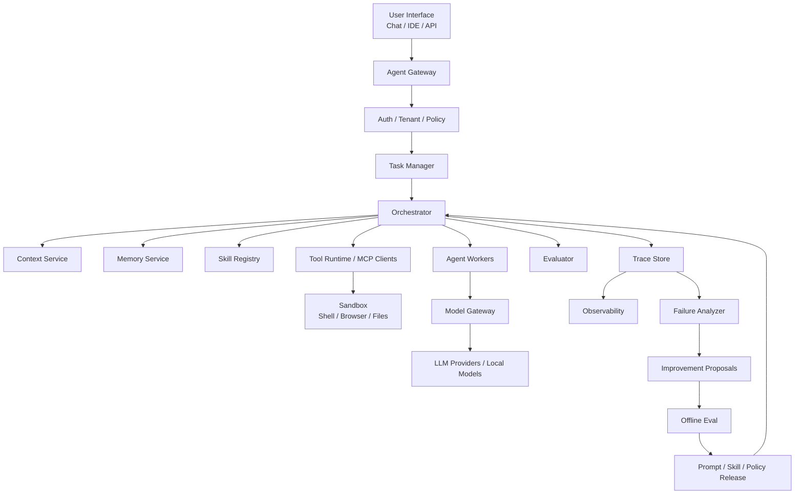
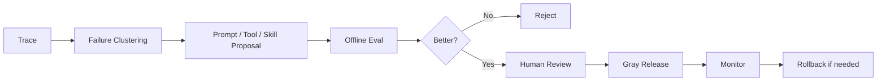

# 大型 Agent 系统架构设计

这篇讲大型 Agent 系统怎么设计。

前面的文章讲了：

- Agent 是什么。
- Multi-Agent 如何协作。
- Harness Engineering。
- Loop Engineering。
- 记忆系统。

这篇把它们放到一个平台架构里。

先看一张大图。



大型 Agent 系统不是一个 while loop。

它更像一个平台。

## 分层架构

可以分成 8 层。

| 层 | 作用 |
| --- | --- |
| Interface Layer | 用户入口，Chat、IDE、API、Webhook |
| Gateway Layer | 鉴权、租户、限流、策略 |
| Orchestration Layer | 任务状态机、Agent 调度、预算控制 |
| Context Layer | 构建每轮模型上下文 |
| Capability Layer | tools、MCP、skills、memory |
| Runtime Layer | 沙箱、浏览器、文件、shell、网络 |
| Evaluation Layer | 过程和结果评测 |
| Evolution Layer | trace 分析、改进提案、离线评测、发布 |

越往下越像基础设施。

越往上越接近用户体验。

## Agent Gateway

Agent Gateway 是入口。

它负责：

- 接收用户请求。
- 鉴权。
- 判断租户和项目。
- 限流。
- 创建 task。
- 注入策略。
- 记录入口 trace。

请求进来时，不要直接丢给模型。

应该先变成结构化任务：

```json
{
  "task_id": "task_123",
  "tenant_id": "tenant_a",
  "user_id": "user_1",
  "workspace_id": "repo_abc",
  "goal": "修复登录 token 过期判断 bug",
  "source": "ide",
  "priority": "normal",
  "created_at": "2026-06-21T10:00:00+08:00"
}
```

这样后面才能做状态管理、权限、审计和恢复。

## Task Manager

Task Manager 管任务生命周期。

它不负责“聪明”。

它负责确定性状态：

```text
CREATED
  ↓
PLANNING
  ↓
RUNNING
  ↓
WAITING_TOOL / WAITING_AGENT / WAITING_USER
  ↓
REVIEWING
  ↓
DONE / FAILED / CANCELLED / ESCALATED
```

Task Manager 保存：

- 当前状态。
- 预算。
- owner。
- 子任务。
- 取消信号。
- deadline。
- retry count。
- artifacts。

没有 Task Manager，长任务很容易丢现场。

## Orchestrator

Orchestrator 是调度核心。

它决定：

- 用哪个 Agent。
- 是否需要 planner。
- 是否调用工具。
- 是否委托给子 Agent。
- 是否进入 review。
- 是否停止。

但它不应该全靠 LLM。

推荐混合控制：

```text
LLM 提建议
规则做边界
状态机做流程
Evaluator 做验收
Runtime 做权限
```

伪流程：

```python
while task.is_active():
    state = task_manager.load(task_id)
    context = context_service.build(state)
    decision = agent_worker.decide(context)

    if violates_policy(decision):
        task_manager.escalate(task_id)
        break

    result = runtime.execute(decision)
    task_manager.update(task_id, result)

    if evaluator.pass_(task_id):
        task_manager.done(task_id)
```

## Model Gateway

不要让每个 Agent 直接调用模型供应商。

中间应该有 Model Gateway。

它负责：

- 统一 OpenAI-compatible / Responses / Anthropic / 本地模型接口。
- model routing。
- fallback。
- rate limit。
- token 统计。
- 成本统计。
- prompt logging。
- safety filter。
- caching。

统一后，Agent 不关心底层模型来自：

- OpenAI。
- Anthropic。
- Gemini。
- 本地 vLLM。
- SGLang。
- llama.cpp。

Model Gateway 输出统一结构：

```json
{
  "model": "local-qwen-32b",
  "finish_reason": "tool_call",
  "tool_calls": [],
  "usage": {
    "input_tokens": 12000,
    "output_tokens": 800
  },
  "latency_ms": 2300
}
```

## Context Service

Context Service 是上下文工程的平台化实现。

它负责：

- 读取任务状态。
- 读取相关记忆。
- 选择 skill。
- 注入工具 schema。
- 注入权限说明。
- 压缩历史。
- 控制 token budget。
- 构造最终 messages。

它应该输出可审计结果：

```json
{
  "context_id": "ctx_123",
  "included_memories": ["mem_1", "mem_7"],
  "included_files": ["AuthService.java"],
  "included_tools": ["read_file", "run_tests"],
  "input_tokens_estimate": 14800,
  "prompt_version": "agent_system_v12"
}
```

这样当 Agent 出错时，可以追问：

```text
它当时到底看到了什么？
```

## Memory Service

Memory Service 管长期信息。

它不是简单向量库。

至少包含：

- 向量检索。
- 结构化数据库。
- 文档存储。
- 权限过滤。
- scope 管理。
- 冲突处理。
- 过期处理。
- 删除和审计。

记忆写入要经过：

```text
candidate
  ↓
privacy filter
  ↓
dedup
  ↓
conflict check
  ↓
confidence scoring
  ↓
human confirmation if needed
  ↓
write
```

大型系统里尤其要防止：

- 用户 A 记忆泄露给用户 B。
- 项目 A 规则污染项目 B。
- 过期记忆继续影响决策。
- prompt injection 被写进长期记忆。

## Skill Registry

Skill Registry 管可复用能力。

它保存：

- skill metadata。
- skill description。
- skill version。
- references。
- scripts。
- assets。
- permissions。
- eval cases。

Agent 不应该启动就加载所有 skill。

推荐：

```text
加载 skill index
  ↓
按任务匹配
  ↓
读取 SKILL.md
  ↓
按需读取 references/scripts
```

Skill 也要版本化。

因为 skill 改动会影响 Agent 行为。

## Tool Runtime

Tool Runtime 是执行层。

它负责：

- 文件读写。
- Shell。
- 浏览器。
- 数据库。
- 企业 API。
- MCP tools。
- 外部 SaaS。

最关键的是权限。

不要让模型直接执行危险动作。

工具调用必须经过：

```text
schema validation
  ↓
permission check
  ↓
risk classification
  ↓
approval if needed
  ↓
sandbox execution
  ↓
observation formatting
```

工具结果要结构化返回。

不要把原始大日志全部塞回上下文。

## Sandbox

Sandbox 是安全边界。

常见隔离：

- 工作区文件隔离。
- 容器。
- VM。
- 浏览器 profile 隔离。
- 网络 allowlist。
- secret 隔离。
- 只读挂载。
- 命令 allowlist / denylist。

Agent 系统一定要假设：

```text
模型可能被 prompt injection 影响
工具可能失败
网页可能恶意
用户可能越权
```

所以安全必须在 runtime 层兜住。

## Evaluator

Evaluator 是质量闭环。

它可以评：

- 最终答案。
- 工具调用轨迹。
- 单步决策。
- 文件 diff。
- 测试结果。
- 安全违规。
- 成本和延迟。

大型系统里 evaluator 不只是离线评测。

它还可以参与运行时：

```text
Executor 产出
  ↓
Evaluator 判断 pass/revise/fail
  ↓
Orchestrator 决定 done/retry/escalate
```

Evaluator 输出建议结构化：

```json
{
  "verdict": "revise",
  "blocking_issues": [
    "没有运行 AuthServiceTest"
  ],
  "confidence": 0.88
}
```

## Trace Store

Trace Store 是 Agent 系统的黑匣子。

保存：

- 用户输入。
- context 构建结果。
- 模型请求和响应。
- 工具调用。
- 工具结果。
- 状态转换。
- 记忆读写。
- 权限判断。
- evaluator 结果。
- 成本、耗时、token。

没有 trace，就无法：

- 调试失败。
- 做 eval。
- 做自进化。
- 做审计。
- 解释用户投诉。

Trace 要支持按 task、user、project、agent、tool、版本检索。

## Observability

大型 Agent 系统需要指标。

| 指标 | 说明 |
| --- | --- |
| success_rate | 任务成功率 |
| fail_reason_distribution | 失败原因分布 |
| tool_error_rate | 工具失败率 |
| retry_rate | 重试率 |
| loop_steps | 平均 loop 步数 |
| human_escalation_rate | 转人工比例 |
| memory_hit_rate | 记忆命中率 |
| context_tokens | 上下文 token 数 |
| cost_per_task | 单任务成本 |
| p95_latency | p95 延迟 |
| safety_violation_rate | 安全违规率 |

这些指标会指导产品优化。

## Evolution Pipeline

自进化不是生产环境里让 Agent 随便改自己。

应该是流水线：



可进化对象：

- prompt。
- tool schema。
- tool description。
- context policy。
- memory policy。
- skill workflow。
- routing policy。
- evaluator rubric。

每次变化都必须：

- 有版本。
- 有 eval。
- 有灰度。
- 可回滚。

## 多租户和权限

企业 Agent 一定会遇到多租户。

要隔离：

- 用户。
- 团队。
- 项目。
- 数据源。
- 工具权限。
- 记忆。
- trace。
- secrets。

权限不能只在 prompt 里写。

必须在服务端检查。

例如：

```text
用户没有生产数据库权限
  ↓
即使模型调用 run_sql
  ↓
Tool Runtime 也必须拒绝
```

## 可靠性设计

大型 Agent 系统会失败。

要提前设计：

- 任务取消。
- 超时。
- checkpoint。
- retry。
- fallback model。
- tool fallback。
- partial result。
- human escalation。
- idempotency。
- replay。

尤其是工具执行要考虑幂等。

不要因为 retry 导致：

```text
重复下单
重复发邮件
重复写数据库
```

## 推荐落地顺序

不要第一天就做完整平台。

建议：

```text
1. 单 Agent + 少量工具 + trace
2. 加 Task Manager 和状态机
3. 加 Context Service
4. 加 Tool Runtime 权限和沙箱
5. 加 Evaluator
6. 加 Memory Service
7. 加 Skill Registry
8. 加 Multi-Agent / Supervisor
9. 加 Evolution Pipeline
10. 做多租户、审计、灰度和回滚
```

每一步都能独立带来收益。

## 架构 checklist

设计大型 Agent 系统前，问这些问题：

- 有没有任务状态机？
- Agent 是否能被取消？
- 有没有预算和 deadline？
- 工具权限是否由服务端强制？
- 上下文构建是否可审计？
- 记忆是否有 scope、权限和删除机制？
- skill 是否有版本和 eval？
- trace 是否完整保存？
- evaluator 是否能判断 pass/revise/fail？
- 多 Agent 是否有 owner 和 contract？
- A2A 是否有 hop count 和预算？
- prompt/tool/context policy 是否版本化？
- 改动是否能离线评测和回滚？
- 是否有 p95 latency、cost、failure reason 指标？

## 下一步

继续读：

- [从 LLM 出生到大型 Agent 系统](llm-to-agent-system-overview.md)
- [Harness Engineering：把模型变成可用 Agent 的工程](harness-engineering.md)
- [Agent 安全与 Guardrails：权限、注入攻击与运行时边界](agent-security-guardrails.md)
- [Loop Engineering：Agent 循环、停止条件与恢复](loop-engineering.md)
- [Multi-Agent 协作、自进化与记忆系统](multi-agent-collaboration-memory.md)
- [Agent 效果评测框架](agent-evaluation-framework.md)
