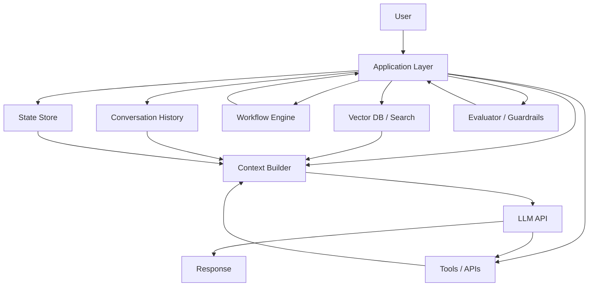
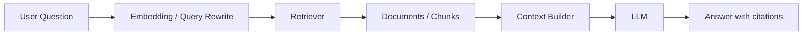
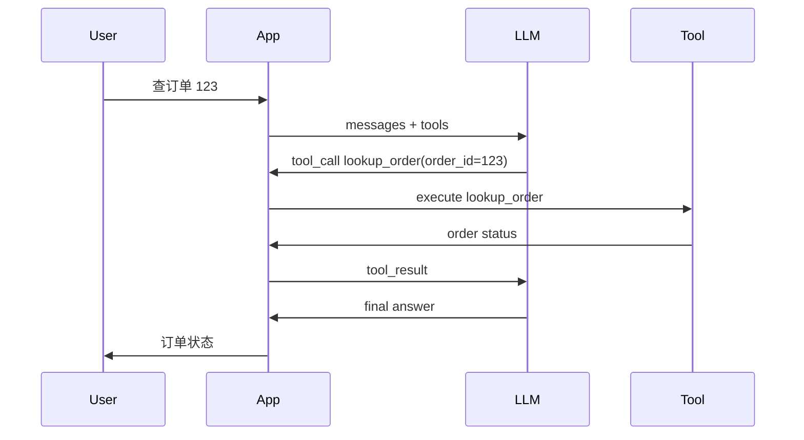
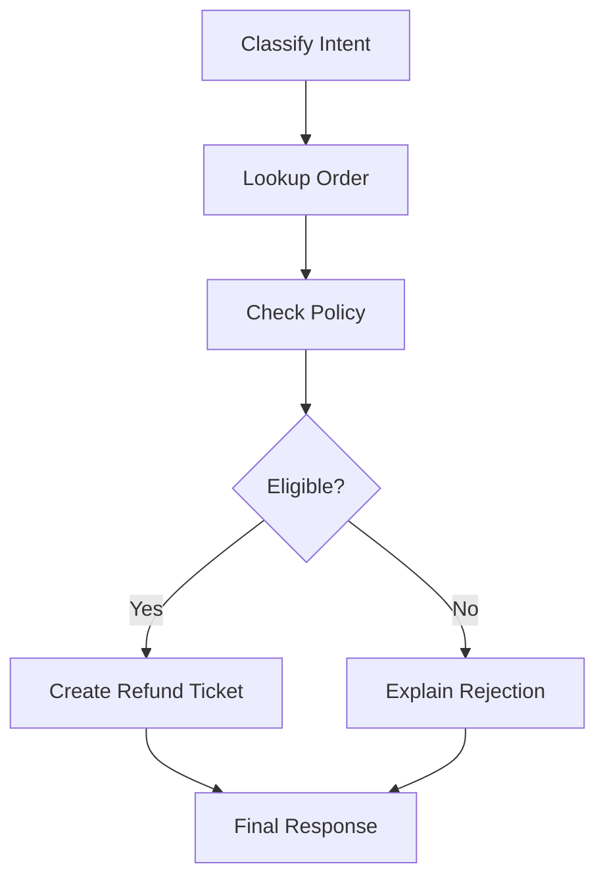

# LLM 应用架构：Chatbot、RAG、工具调用、工作流与 Agent

这篇讲 LLM 从 API 到真实应用中间的架构层。

很多人学完 API 后会直接跳到 Agent。

但实际产品通常是逐层演进的：

```text
一次问答
  ↓
多轮 Chatbot
  ↓
RAG 知识库问答
  ↓
工具调用
  ↓
工作流
  ↓
Agent
  ↓
Multi-Agent
```

这些不是互相替代，而是能力逐层增加。

## 全局图



可以先记住：

> LLM API 是模型能力入口，应用架构决定这个能力如何被业务使用。

## 形态 1：一次问答

最简单的应用：

```text
用户输入
  ↓
调用 LLM
  ↓
返回回答
```

适合：

- 简单问答。
- 文案生成。
- 翻译。
- 改写。
- 摘要。

伪代码：

```python
answer = llm.generate(user_input)
return answer
```

优点：

- 简单。
- 成本低。
- 容易上线。

缺点：

- 没有外部知识。
- 不知道用户历史。
- 不能执行动作。
- 很难处理复杂任务。

## 形态 2：多轮 Chatbot

Chatbot 增加了历史对话。

```text
历史消息
  +
当前问题
  ↓
LLM
  ↓
回答
```

关键问题：

- 保留多少历史？
- 历史太长怎么压缩？
- 哪些历史已经过期？
- 用户纠正了前面内容怎么办？

常见结构：

```json
{
  "messages": [
    {"role": "system", "content": "你是客服助手。"},
    {"role": "user", "content": "我想退款。"},
    {"role": "assistant", "content": "请提供订单号。"},
    {"role": "user", "content": "订单 123。"}
  ]
}
```

这个阶段已经开始需要上下文工程。

## 形态 3：RAG 知识库问答

RAG 是 Retrieval-Augmented Generation。

中文可以理解成：

```text
先检索资料，再让模型基于资料回答
```

流程：



RAG 解决：

- 模型不知道最新知识。
- 企业私有文档不在模型训练数据里。
- 需要基于证据回答。
- 希望减少幻觉。

### RAG 的核心模块

| 模块 | 作用 |
| --- | --- |
| Document Loader | 加载 PDF、网页、Markdown、数据库 |
| Chunking | 把文档切成片段 |
| Embedding | 把文本变成向量 |
| Vector Store | 存储和检索向量 |
| Retriever | 找相关片段 |
| Reranker | 重排检索结果 |
| Context Builder | 把片段组织进 prompt |
| Answer Generator | 基于资料回答 |
| Citation | 给出引用来源 |

### RAG 的常见问题

| 问题 | 可能原因 |
| --- | --- |
| 答错 | 检索错了，或模型没忠于证据 |
| 答不全 | chunk 切得差，召回少 |
| 幻觉 | prompt 没要求基于证据，或资料不足 |
| 引用不准 | chunk/source metadata 设计差 |
| 很慢 | 检索、rerank、长上下文太重 |

RAG 不是“加个向量库”就完事。

它本质上是一个信息检索系统 + 生成系统。

## 形态 4：工具调用应用

RAG 主要是“查资料”。

工具调用可以“做动作”。

例如：

- 查订单。
- 创建工单。
- 调天气 API。
- 运行 SQL。
- 发送邮件。
- 读取文件。
- 调用搜索。

流程：



工具调用应用的关键：

- tool schema 要清楚。
- 参数要能验证。
- 工具结果要结构化。
- 权限要由服务端控制。
- 高风险动作要审批。

工具调用不是 Agent 的全部。

一次工具调用也可以是普通应用。

## 形态 5：工作流应用

工作流是确定性流程。

例如退款流程：

```text
查订单
  ↓
检查政策
  ↓
判断是否可退
  ↓
创建退款工单
  ↓
通知用户
```

这里不需要模型自由决定所有步骤。

模型可以只负责：

- 理解用户意图。
- 填参数。
- 总结结果。
- 处理异常说明。

流程由程序控制。



工作流优点：

- 可控。
- 可审计。
- 适合生产。
- 不容易乱跑。

缺点：

- 灵活性弱。
- 需要提前定义流程。

## 形态 6：Agent 应用

Agent 增加了循环和状态。

```text
目标
  ↓
模型判断下一步
  ↓
调用工具
  ↓
观察结果
  ↓
更新状态
  ↓
继续直到完成
```

Agent 适合：

- 代码修复。
- 长任务调研。
- 数据分析。
- 自动化操作。
- 多步文件处理。
- 需要根据结果调整路线的任务。

Agent 和工作流的区别：

| 对比 | 工作流 | Agent |
| --- | --- | --- |
| 控制流 | 程序预定义 | 模型参与决策 |
| 灵活性 | 较低 | 较高 |
| 可控性 | 较高 | 较难 |
| 适合 | 固定业务流程 | 开放任务 |
| 风险 | 流程覆盖不全 | 循环、越权、成本 |

真实生产中经常混合：

```text
外层工作流控制大流程
局部节点使用 Agent 处理开放子任务
```

## 形态 7：Multi-Agent

Multi-Agent 是多个 Agent 协作。

适合：

- 分工明显。
- 需要审查。
- 需要并行。
- 需要权限隔离。
- 跨系统协作。

但它不是第一选择。

更推荐：

```text
单 Agent 做不稳
  ↓
拆专家 Agent
  ↓
Supervisor 统一调度
  ↓
Evaluator 控制质量
```

## RAG、工具、工作流、Agent 怎么选

先看问题类型。

| 需求 | 首选架构 |
| --- | --- |
| 只需要生成文本 | 一次问答 |
| 需要记住对话 | Chatbot |
| 需要基于文档回答 | RAG |
| 需要查外部系统 | 工具调用 |
| 流程固定、风险高 | 工作流 |
| 任务开放、多步骤 | Agent |
| 需要分工和审查 | Multi-Agent |

一个简单判断：

```text
知识问题 -> RAG
动作问题 -> 工具调用
固定流程 -> 工作流
开放目标 -> Agent
复杂组织 -> Multi-Agent
```

## 一个企业客服例子

用户：

```text
我买的商品坏了，能退款吗？
```

不同架构会这样处理。

### 只用 Chatbot

模型根据训练知识回答退款政策。

风险：

- 可能不知道最新政策。
- 不知道用户订单。

### RAG

先检索退款政策，再回答。

更好：

- 基于最新政策。
- 可以引用条款。

但仍然不知道订单状态。

### 工具调用

调用订单系统：

```text
lookup_order(order_id)
check_refund_policy(category, date)
```

能给个性化回答。

### 工作流

固定流程：

```text
查订单 -> 查政策 -> 判断 -> 创建工单
```

适合正式业务。

### Agent

如果用户描述复杂，比如涉及多订单、物流、售后图片，Agent 可以动态决定：

- 先查哪个订单。
- 是否需要用户补图。
- 是否需要升级人工。
- 是否创建多个工单。

## 应用层的核心工程问题

### 1. Context

应用要决定模型看什么：

- 历史消息。
- 检索片段。
- 工具 schema。
- 工具结果。
- 业务规则。
- 用户权限。

这就是上下文工程。

### 2. State

应用要保存状态：

- 当前任务。
- 当前步骤。
- 已调用工具。
- 已拿到的证据。
- 用户确认。
- 中间产物。

状态不要只靠模型记忆。

### 3. Permission

所有动作要有权限。

尤其是：

- 写数据库。
- 发邮件。
- 删除文件。
- 花钱调用服务。
- 访问私有数据。

### 4. Evaluation

应用要能回答：

```text
这次回答对吗？
检索对吗？
工具调用对吗？
是否越权？
成本是否可接受？
```

### 5. Observability

要保存 trace。

否则出了问题只能看最终回答，很难定位是：

- 检索错。
- 工具错。
- prompt 错。
- 模型错。
- 权限错。
- 状态错。

## 和后续主题的关系

```text
LLM API
  ↓
LLM 应用架构
  ↓
上下文工程
  ↓
Harness Engineering
  ↓
Loop Engineering
  ↓
Agent / Multi-Agent
```

这篇处在 API 和 Agent 之间。

它回答：

> 有了 LLM API 后，产品到底可以怎么搭？

## 下一步

继续读：

- [上下文工程入门](context-engineering-beginner.md)
- [Harness Engineering：把模型变成可用 Agent 的工程](harness-engineering.md)
- [Loop Engineering：Agent 循环、停止条件与恢复](loop-engineering.md)
- [Agent 开发入门](agent-development-beginner.md)
- [Agent 效果评测框架](agent-evaluation-framework.md)
