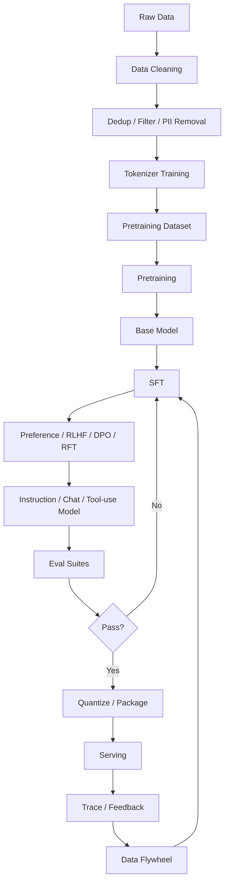

# LLM 生命周期：从数据到线上模型

这篇讲 LLM 是怎么“出生”的。

不是从数学公式开始，而是从工程流水线看：

```text
数据
  ↓
Tokenizer
  ↓
预训练
  ↓
后训练
  ↓
评测
  ↓
压缩和部署
  ↓
线上反馈
```

先看全局图。



这个图说明一件事：

> LLM 不是训练一次就结束，而是数据、训练、评测、部署、反馈不断循环。

## 阶段 1：数据

模型最早来自数据。

常见数据来源：

- 网页。
- 书籍。
- 论文。
- 代码。
- 问答。
- 对话。
- 企业内部文档。
- 人工标注数据。
- 合成数据。

但原始数据不能直接喂给模型。

需要处理：

| 步骤 | 目的 |
| --- | --- |
| 清洗 | 去掉乱码、模板页、广告、无意义内容 |
| 去重 | 避免重复数据浪费训练，降低记忆风险 |
| 过滤 | 去掉低质量、违法、有害、隐私内容 |
| PII 处理 | 处理手机号、邮箱、身份证等敏感信息 |
| 分类 | 区分网页、代码、数学、对话、领域数据 |
| 配比 | 控制不同数据类型占比 |

数据决定模型的底色。

如果模型训练语料里代码少，它代码能力通常不会特别强。

如果后训练数据里工具调用格式少，它就不容易稳定调用工具。

## 阶段 2：Tokenizer

Tokenizer 决定文本如何变成 token。

例子：

```text
"上下文工程"
  ↓
[token_1, token_2, token_3]
```

为什么 tokenizer 重要？

- 它影响上下文长度。
- 它影响训练效率。
- 它影响中文、代码、多语言表现。
- 它影响 API 里的 token 成本。
- 它影响模型能否很好处理特殊格式。

Tokenizer 里常见特殊 token：

```text
<bos>
<eos>
<|user|>
<|assistant|>
<|tool_call|>
<|tool_result|>
```

这些特殊 token 后面会和 chat template、工具调用格式连起来。

## 阶段 3：预训练

预训练是 LLM 的基础能力来源。

最常见的目标是：

```text
给前面的 token，预测下一个 token
```

例如：

```text
输入：Transformer 是一种
目标：神经
```

模型通过海量样本学习：

- 语言规律。
- 事实知识。
- 推理模式。
- 代码结构。
- 文档格式。
- 世界常识。

预训练产物叫 base model。

base model 通常还不是一个好助手。

它更像：

```text
会续写一切文本的通用模型
```

## 阶段 4：后训练

后训练把 base model 变成可用助手。

### SFT

SFT 是监督微调。

它让模型学习：

```text
用户指令 -> 理想回答
```

例子：

```json
{
  "messages": [
    {"role": "user", "content": "解释一下 KV Cache"},
    {"role": "assistant", "content": "KV Cache 是..."}
  ]
}
```

SFT 主要解决：

- 听指令。
- 对话格式。
- 输出风格。
- 结构化回答。
- 工具调用样式。

### Preference / DPO / RLHF

SFT 让模型“会答”。

偏好训练让模型“答得更好”。

常见数据是：

```text
同一个问题
回答 A 更好
回答 B 更差
```

模型学习偏好：

- 更有帮助。
- 更安全。
- 更诚实。
- 更符合人类期望。
- 更少废话。

DPO 是常见的偏好优化方法。

RLHF 是更经典但更复杂的路线。

### RFT

RFT 可以理解成在可验证任务上强化。

适合：

- 数学。
- 代码。
- 工具调用。
- 结构化任务。

因为这些任务可以给明确反馈：

```text
测试是否通过
答案是否正确
JSON 是否合法
工具调用是否成功
```

### Tool-use tuning

Agent 模型还需要学工具调用。

它要知道：

- 什么时候调用工具。
- 调哪个工具。
- 参数怎么填。
- 工具结果回来后怎么继续。
- 什么时候停止工具调用并回答。

这和普通聊天不同。

数据里要有类似：

```text
user -> assistant tool_call -> tool_result -> assistant final
```

这样的轨迹。

如果你想系统区分 SFT、DPO、RLHF 和 RFT，继续读：[后训练与对齐入门：SFT、DPO、RLHF、RFT](post-training-alignment.md)。

## 阶段 5：Chat Template

模型不是直接看到 JSON messages。

服务端会把 messages 渲染成模型训练时熟悉的格式。

例如：

```json
[
  {"role": "system", "content": "你是一个助手。"},
  {"role": "user", "content": "解释 attention。"}
]
```

可能被渲染成：

```text
<|system|>
你是一个助手。
<|user|>
解释 attention。
<|assistant|>
```

这就是 chat template。

如果 chat template 和模型训练格式不匹配，模型会表现异常。

所以：

```text
API messages
  ↓
chat template
  ↓
token ids
  ↓
Transformer
```

这条链必须一致。

## 阶段 6：评测

模型训练完不能直接上线。

需要评测：

| 评测类型 | 看什么 |
| --- | --- |
| 通用能力 | 语言、知识、推理、代码 |
| 指令跟随 | 是否听用户要求 |
| 安全 | 是否拒绝危险请求 |
| 工具调用 | 工具选择和参数是否正确 |
| RAG | 是否忠于检索资料 |
| 长上下文 | 是否能利用远处信息 |
| 结构化输出 | JSON、XML、函数调用是否稳定 |
| Agent 任务 | 多步工具链是否成功 |

对于 Agent 产品，尤其不能只看最终答案。

要看：

```text
trace
tool calls
arguments
observations
final response
```

## 阶段 7：压缩和部署

训练产物通常很大。

部署前可能会做：

- 量化。
- 蒸馏。
- 权重格式转换。
- LoRA 合并。
- Tensor parallel 切分。
- KV Cache 精度设置。
- 服务镜像打包。

部署框架可能是：

- llama.cpp。
- vLLM。
- SGLang。
- TGI。
- 自研推理服务。

部署后要关注：

- TTFT。
- TPOT。
- throughput。
- latency。
- concurrency。
- OOM。
- GPU 利用率。
- 成本。

## 阶段 8：线上反馈和数据飞轮

模型上线后，真正的学习还没有结束。

线上会产生：

- 用户反馈。
- trace。
- 失败样本。
- 安全拦截。
- 工具调用失败。
- 低分回答。
- 人工修正。

这些可以回流成：

- eval case。
- SFT 数据。
- preference 数据。
- tool-use 数据。
- prompt 改进。
- memory / skill 改进。

这就是数据飞轮。

但要注意：

> 线上数据不能直接无脑回灌训练。

必须做：

- 隐私处理。
- 质量过滤。
- 去重。
- 人工或模型审核。
- 版权和合规检查。
- 安全过滤。

## LLM 生命周期和 Agent 的关系

Agent 产品不是只靠 prompt。

它依赖模型在生命周期中学到的能力：

| Agent 能力 | 主要来自哪里 |
| --- | --- |
| 语言理解 | 预训练 |
| 指令跟随 | SFT / 偏好训练 |
| 工具调用格式 | tool-use tuning |
| 安全拒绝 | safety tuning |
| 代码能力 | 代码预训练 + SFT + RFT |
| 长上下文 | 架构、训练、位置编码、推理系统 |
| JSON 稳定性 | SFT、约束解码、eval |

如果模型没有学过工具调用，只靠 prompt 让它稳定 function call，会很难。

如果模型训练时没有见过某种 chat template，上线时格式不匹配，也会掉效果。

## 和上下文工程的关系

模型生命周期决定模型“学过什么”。

上下文工程决定模型“这一轮看到什么”。

两者要配合：

```text
模型训练过 tool call
  +
上下文里提供清晰 tool schema
  +
runtime 能执行工具
```

工具调用才会稳定。

## 常见误区

### 误区 1：预训练模型就是聊天模型

不是。

base model 会续写文本，但不一定会可靠执行用户指令。

### 误区 2：SFT 数据越多越好

不一定。

低质量 SFT 数据会教坏模型。

质量、覆盖、格式一致性很重要。

### 误区 3：模型上线后就结束

不是。

上线后还要持续 eval、收集失败、修 prompt、改工具、补数据。

### 误区 4：Agent 问题都能靠 prompt 修

不一定。

有些问题来自：

- 模型训练能力不足。
- chat template 不匹配。
- 工具 schema 设计差。
- runtime 权限不清。
- eval 缺失。

## 下一步

继续读：

- [数据、Tokenizer 与预训练数据工程入门](data-tokenizer-pretraining-data.md)
- [Transformer 入门](transformer-beginner.md)
- [模型训练与部署学习路线](model-training-deployment-roadmap.md)
- [LLM API：从 HTTP 到 Transformer](openai-api-beginner.md)
- [Agent 效果评测框架](agent-evaluation-framework.md)
