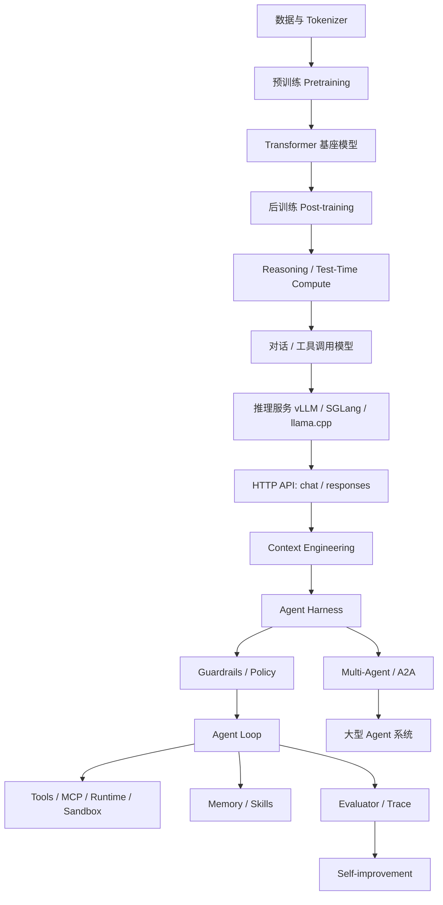
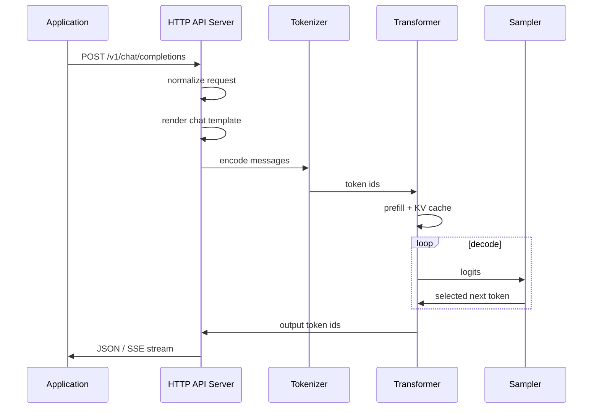
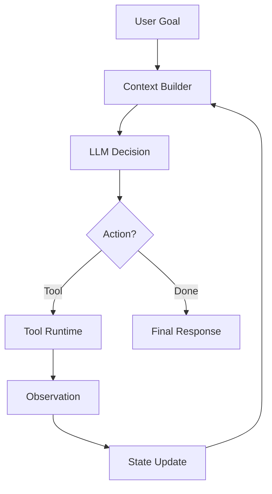
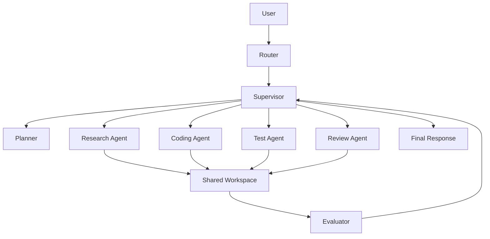
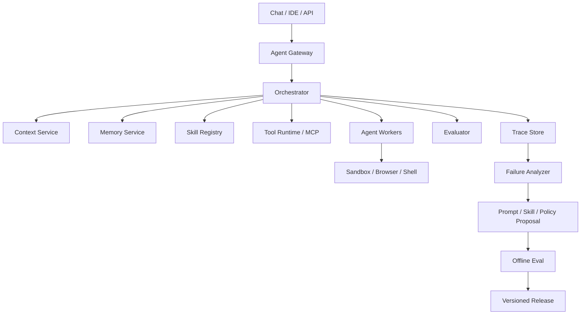

# 从 LLM 出生到大型 Agent 系统：全局地图

这篇是整套文档的总览。

目标是把这些主题连成一条线：

```text
LLM 如何诞生
  ↓
Transformer 如何工作
  ↓
Reasoning / Test-Time Compute 如何提升复杂任务
  ↓
HTTP API 如何调用模型
  ↓
推理服务如何部署
  ↓
上下文工程如何组织输入
  ↓
Agent 如何循环行动
  ↓
Harness 如何把模型包成产品
  ↓
Multi-Agent 和大型 Agent 系统如何设计
```

先看全局图。



你可以把它理解成三段。

## 第一段：模型如何出生

LLM 不是一开始就会聊天。

它通常经历：

```text
收集语料
  ↓
训练 tokenizer
  ↓
预训练
  ↓
监督微调 SFT
  ↓
偏好对齐 / RLHF / DPO / RFT
  ↓
工具调用和指令跟随能力增强
```

### Tokenizer

Tokenizer 先把文字切成 token。

例子：

```text
用户：解释 Transformer
  ↓
token ids: [1234, 5678, 9012]
```

模型真正看到的是 token id，不是自然语言字符串。

所以后面所有事情都建立在 token 上：

- 上下文长度。
- prompt 成本。
- KV Cache。
- sampling。
- API 的 `max_tokens`。

### Pretraining

预训练像是让模型读大量文本，学习：

- 语言结构。
- 世界知识。
- 代码模式。
- 推理模式。
- 文档格式。

训练目标可以先粗略理解为：

```text
给前面的 token，预测下一个 token
```

它学到的是通用能力。

### Post-training

预训练模型不一定好用。

它可能会续写网页、论文、代码，但不一定会：

- 听用户指令。
- 拒绝危险请求。
- 输出结构化 JSON。
- 调用工具。
- 在对话中保持角色。

所以需要后训练：

| 阶段 | 作用 |
| --- | --- |
| SFT | 学会按指令回答 |
| Preference / DPO / RLHF | 学会偏好更好的回答 |
| Tool-use tuning | 学会何时调用工具 |
| Safety tuning | 学会安全边界 |
| RFT | 在可验证任务上强化能力 |

这就是模型从“会续写文本”变成“可交互助手”的过程。

## 第二段：模型如何被调用和部署

模型训练好后，还不能直接成为产品。

还需要推理服务。



一次 HTTP 请求背后会发生：

- JSON 参数解析。
- chat template 渲染。
- tokenizer 编码。
- prefill。
- KV Cache 建立。
- decode。
- sampler 采样。
- streaming 返回。

这就是为什么 API 参数和底层 Transformer 是连着的。

例如：

| API 参数 | 底层影响 |
| --- | --- |
| `temperature` | 影响 sampler 随机性 |
| `top_p` | 影响候选 token 集合 |
| `max_tokens` | 控制 decode 最长步数 |
| `stop` | 控制生成停止 |
| `max_model_len` | 影响上下文和 KV Cache |

### 推理优化

推理服务要解决性能问题：

- KV Cache：避免重复算历史 token。
- Prefix Cache：复用相同 prompt 前缀。
- Batching：合并请求提高 GPU 利用率。
- PagedAttention：管理 KV Cache。
- Quantization：降低权重和缓存占用。
- Speculative Decoding：加快逐 token 生成。
- MQA/GQA：减少 KV Cache。
- MoE：总参数大，但每 token 激活部分专家。

这些优化决定：

- TTFT。
- TPOT。
- throughput。
- latency。
- concurrency。
- 显存占用。
- 部署成本。

## 第三段：从 API 到 Agent

如果只是 API 调用，系统像这样：

```text
用户问题
  ↓
LLM
  ↓
回答
```

Agent 系统多了 loop、tools、state、memory：



Agent 不只是回答。

它会：

- 判断下一步。
- 调用工具。
- 读取结果。
- 更新状态。
- 必要时重试。
- 最后交付结果。

## Context Engineering 在哪

上下文工程发生在：

```text
应用状态 / 工具 / 记忆 / 用户目标
  ↓
HTTP API request body
  ↓
LLM
```

它决定模型看到什么。

```text
Context Engineering = 选择、组织、压缩、注入、更新上下文
```

包括：

- system / developer prompt。
- 用户任务。
- 工具 schema。
- 文件片段。
- 检索结果。
- 记忆。
- 当前计划。
- 权限说明。
- 输出格式。

上下文工程的质量直接影响 Agent 决策。

## Harness Engineering 在哪

Harness Engineering 比上下文工程更外层。

它把这些东西装成一个可靠系统：

```text
Context Builder
Tools
Memory
State
Loop
Runtime
Evaluator
Trace
Permissions
```

如果说：

```text
上下文工程：模型这一轮看什么
```

那么：

```text
Harness Engineering：整个 Agent 壳怎么设计，才能稳定完成任务
```

## Loop Engineering 在哪

Loop Engineering 管的是持续行动。

核心问题：

- 下一步做什么？
- 工具失败怎么办？
- 什么时候重试？
- 什么时候停？
- 如何避免无限循环？
- 长任务如何压缩历史？
- 多 Agent 如何防止互相调用不停？

Loop Engineering 是 Agent 从 demo 变成产品的分水岭。

## Multi-Agent 在哪

Multi-Agent 不是让一群 Agent 自由聊天。

更稳的方式是：

```text
Router
  ↓
Supervisor
  ↓
Specialist Agents
  ↓
Evaluator
```

典型架构：



关键是：

- 谁是 owner。
- 谁能委托谁。
- 每次委托的 contract 是什么。
- 有多少预算。
- 最大 hop count 是多少。
- evaluator 如何判断完成。

## 大型 Agent 系统是什么样

大型 Agent 系统不是一个 Agent。

它更像平台：



它至少包含：

| 模块 | 作用 |
| --- | --- |
| Agent Gateway | 接收用户请求，鉴权，创建任务 |
| Orchestrator | 调度 Agent、工具、状态机 |
| Context Service | 构建每轮模型上下文 |
| Memory Service | 管理长期记忆 |
| Skill Registry | 管理可复用能力 |
| Tool Runtime | 执行工具，做权限和沙箱 |
| Agent Workers | 专家 Agent 或任务执行者 |
| Evaluator | 评估结果和过程 |
| Trace Store | 保存完整轨迹 |
| Failure Analyzer | 失败归因 |
| Release Manager | prompt、policy、skill 版本发布 |

## 自进化在哪里

自进化不是 Agent 自己在生产环境随便改自己。

可靠路线是：

```text
Trace
  ↓
Eval
  ↓
Failure Analysis
  ↓
Memory / Skill / Prompt Proposal
  ↓
Offline Eval
  ↓
Human Review
  ↓
Gray Release
  ↓
Monitoring / Rollback
```

核心不是“自动改 prompt”。

核心是：

```text
有反馈
有归因
有版本
有评测
可回滚
```

## 这套文档怎么读

建议按这条线读：

1. [Transformer 入门](transformer-beginner.md)：理解模型怎么处理 token。
2. [LLM 生命周期：从数据到线上模型](llm-lifecycle.md)：理解模型如何诞生。
3. [LLM 推理与架构优化入门](llm-inference-architecture.md)：理解推理为什么贵、怎么优化。
4. [LLM API：从 HTTP 到 Transformer](openai-api-beginner.md)：理解 HTTP 请求到底怎么进入模型。
5. [模型训练与部署学习路线](model-training-deployment-roadmap.md)：理解模型如何训练、微调、部署。
6. [本地部署框架对比](local-deployment-frameworks.md)：理解 llama.cpp、vLLM、SGLang。
7. [模型量化与推理压缩入门](model-quantization-and-compression.md)：理解低成本部署。
8. [模型部署硬件选型](model-deployment-hardware-sizing.md)：理解显卡、显存、多卡。
9. [上下文工程入门](context-engineering-beginner.md)：理解模型应该看什么。
10. [Harness Engineering](harness-engineering.md)：理解如何把模型包成 Agent 产品。
11. [Loop Engineering](loop-engineering.md)：理解 Agent 如何持续行动并停止。
12. [Agent 开发入门](agent-development-beginner.md)：理解 Agent 基础结构。
13. [Agent 模式与实现](agent-patterns.md)：理解 ReAct、Plan、Graph、Multi-Agent。
14. [Multi-Agent 协作、自进化与记忆系统](multi-agent-collaboration-memory.md)：理解大型 Agent 协作。
15. [大型 Agent 系统架构设计](large-agent-system-architecture.md)：理解平台级架构。
16. [Agent 效果评测框架](agent-evaluation-framework.md)：理解质量闭环。
17. [上下文工程提示词模板库](context-engineering-prompt-templates.md)：查模板。
18. [开源 Agent 提示词目录](open-source-agent-prompts.md)：看真实项目中的 prompt 注入。

## 一句话收束

这条路线可以压缩成一句话：

> LLM 是会预测 token 的模型，API 把它服务化，上下文工程决定它看什么，Harness Engineering 决定它如何被产品化，Loop Engineering 决定它如何持续做事，评测和记忆决定它能否长期变好。
