# Loop Engineering：Agent 循环、停止条件与恢复

Loop Engineering 研究的是：

> Agent 如何一轮一轮行动，并且知道什么时候继续、什么时候停止、什么时候恢复。

普通 LLM 调用是一次性的：

```text
输入 -> 输出
```

Agent 是循环式的：

```text
目标
  ↓
思考
  ↓
工具调用
  ↓
观察结果
  ↓
更新状态
  ↓
继续或停止
```

所以 Agent 产品的稳定性，很大程度取决于 loop 设计。

## 2026 年看 Loop Engineering 的新共识

联网查了一圈主流资料后，可以把现在的共识压缩成五句话。

### 1. 先做 workflow，再做自由 Agent

Anthropic 的《Building Effective Agents》把 workflow 和 agent 分开：

```text
Workflow：LLM 和工具被编排在预定义流程里。
Agent：LLM 能动态决定自己的过程和工具使用。
```

这对 Loop Engineering 很重要。

不要一开始就写：

```text
while not done:
    让模型自己决定一切
```

更稳的路线是：

```text
确定性 workflow
  ↓
局部 LLM 决策
  ↓
有限 Agent loop
  ↓
必要时 Multi-Agent
```

### 2. Loop 不是 prompt 技巧，而是运行时系统

LangGraph 这类框架强调 durable execution、persistence、human-in-the-loop。

这说明生产 Agent loop 要支持：

- 持久化状态。
- 中断后恢复。
- 人工介入。
- 流式输出。
- checkpoint。
- replay。

所以 loop 不应该只存在于模型上下文里。

它应该是一个可以恢复、可以审计、可以暂停的运行时。

### 3. 应用要拥有 orchestration、tool execution、approval、state

OpenAI Agents 相关文档也强调：

```text
模型可以计划和调用工具
但应用要拥有编排、工具执行、审批和状态
```

换句话说：

```text
LLM 做判断
应用做控制
runtime 做兜底
```

这是防止 Agent 乱跑的底线。

### 4. 工具调用可以看成结构化输出

12-Factor Agents 里一个很实用的观点是：

> Tools are structured outputs.

也就是说，模型不是“真的执行工具”。

模型只是输出：

```json
{
  "tool": "read_file",
  "arguments": {
    "path": "src/AuthService.java"
  }
}
```

真正执行的是你的应用代码。

这会让设计更清楚：

```text
LLM 负责提出下一步动作
程序负责验证、执行、记录和回填
```

### 5. Evaluator-optimizer loop 要有硬停止

生成者 + 评审者循环很常见。

但如果没有限制，会变成：

```text
生成 -> 评审 -> 修改 -> 评审 -> 修改 -> ...
```

所以 evaluator loop 必须有：

- blocking issue 定义。
- revision 上限。
- pass/fail 结构化输出。
- 成本和时间预算。
- 人工升级条件。

## Addy Osmani：Loop 在 Harness 之上

Addy Osmani 在 2026 年 6 月的 [Loop Engineering](https://addyosmani.com/blog/loop-engineering/) 里给了一个很有用的视角：

> 不要只做“我来提示 Agent”，而是设计一个系统，让这个系统去提示、检查和推进 Agent。

这句话可以翻译成工程语言：

```text
Prompt Engineering：我写一段提示词，让模型这次答好。
Context Engineering：我决定模型这一轮该看到什么。
Harness Engineering：我给 Agent 一个可控运行环境。
Loop Engineering：我设计一个能反复发现、执行、检查、记录、继续的系统。
```

Addy 把一个成熟 loop 拆成 5 个部件，再加一个外部记忆：

| 部件 | 作用 | Agent 产品里的体现 |
| --- | --- | --- |
| Automations | 定时发现和分派任务 | 每天检查 issue、CI、PR、报错日志 |
| Worktrees | 隔离并行任务 | 一个任务一个独立工作区，避免互相覆盖 |
| Skills | 固化项目知识 | 把项目规范、命令、约束写进可加载技能 |
| Plugins / Connectors | 连接真实工具 | GitHub、Linear、Slack、数据库、浏览器 |
| Sub-agents | 分离生成和验证 | 一个实现，一个审查，一个做安全检查 |
| External state | 保存长期进展 | Markdown、任务系统、数据库、trace store |

这个观点很关键：

```text
Loop 不是单次对话里的 while 循环
Loop 是一个围绕 Agent 运行的持续工程系统
```

如果没有外部 state，Agent 每次启动都像第一次见项目。

如果没有 verifier，Agent 很容易自己宣布自己完成。

如果没有 worktree，并行 Agent 很容易互相覆盖文件。

## MindStudio：Loop 的基本解剖

[MindStudio 的文章](https://www.mindstudio.ai/blog/what-is-loop-engineering-ai-coding-agents) 更偏实现，把 loop 定义成：

```text
模型行动
  ↓
环境反馈
  ↓
模型根据反馈决定下一步
  ↓
直到达到停止条件
```

它强调 loop 和 chain 的区别：

| 类型 | 控制方式 | 适合 |
| --- | --- | --- |
| Chain | 固定步骤，线性执行 | 摘要、抽取、格式转换 |
| Loop | 根据反馈动态调整 | 写代码、调试、搜索、修复 |

一个好 loop 至少要有 5 件事：

| 要素 | 问题 |
| --- | --- |
| Clear goal | 到底什么叫完成？ |
| Tool set | Agent 可以用哪些工具？ |
| Context management | 每轮该给模型哪些上下文？ |
| Termination logic | 什么时候停？ |
| Error recovery | 失败后如何换策略？ |

所以 Loop Engineering 的核心不是“让模型多想几轮”，而是：

```text
目标要可验收
反馈要结构化
状态要可恢复
预算要可强制
停止要可证明
```

## 几种主流 Loop Pattern

### Retry Loop

最简单的重试循环。

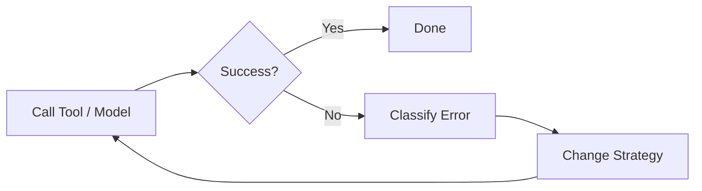

适合：

- 临时网络失败。
- JSON 格式错误。
- 可恢复的工具超时。

注意：

```text
Retry 不是重复同一件事
每次重试都必须改变策略或缩小问题
```

### Plan-Execute-Verify Loop

这是代码 Agent 最常用的结构。

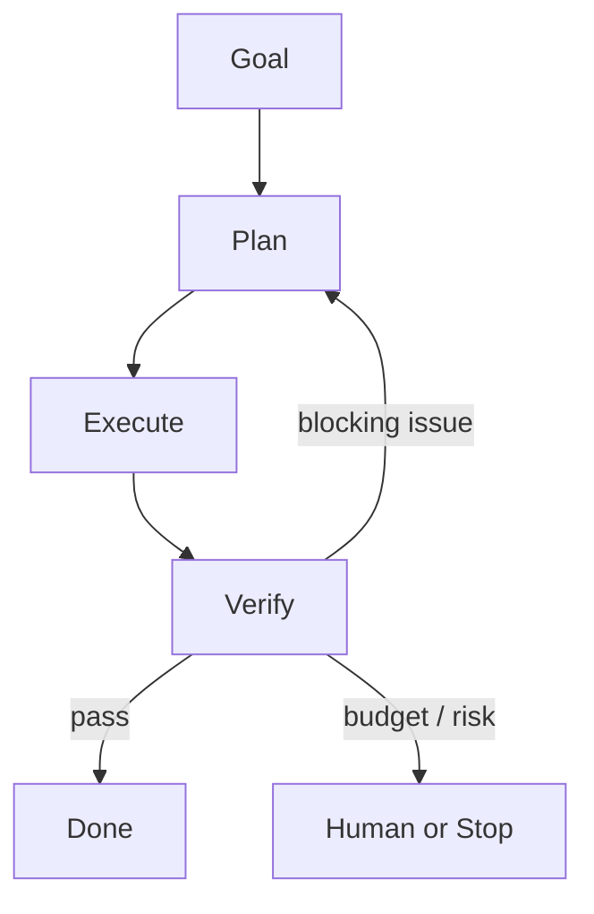

适合：

- 修 bug。
- 实现功能。
- 写文档并检查链接。
- 生成报告并验证引用。

关键点：

```text
Verify 最好和 Execute 分离
写的人不要做唯一评审者
```

### Explore-Narrow Loop

先探索，再收敛。

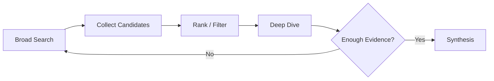

适合：

- 调研。
- 源码阅读。
- 多方案比较。
- 不知道问题根因的排障。

### Human-in-the-Loop

高风险或低置信度时停下来。

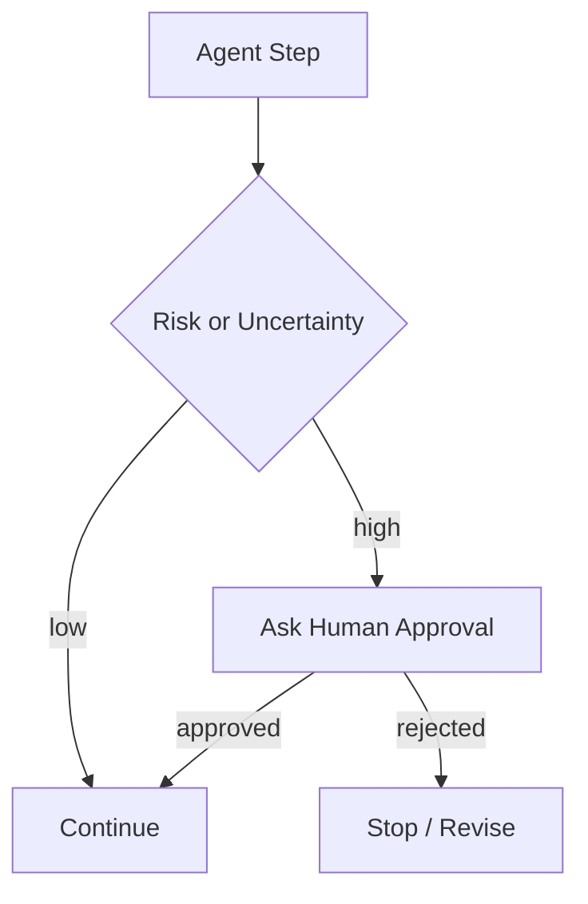

适合：

- 删除文件。
- 改生产配置。
- 发邮件。
- 花钱调用工具。
- 访问敏感数据。

### Multi-Agent Loop

多个 Agent 协作时，loop 要更严格。

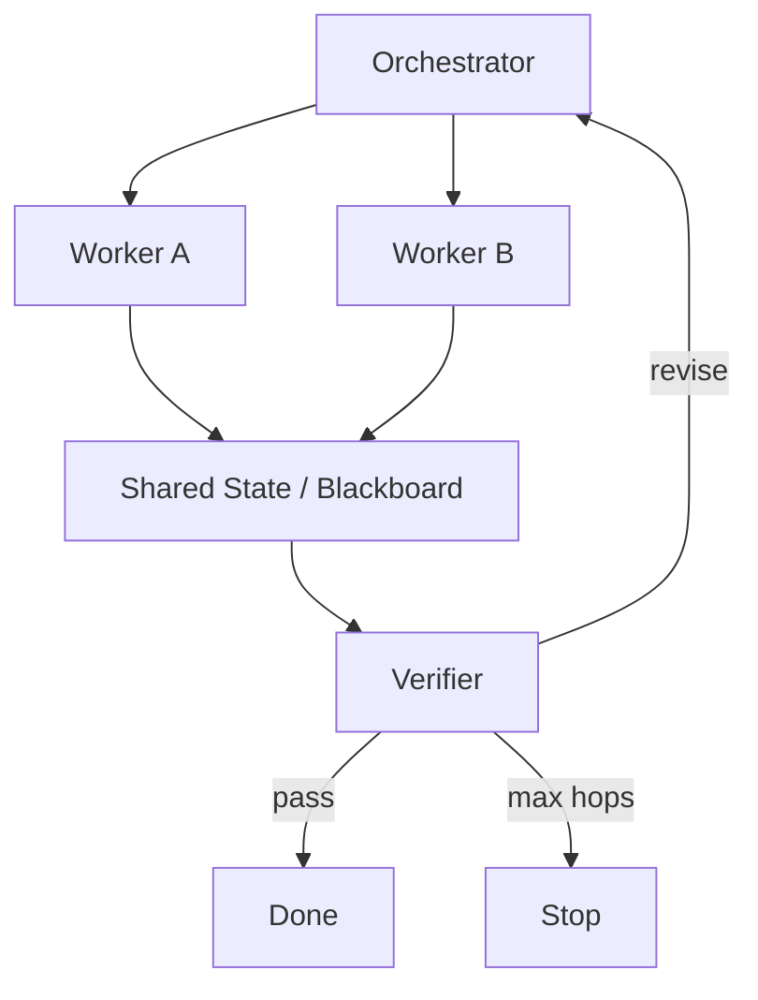

关键：

```text
多 Agent 不能自由互相聊天
必须由 orchestrator 控制 owner、contract、deadline、max_hops
```

## Workflow 和 Agent 的分界线

Loop Engineering 第一件事是判断：

```text
这个任务需要 workflow，还是需要 agent？
```

| 任务特征 | 更适合 |
| --- | --- |
| 步骤固定、风险高 | Workflow |
| 需要审批和审计 | Workflow |
| 每次路径差不多 | Workflow |
| 环境开放、路径不确定 | Agent |
| 需要根据观察动态调整 | Agent |
| 需要探索、搜索、调试 | Agent |

例子：

```text
退款审批：Workflow
代码 bug 修复：Agent
企业知识库问答：RAG workflow
复杂调研报告：Planner + Agent loop
```

真实系统常常混合：

```text
外层 workflow 控制风险
内层 agent loop 处理开放子任务
```

## 五种常见 Workflow Pattern

Anthropic 总结的几种 workflow pattern 很适合放进 Loop Engineering。

### Prompt Chaining

把任务拆成固定步骤。

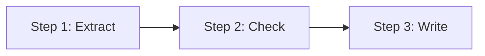

适合：

- 文档处理。
- 信息抽取。
- 固定格式生成。

关键：

```text
每一步都有明确输入输出
每一步之间可以加校验
```

### Routing

先判断类型，再走不同分支。

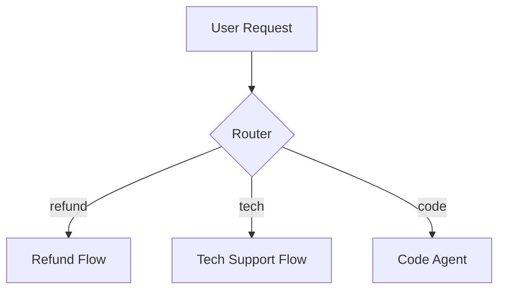

适合：

- 客服。
- 企业助手。
- 多能力产品。

关键：

```text
路由错了后面都错
所以 routing eval 很重要
```

### Parallelization

多个子任务并行。

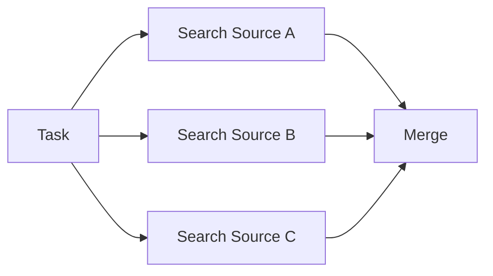

适合：

- 多源检索。
- 多文件分析。
- 多候选答案比较。

关键：

```text
合并结果时要去重、冲突检测和引用来源
```

### Orchestrator-Workers

一个 orchestrator 动态拆任务，workers 执行。

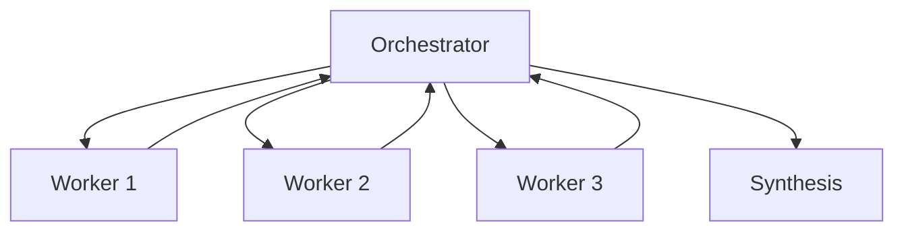

适合：

- 子任务数量不固定。
- 需要动态分工。
- 多文件代码任务。

关键：

```text
orchestrator 要控制预算、任务 contract 和停止条件
```

### Evaluator-Optimizer

生成器和评估器循环。

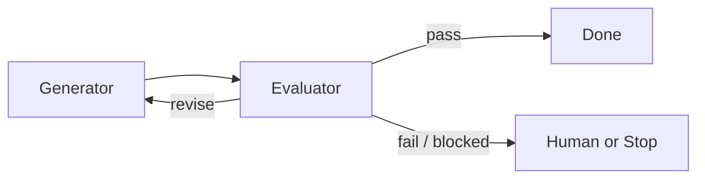

适合：

- 代码修改。
- 报告写作。
- 结构化输出。
- 高质量内容生成。

关键：

```text
Evaluator 只能用 blocking issue 触发重做
非阻塞建议不能无限循环
```

## 最小 Agent Loop

一个最小循环：

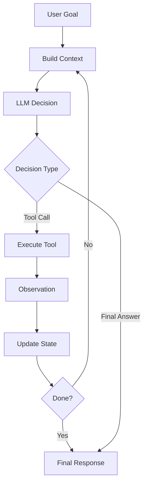

伪代码：

```python
while True:
    context = build_context(state)
    decision = call_model(context, tools=tools)

    if decision.type == "final_answer":
        return decision.content

    observation = run_tool(decision.tool_call)
    state = update_state(state, decision, observation)

    if should_stop(state):
        return summarize_current_best(state)
```

这段看起来简单，真正难的是：

```text
should_stop 怎么判断？
失败怎么恢复？
上下文怎么更新？
预算怎么控制？
```

## Loop 的状态机

不要让 Agent loop 只有 `while True`。

生产系统里建议用状态机。

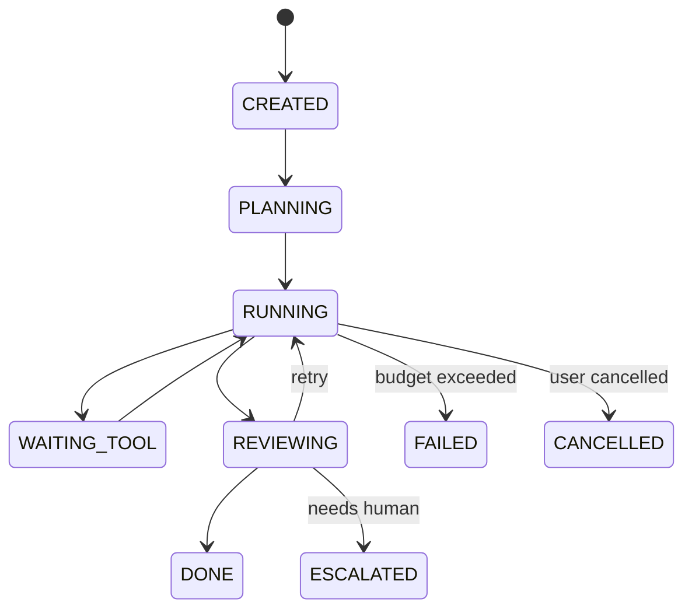

状态机的好处：

- 每一步都可观测。
- 容易恢复。
- 容易设置超时。
- 容易审计。
- 不容易无限循环。

## Loop 的输入和输出

每一轮 loop 都应该有明确输入和输出。

输入：

- 当前目标。
- 当前状态。
- 最近观察。
- 可用工具。
- 预算剩余。
- 权限。
- 相关记忆。

输出：

- 下一步动作。
- 工具参数。
- 更新后的计划。
- 是否完成。
- 是否需要用户。
- 是否需要转交。

如果输出只是自然语言：

```text
我接下来应该查一下文件。
```

系统很难执行。

更好的输出是结构化的：

```json
{
  "action": "tool_call",
  "tool": "read_file",
  "arguments": {
    "path": "src/AuthService.java"
  },
  "reason": "需要确认 token 过期判断逻辑",
  "expected_observation": "找到过期判断实现"
}
```

## 停止条件

Loop Engineering 最重要的问题是停止。

停止条件可以分成 6 类。

### 1. 目标完成

最理想的停止：

```text
任务目标已完成
验收条件已满足
```

例子：

```text
代码已修改
相关测试通过
diff 范围合理
最终说明已生成
```

### 2. 无法继续

Agent 遇到阻塞：

- 缺少权限。
- 缺少文件。
- API 失败。
- 用户信息不足。
- 工具不可用。

这时应该停止并说明阻塞，而不是继续猜。

### 3. 达到预算

预算包括：

```text
max_steps
max_tool_calls
max_agent_calls
max_tokens
max_cost
max_wall_time
max_retries
```

达到预算后要：

- 停止继续调用。
- 返回当前进展。
- 说明还缺什么。

### 4. 没有新增信息

如果连续几轮没有获得新信息，就该停。

例子：

```text
连续 3 次搜索都返回同样资料
连续 2 次测试都是同一个错误
连续 2 次修改没有改变失败原因
```

可以记录：

```text
information_gain = low
```

### 5. 质量验收通过

用 evaluator 判断是否完成。

```json
{
  "verdict": "pass",
  "blocking_issues": [],
  "confidence": 0.91
}
```

如果没有 blocking issue，就不要继续让 Agent 无休止优化。

### 6. 需要人工确认

高风险操作要停下来。

例如：

- 删除文件。
- 修改生产配置。
- 执行数据库写操作。
- 发送邮件。
- 花钱调用外部服务。

## 预算设计

预算不要只写在 prompt。

Runtime 要强制执行。

一个任务预算可以这样：

```json
{
  "max_steps": 25,
  "max_tool_calls": 40,
  "max_llm_calls": 30,
  "max_retries_per_tool": 2,
  "max_wall_time_seconds": 600,
  "max_tokens": 200000,
  "max_cost_usd": 3.0
}
```

每轮 loop 都应该看到剩余预算：

```json
{
  "steps_left": 8,
  "tool_calls_left": 12,
  "wall_time_left_seconds": 120
}
```

这样模型更容易做取舍。

但最终执行权在 runtime。

## 错误恢复

Agent 不可避免会遇到失败。

常见失败：

| 失败 | 恢复方式 |
| --- | --- |
| 工具超时 | 重试一次，降低输入规模 |
| 文件不存在 | 搜索路径或请求用户 |
| 测试失败 | 读取失败日志，定位原因 |
| API rate limit | backoff，减少并发 |
| JSON 输出不合法 | 修复格式，不重做全部任务 |
| 权限不足 | 请求审批或返回阻塞 |
| 上下文太长 | 压缩历史，保留关键状态 |

恢复不是无脑 retry。

每次 retry 都要有新策略：

```text
同样输入、同样工具、同样参数，重复三次通常没有意义。
```

## 反思循环要谨慎

很多 Agent 会加 Reflexion：

```text
失败
  ↓
反思原因
  ↓
重试
```

这有用，但也危险。

如果没有可靠反馈，反思可能变成自我编故事。

建议：

- 只在有明确失败信号时反思。
- 反思输出结构化。
- 只允许有限轮重试。
- 反思要绑定证据。
- 成功后才考虑写入记忆。

结构化反思：

```json
{
  "failure_type": "test_failed",
  "evidence": "AuthServiceTest line 42 failed",
  "hypothesis": "边界时间使用了本地时区",
  "next_strategy": "检查 token expiry 比较逻辑",
  "retry_allowed": true
}
```

## Planner、Executor、Evaluator Loop

一个更稳的 loop 是三段式：

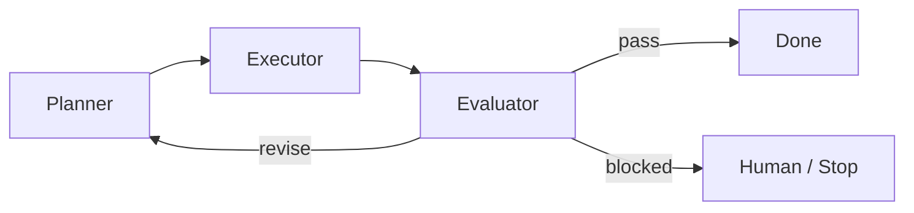

这比单个 Agent 自己判断更稳。

Planner 负责：

- 拆任务。
- 更新计划。

Executor 负责：

- 调工具。
- 产出 artifacts。

Evaluator 负责：

- 判断完成度。
- 给出 blocking issue。

## Loop 和上下文压缩

长任务里，历史会越来越长。

不能每轮把完整历史放进去。

需要压缩：

```text
raw trace
  ↓
state summary
  ↓
task ledger
  ↓
current context
```

保留：

- 目标。
- 约束。
- 已完成事项。
- 关键证据。
- 当前阻塞。
- 下一步。

丢弃：

- 重复日志。
- 无关探索。
- 过期假设。
- 大量原始输出。

## Loop 和工具结果

工具结果不能原样乱塞。

建议：

```text
raw tool output
  ↓
artifact storage
  ↓
summary
  ↓
important snippets
  ↓
context injection
```

例子：

```json
{
  "tool": "run_tests",
  "status": "failed",
  "summary": "1 test failed: AuthServiceTest.testExpiredToken",
  "important_lines": [
    "expected: expired",
    "actual: valid"
  ],
  "artifact_ref": "artifacts/test-log-001.txt"
}
```

## Loop 和 Multi-Agent

Multi-Agent 的 loop 更容易失控。

所以每个 delegation 都要有：

- owner。
- contract。
- deadline。
- max_hops。
- allowed actions。
- expected output。
- done condition。

不要让 Worker Agent 自由互相拉群聊天。

## Loop 观测指标

Loop 需要指标。

| 指标 | 说明 |
| --- | --- |
| steps | 总步数 |
| llm_calls | 模型调用次数 |
| tool_calls | 工具调用次数 |
| retries | 重试次数 |
| time_to_done | 完成耗时 |
| cost | token 和工具成本 |
| blocked_rate | 阻塞率 |
| human_escalation_rate | 转人工比例 |
| repeated_action_rate | 重复动作比例 |
| no_information_gain_steps | 无新增信息步数 |

这些指标能直接指导优化：

```text
重复动作多 -> 调整状态和停止条件
阻塞率高 -> 工具权限或上下文缺失
成本高 -> 压缩历史或减少反思轮次
```

## Loop Engineering Checklist

做 Agent loop 时检查：

- 是否有明确状态机？
- 每轮输出是否结构化？
- 是否有预算？
- 预算是否由 runtime 强制？
- 是否有目标完成判定？
- 是否有 evaluator？
- 是否有无新增信息检测？
- 是否有限制 retry？
- 高风险动作是否会停下来？
- 工具结果是否被摘要？
- 长历史是否会压缩？
- 是否能取消任务？
- 是否能从中断恢复？
- 是否保存 trace？

## 下一步

继续读：

- [Harness Engineering：把模型变成可用 Agent 的工程](harness-engineering.md)
- [Multi-Agent 协作、自进化与记忆系统](multi-agent-collaboration-memory.md)
- [大型 Agent 系统架构设计](large-agent-system-architecture.md)
- [Agent 效果评测框架](agent-evaluation-framework.md)
- [上下文工程入门](context-engineering-beginner.md)
- [Reasoning Models 与 Test-Time Compute 入门](reasoning-models-test-time-compute.md)
- [参数调优手册](parameter-tuning-handbook.md)

## 参考资料

- [Addy Osmani: Loop Engineering](https://addyosmani.com/blog/loop-engineering/)
- [MindStudio: What Is Loop Engineering? The New Meta for AI Coding Agents](https://www.mindstudio.ai/blog/what-is-loop-engineering-ai-coding-agents)
- [Anthropic: Building Effective Agents](https://www.anthropic.com/engineering/building-effective-agents)
- [LangGraph Overview](https://docs.langchain.com/oss/python/langgraph/overview)
- [OpenAI Agents SDK 文档](https://developers.openai.com/api/docs/guides/agents)
