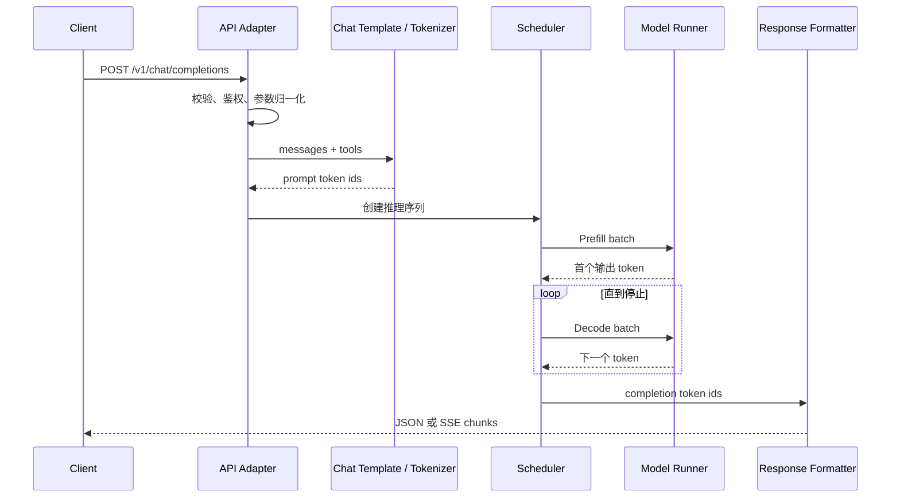
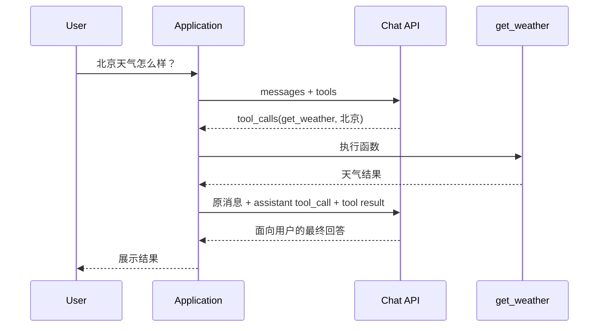

# OpenAI-compatible Chat API 执行链路：从 messages 到逐 Token 返回

调用聊天接口时，我们提交的是一段 JSON：

```json
{
  "model": "Qwen3-0.6B",
  "messages": [
    {"role": "system", "content": "你是一名 Java 开发工程师。"},
    {"role": "user", "content": "你是谁？"}
  ],
  "temperature": 0.7,
  "stream": false
}
```

模型真正接收的却不是 JSON，而是一串 token id。

中间至少要经过：

```text
HTTP JSON
  ↓
请求校验与参数归一化
  ↓
Chat Template 渲染
  ↓
Tokenizer 编码
  ↓
请求调度与 KV Cache 分配
  ↓
Prefill
  ↓
逐 Token Decode 与 Sampling
  ↓
Detokenize
  ↓
JSON 或 SSE 返回
```

这篇只回答一个问题：

> 一次 OpenAI-compatible Chat Completions 请求，如何在本地推理服务中完成从 `messages` 到模型输出的转换？

文中的 HTTP 协议以 OpenAI Chat Completions 的公开接口为参照，推理引擎部分以 `nano-vllm`、vLLM 和 Transformers 的公开实现为参照。它解释的是一种可观察、可复现的兼容服务链路，**不代表 OpenAI 托管模型的内部实现**。

如果你还不熟悉 Chat Completions 和 Responses API 的请求结构，先读：[LLM API：从 HTTP 请求到 Transformer](openai-api-beginner.md)。

## 先看完整链路



每一层有不同职责：

| 层 | 输入 | 输出 | 主要职责 |
| --- | --- | --- | --- |
| API Adapter | HTTP JSON | 归一化请求 | 校验字段、鉴权、限流、模型路由 |
| Chat Template | `messages`、`tools` | 格式化 prompt | 把角色、工具和控制标记拼成模型熟悉的格式 |
| Tokenizer | prompt 文本 | token ids | 分词、查词表、处理特殊 token |
| Scheduler | token ids、采样参数 | 执行批次 | 排队、批处理、KV Cache 分配、抢占 |
| Model Runner | 当前批次 | logits / token ids | 执行 Transformer 前向计算与采样 |
| Response Formatter | 输出 token ids | JSON / SSE | 解码文本、解析工具调用、包装协议 |

理解这张表之后，再看任何 SDK、推理框架或模型模板，都能知道它属于哪一层。

## 第一步：客户端提交 Chat 请求

本地的 OpenAI-compatible 服务通常暴露：

```text
POST http://localhost:8000/v1/chat/completions
```

最小请求可以写成：

```bash
curl http://localhost:8000/v1/chat/completions \
  -H "Content-Type: application/json" \
  -d '{
    "model": "Qwen3-0.6B",
    "messages": [
      {"role": "system", "content": "你是一名 Java 开发工程师。"},
      {"role": "user", "content": "你是谁？"}
    ],
    "temperature": 0.7,
    "max_tokens": 128,
    "stream": false
  }'
```

API 层首先处理的是协议问题，而不是矩阵计算：

- 请求 JSON 是否合法。
- `model` 是否存在。
- `messages` 的角色和内容是否符合约束。
- `temperature`、`top_p`、`max_tokens` 是否在允许范围内。
- 是否需要鉴权、限流或内容策略检查。
- 请求应该进入哪个模型实例和调度队列。

处理完这些事项，服务端才会把结构化请求转换成模型输入。

## 第二步：Chat Template 把 messages 变成模型格式

Chat 模型仍然是“续写下一个 token”的语言模型。`system`、`user`、`assistant` 并不是 Transformer 原生理解的 JSON 字段，而是要通过模型对应的 Chat Template 变成特殊标记和文本排列。

例如，上面的消息对某类 Qwen 模型可能被渲染为：

```text
<|im_start|>system
你是一名 Java 开发工程师。<|im_end|>
<|im_start|>user
你是谁？<|im_end|>
<|im_start|>assistant
```

这只是某类模型的格式。其他模型可能使用 `[INST]`、`<|start_header_id|>` 或不同的角色标记。

Transformers 中可以直接调用模型自带的模板：

```python
messages = [
    {"role": "system", "content": "你是一名 Java 开发工程师。"},
    {"role": "user", "content": "你是谁？"},
]

input_ids = tokenizer.apply_chat_template(
    messages,
    tokenize=True,
    add_generation_prompt=True,
    return_tensors="pt",
)
```

`add_generation_prompt=True` 的作用，是在末尾添加“下一段应该由 assistant 生成”的起始标记。它不是所有模型都需要；是否产生效果取决于模板本身。

### 为什么模板不能随便换

Chat Template 应与模型训练或后训练时使用的格式一致。

模板错了，常见结果包括：

- 模型继续补写用户消息，而不是回答。
- 系统指令被当成普通文本。
- 多轮对话的角色边界错乱。
- 工具调用标签无法被服务端解析。
- 重复加入 BOS、EOS 等特殊 token，导致质量下降。

如果先用 `tokenize=False` 得到文本，再单独调用 `tokenizer.encode()`，还要留意是否重复添加特殊 token。能直接用 `apply_chat_template(..., tokenize=True)` 时，通常更不容易出错。

## tools 参数如何进入上下文

请求可以携带函数工具：

```json
{
  "tools": [
    {
      "type": "function",
      "function": {
        "name": "get_weather",
        "description": "查询指定城市的天气",
        "parameters": {
          "type": "object",
          "properties": {
            "city": {"type": "string"}
          },
          "required": ["city"]
        }
      }
    }
  ]
}
```

在开源服务中，工具定义通常会经过模型模板，变成模型见过的工具说明、JSON Schema、XML 标签或专用控制 token。模型随后生成符合该模型协议的工具调用文本，服务端再用对应 parser 转成 API 的 `tool_calls` 字段。

因此不能把工具调用简化成“API 把一段固定的隐藏系统提示词塞给所有模型”。更准确的说法是：

```text
OpenAI 风格 tools
  ↓
模型专属 Chat Template
  ↓
模型专属 tool-call 格式
  ↓
服务端 Tool Parser
  ↓
OpenAI 风格 tool_calls
```

模板、模型和 parser 必须匹配。换模型后只沿用旧 parser，常常会出现“模型明明输出了工具调用，API 却把它当普通文本”的问题。

## 第三步：Tokenizer 把文本变成 token id

模板输出仍然是字符串。Tokenizer 会将它切成 token，并映射到词表中的整数：

```text
<|im_start|>system
你是一名 Java 开发工程师。...
```

可能变成：

```text
[151644, 8948, 198, 56568, ..., 151645, 198]
```

这些数字才是模型真正接收的输入。

这里要分清三件事：

1. token 不等于“字”。一个 token 可能是一个汉字、多个字符、英文片段、空格或标点。
2. `<|im_start|>` 一类控制符通常也是词表里的特殊 token，不是 Transformer 之外的魔法指令。
3. Tokenizer 的 `decode()` 是逆向映射，但流式解码时可能需要等待多个 token，才能组成合法、可显示的文本片段。

## 第四步：API Server 与推理引擎在这里分工

这是最容易混淆的边界。

以 `nano-vllm` 当前公开源码为例，它的核心定位是轻量级离线推理引擎。`LLMEngine.add_request()` 接收 prompt 字符串或 token id 列表，再交给 Scheduler；核心仓库本身并不负责解析 `/v1/chat/completions` 的 HTTP JSON。

因此，一个完整的兼容服务通常是两层：

```text
OpenAI-compatible API Server
  - HTTP
  - messages / tools
  - Chat Template
  - JSON / SSE formatter

Inference Engine
  - request sequence
  - Scheduler
  - Model Runner
  - KV Cache
  - Prefill / Decode
```

vLLM 把这两层一起提供了；nano-vllm 更适合用来阅读第二层的核心实现。给 nano-vllm 外面再包一个 API Adapter，才能接收前面的 `curl` 请求。

这个边界也说明：

> OpenAI-compatible 表示接口形状尽量兼容，不表示底层模型、Chat Template、采样默认值和调度实现都与 OpenAI 相同。

## 第五步：Scheduler 建立序列并安排批次

Tokenizer 产生 token ids 后，引擎会把请求包装成一个 Sequence。它通常包含：

```text
prompt token ids
completion token ids
当前状态
采样参数
最大输出长度
KV Cache block table
已缓存 token 数
本轮计划计算的 token 数
```

在 nano-vllm 中，请求大致经历两个队列：

| 状态 / 队列 | 含义 |
| --- | --- |
| `WAITING` / `waiting` | 新请求等待分配 KV Cache 并完成 Prefill |
| `RUNNING` / `running` | Prompt 已处理完成，正在逐步 Decode |
| `FINISHED` | 遇到 EOS、停止条件或输出长度上限 |

它的控制循环可以浓缩成：

```python
while not engine.is_finished():
    sequences, is_prefill = scheduler.schedule()
    next_token_ids = model_runner.run(sequences, is_prefill)
    scheduler.postprocess(sequences, next_token_ids, is_prefill)
```

调度器还要处理：

- 一个批次最多容纳多少序列。
- 一个批次最多容纳多少 token。
- 长 Prompt 是否做 Chunked Prefill。
- 相同前缀是否命中 Prefix Cache。
- 新 token 是否需要额外 KV Cache block。
- 显存不足时是否抢占并重新排队。

nano-vllm 的简化调度策略会优先返回已安排的 Prefill 批次；没有待处理 Prefill 时，再安排 running 序列的 Decode。生产引擎可能使用更复杂的 continuous batching、优先级和混合调度策略。

## 第六步：Prefill 读取整段输入

Prefill 是处理 Prompt 的阶段。

假设模板和 Tokenizer 最终产生了 1,000 个输入 token。模型会处理这 1,000 个位置；如果服务开启 Chunked Prefill，也可能分成几个 chunk 完成。

在每一层 Attention 中，模型会为这些位置计算 Key 和 Value，并把后续生成仍需要的 K/V 写入 KV Cache。

```text
1,000 个输入 token
  ↓
Embedding + RoPE
  ↓
多层 Attention / FFN
  ↓
写入各层 KV Cache
  ↓
取得最后位置的 logits
  ↓
采样首个 completion token
```

Prompt 内的不同位置可以利用 GPU 做并行矩阵计算，因此 Prefill 往往更偏计算密集。它直接影响首 token 延迟，也就是 TTFT（Time to First Token）。

KV Cache 保存的是 Attention 后续计算需要复用的 K/V 张量。它是推理缓存，不是产品里的长期 Memory，也不会让模型凭空记住跨请求信息。

## 第七步：Decode 逐个位置生成

首个输出 token 产生后，请求进入 Decode。

对于同一条序列，第 2 个输出 token 依赖第 1 个，第 3 个又依赖前两个，因此生成具有自回归依赖：

```text
token 1 -> token 2 -> token 3 -> ...
```

有了 KV Cache，每个 Decode step 不必重新计算全部历史位置的 K/V。引擎只处理当前新增位置，同时读取已有 Cache 做 Attention，再把新位置的 K/V 追加进去。

```text
当前 token
  +
历史 KV Cache
  ↓
本轮 Transformer forward
  ↓
logits
  ↓
sampling
  ↓
下一个 token
```

需要修正一个常见说法：

> Decode 在单条序列内部必须按顺序进行，但 GPU 仍然可以把多条活跃序列的 Decode step 组成 batch 并行执行。

所以“Decode 无法并行”只适用于同一序列的时间依赖，不代表服务器一次只能服务一个请求。

Prefill 与 Decode 的差异可以总结为：

| 对比 | Prefill | Decode |
| --- | --- | --- |
| 处理对象 | 输入 Prompt | 新生成位置 |
| 单序列一次处理量 | 多个 token，可被切块 | 通常一个新位置 |
| 主要缓存动作 | 建立 KV Cache | 读取并追加 KV Cache |
| 典型瓶颈 | 计算量、输入长度 | 显存带宽、KV Cache、模型大小 |
| 常用指标 | TTFT、Prefill tok/s | TPOT、ITL、Decode tok/s |

## 第八步：Sampling 与停止条件决定下一个 token

Model Runner 输出的是词表上每个候选 token 的 logits。采样器再根据请求参数选择下一个 token：

```text
logits
  ↓ temperature
调整分布尖锐程度
  ↓ top-p / top-k
缩小候选集合
  ↓ sampling
选出 token id
```

选出的 token 会追加到 Sequence。调度器随后检查：

- 是否遇到模型的 EOS token。
- 是否命中 `stop` 序列。
- 是否达到 `max_tokens`。
- 是否因工具调用、内容策略或取消请求而结束。

因此参数作用在不同位置：

| 参数 | 主要生效位置 |
| --- | --- |
| `messages`、`tools` | Chat Template / 上下文构建 |
| `temperature`、`top_p` | Sampling |
| `max_tokens`、`stop` | Decode 控制与后处理 |
| `stream` | 返回协议 |

`stream=true` 不会把自回归模型变成另一种生成算法，只是让 API 层更早地把增量结果交给客户端。

## 第九步：Detokenize 并包装响应

生成结束后，Tokenizer 把 completion token ids 解码为文本：

```python
text = tokenizer.decode(completion_token_ids)
```

非流式响应会在完成后一次性返回：

```json
{
  "id": "chatcmpl_local_123",
  "object": "chat.completion",
  "model": "Qwen3-0.6B",
  "choices": [
    {
      "index": 0,
      "message": {
        "role": "assistant",
        "content": "我是一个可以协助你解决开发问题的 AI 助手。"
      },
      "finish_reason": "stop"
    }
  ],
  "usage": {
    "prompt_tokens": 24,
    "completion_tokens": 18,
    "total_tokens": 42
  }
}
```

流式响应则通过 SSE 返回一系列增量事件或 chunk。

但“模型每生成一个 token，网络就一定发送一个 chunk”也不准确。服务端可能因为以下原因缓冲或合并：

- 一个 token 还不能组成合法的 UTF-8 文本。
- Stop Sequence 检测需要保留尾部字符。
- 工具调用 parser 要等到结构足够完整。
- 网络层会合并多个小增量。
- 服务实现选择按文本片段而不是 token 返回。

所以 token、可见字符和 SSE chunk 不是一一对应关系。

## Function Calling 是两次模型请求之间的应用循环

对于自定义函数工具，模型服务通常只负责决定和表达工具调用，不会替你的业务程序执行函数。

完整链路是：



这说明工具调用跨越了三类协议：

1. API 请求中的 OpenAI 风格 `tools`。
2. 模型内部使用的专属工具调用格式。
3. 应用真正执行函数并回填结果的业务协议。

把这三层混在一起，是工具调用兼容问题最常见的来源。

## 一个最小 API Adapter 伪实现

下面的代码只用于把各层串起来，不是生产实现：

```python
def chat_completions(request):
    body = validate_request(request.json())
    tokenizer, engine = model_registry.get(body["model"])

    input_ids = tokenizer.apply_chat_template(
        body["messages"],
        tools=body.get("tools"),
        tokenize=True,
        add_generation_prompt=True,
    )

    completion_ids = engine.generate(
        prompt=input_ids,
        temperature=body.get("temperature", 1.0),
        top_p=body.get("top_p", 1.0),
        max_tokens=body.get("max_tokens", 512),
    )

    parsed = tool_parser_or_text(
        tokenizer.decode(completion_ids)
    )

    return format_chat_completion(parsed)
```

生产版本还需要：

- 异步请求和断开连接取消。
- Streaming detokenizer。
- Continuous batching。
- Prefix Cache 与 KV Cache 分页管理。
- 工具调用与 Structured Output parser。
- 限流、超时、审计和指标。
- 模型特定的模板与采样默认值。

## 如何定位一条慢请求

理解链路后，不要只看“总耗时”。按阶段拆指标更有用：

| 现象 | 优先检查 | 常见原因 |
| --- | --- | --- |
| 请求很久才出现第一个字 | API 排队、Template、Tokenization、Prefill | 队列拥塞、Prompt 太长、Prefill 批次过大 |
| 首字很快，后续输出慢 | Decode、KV Cache、网络流 | 模型太大、显存带宽、活跃 batch、流缓冲 |
| 并发升高后延迟突然恶化 | Scheduler、KV Cache block、抢占 | Cache 不足、频繁 preemption、批次参数不合适 |
| 工具调用变成普通文本 | Template、模型、Tool Parser | 三者协议不匹配 |
| 相同请求输出格式不同 | Sampling、模型配置 | temperature、generation config、默认参数差异 |
| Streaming 有内容但前端不显示 | SSE parser、代理缓冲、UTF-8 增量 | 客户端解析错误、反向代理缓冲 |

建议至少记录：

```text
request_received_at
queue_enter_at
prefill_start_at
first_token_at
last_token_at
prompt_tokens
completion_tokens
finish_reason
model_name
template_version
```

有了这些数据，才能区分：

```text
网络慢
排队慢
Prefill 慢
Decode 慢
返回层慢
```

## 常见误区

### 误区 1：模型直接读取 messages JSON

模型最终读取的是模板渲染后的 token id。JSON 属于 API 层。

### 误区 2：OpenAI-compatible 等于 OpenAI 内部实现

兼容通常只承诺接口字段和行为尽量相近。底层模型、模板、参数默认值、工具 parser 和调度器都可能不同。

### 误区 3：一个 token 就是一个字

token 是词表片段。字符、token 和网络 chunk 没有固定的一一对应关系。

### 误区 4：Decode 只能串行，所以不能批处理

单序列的 token 有先后依赖；多条序列仍然可以组成 Decode batch。

### 误区 5：KV Cache 是模型的长期记忆

KV Cache 是当前推理序列的计算缓存。产品 Memory 是另一套存储、检索和权限系统。

### 误区 6：tools 一定变成固定的隐藏 Prompt

工具如何进入模型上下文由模型模板决定，也可能结合特殊 token、grammar 和服务端 parser。

### 误区 7：nano-vllm 的 LLMEngine 就是 Chat API Server

LLMEngine 负责推理核心。HTTP、`messages`、Chat Template、SSE 和 OpenAI 风格响应通常需要外层 Adapter。

## 自己验证这条链路

想在本地调试时，可以按这个顺序观察：

1. 打印原始 `messages`。
2. 打印 `apply_chat_template(..., tokenize=False)` 的结果。
3. 打印 Tokenizer 产生的 input ids 和 token 数量。
4. 在 Scheduler 记录 waiting、running、scheduled token 数。
5. 分别记录 Prefill 和 Decode 吞吐。
6. 记录首 token 时间与每步 Decode 时间。
7. 打印 completion ids 的增量解码结果。
8. 带 `tools` 重复一次，观察模板输出和 parser 结果。

只要这八个观察点打通，一次 Chat 请求就不再是黑盒。

## 下一步

- 想继续理解 KV Cache、PagedAttention 和 Batching：[LLM 推理与架构优化入门](llm-inference-architecture.md)
- 想理解 temperature、top-p 和服务参数：[参数调优手册](parameter-tuning-handbook.md)
- 想理解工具调用如何进入应用架构：[LLM 应用架构](llm-application-architecture.md)
- 想比较 vLLM、SGLang 和 llama.cpp：[本地部署框架对比](local-deployment-frameworks.md)

## 参考资料

- [原始文章：OpenAI Chat API 的执行过程解析](https://blog.lacknb.cn/articles/2026/07/11/1783760699988.html)
- [OpenAI Chat API Reference](https://developers.openai.com/api/reference/resources/chat)
- [Transformers Chat Templates](https://huggingface.co/docs/transformers/en/chat_templating)
- [vLLM OpenAI-Compatible Server 文档源码](https://github.com/vllm-project/vllm/blob/main/docs/serving/online_serving/openai_compatible_server.md)
- [vLLM Chat Template 文档源码](https://github.com/vllm-project/vllm/blob/main/docs/serving/online_serving/README.md#chat-template)
- [nano-vllm](https://github.com/GeeeekExplorer/nano-vllm)
- [nano-vllm LLMEngine](https://github.com/GeeeekExplorer/nano-vllm/blob/main/nanovllm/engine/llm_engine.py)
- [nano-vllm Scheduler](https://github.com/GeeeekExplorer/nano-vllm/blob/main/nanovllm/engine/scheduler.py)
