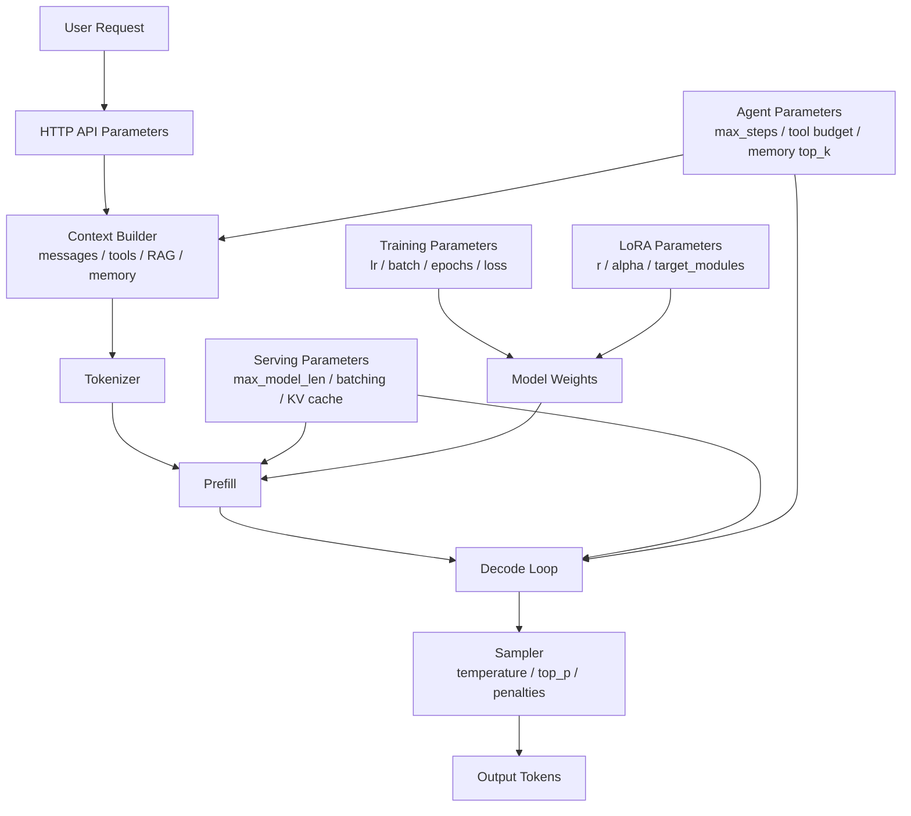
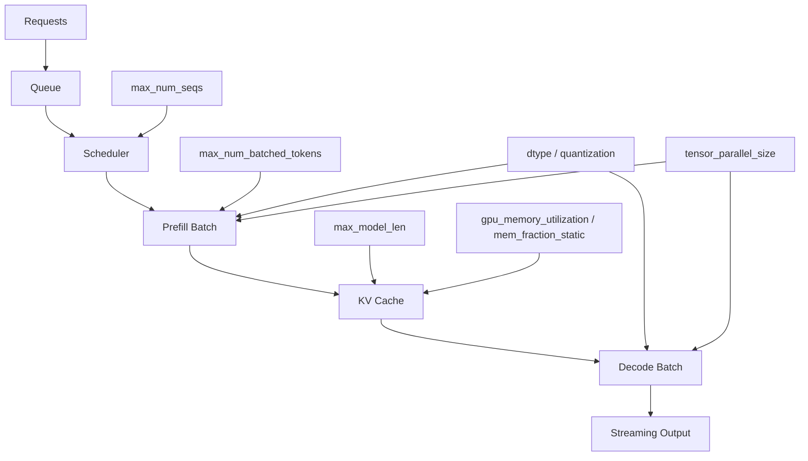

# 参数调优手册：API、训练、部署与 Agent

参数很多，先不要背。

先问一个问题：

> 这个参数到底在控制哪一层？

同样叫“调参”，可能完全不是一回事：

```text
API 采样参数：控制模型怎么生成下一个 token
上下文参数：控制模型这一轮能看到什么
训练参数：控制模型怎么更新权重
LoRA 参数：控制 adapter 怎么学习
部署参数：控制推理服务怎么排队、缓存、并发
Agent 参数：控制 loop、工具、记忆和停止条件
评测参数：控制怎么判断改动是否真的变好
```

如果层次没分清，就容易出现这种情况：

```text
明明是检索召回差，却一直调 temperature
明明是 KV Cache 显存不够，却一直换 prompt
明明是训练数据格式错，却一直调 learning_rate
明明是 Agent 停止条件差，却一直换更强模型
```

## 总图：参数在哪一层生效



可以先记住：

| 层 | 你在调什么 | 典型参数 |
| --- | --- | --- |
| API 采样 | 输出风格、随机性、长度 | `temperature`、`top_p`、`max_output_tokens` |
| 结构化输出 | JSON、工具调用、schema | `tools`、`tool_choice`、`response_format` / `text.format` |
| 上下文 | 输入质量和 token 预算 | history window、RAG `top_k`、compression |
| 训练 | 模型是否学进去 | `learning_rate`、`batch_size`、`epochs` |
| LoRA | adapter 容量和稳定性 | `r`、`lora_alpha`、`target_modules` |
| 部署 | 延迟、吞吐、显存、并发 | `max_model_len`、`max_num_seqs`、`max_num_batched_tokens` |
| Agent | 循环次数、工具次数、停止 | `max_steps`、`max_tool_calls`、`max_retries` |
| 评测 | 判断改动是否有效 | sample size、pass threshold、grader version |

## 调参第一原则

一次只改一类参数。

不要同时改：

```text
prompt + temperature + top_p + 模型版本 + 部署 batch + 检索 top_k
```

否则你不知道效果变化来自哪里。

更好的流程：

```text
固定任务集
  ↓
固定模型版本
  ↓
固定 prompt / context
  ↓
每次只改一类参数
  ↓
记录指标和样例
  ↓
再决定是否扩大实验
```

## 快速定位：问题属于哪一层

| 现象 | 优先怀疑 | 第一批要看的参数 |
| --- | --- | --- |
| 回答太发散 | 采样层 | `temperature`、`top_p` |
| 回答太短 | 输出长度层 | `max_output_tokens` / `max_completion_tokens`、`stop` |
| JSON 经常坏 | 结构化输出层 | `text.format` / `response_format`、schema、temperature |
| 工具乱调用 | 工具层 | `tool_choice`、工具描述、工具权限 |
| 首 token 很慢 | prefill / 排队 | 输入长度、prefix cache、batch、queue time |
| 已经输出但很慢 | decode | TPOT、batch、模型大小、量化、KV Cache |
| 并发一高就 OOM | KV Cache / 调度 | `max_model_len`、`max_num_seqs`、KV cache dtype |
| 微调后格式不稳 | 数据 / template | SFT 数据格式、chat template、epochs |
| 微调后幻觉变多 | 数据 / 过拟合 | 数据质量、learning rate、epochs、eval |
| Agent 停不下来 | loop 层 | `max_steps`、done condition、evaluator |
| Agent 反复查同一资料 | memory / loop | no information gain、tool budget、state summary |

## API 采样参数

这些参数通常出现在 HTTP 请求体里。

不同接口命名略有差异：

| 接口风格 | 常见输出长度参数 |
| --- | --- |
| Responses API | `max_output_tokens` |
| Chat Completions | `max_completion_tokens` 或旧式 `max_tokens` |
| OpenAI-compatible 本地服务 | 常见 `max_tokens` |

不要只背字段名，要理解它们在哪里生效：

```text
Transformer 输出 logits
  ↓
temperature / top_p / penalties 修改候选分布
  ↓
sampler 选出下一个 token
  ↓
重复 decode，直到 stop 或达到 max tokens
```

### `temperature`

控制随机性。

| 值 | 直觉 | 适合 |
| --- | --- | --- |
| `0` | 尽量确定 | 分类、抽取、严格格式 |
| `0.1` - `0.3` | 稳定 | 代码解释、客服、严肃问答 |
| `0.4` - `0.7` | 有一定变化 | 教学、总结、普通写作 |
| `0.8` - `1.2` | 更开放 | 创意写作、头脑风暴 |

经验：

```text
越需要稳定，temperature 越低。
越需要创意，temperature 可以稍高。
```

但高 temperature 不是“更聪明”，只是更愿意选低概率 token。

### `top_p`

`top_p` 是 nucleus sampling。

它不是直接控制随机性，而是控制候选 token 集合。

例子：

```text
top_p = 0.9
只保留累计概率达到 90% 的候选 token
然后再采样
```

常见经验：

| 值 | 效果 |
| --- | --- |
| `0.1` - `0.5` | 候选很窄，回答更保守 |
| `0.8` - `0.95` | 常用范围 |
| `1.0` | 不用 nucleus 截断 |

一般不要同时大幅调整 `temperature` 和 `top_p`。

先固定 `top_p=1` 调 `temperature`，或者固定 `temperature` 调 `top_p`。

### `top_k` 和 `min_p`

很多本地推理框架支持：

| 参数 | 作用 |
| --- | --- |
| `top_k` | 只保留概率最高的 k 个 token |
| `min_p` | 丢掉相对概率太低的 token |

OpenAI API 不一定暴露这些字段，但 llama.cpp、vLLM、SGLang 或其他 OpenAI-compatible 服务可能支持。

### `max_output_tokens` / `max_completion_tokens` / `max_tokens`

控制最多生成多少 token。

它不是“希望模型回答多长”，而是硬上限。

如果设置太小：

```text
答案被截断
JSON 没闭合
工具参数没生成完整
推理模型还没来得及输出最终答案
```

如果设置太大：

```text
成本增加
延迟增加
Agent 更容易啰嗦
streaming 时间变长
```

经验：

| 任务 | 输出上限起点 |
| --- | --- |
| 分类 / 判断 | 16 - 128 |
| 信息抽取 | 128 - 512 |
| 普通问答 | 512 - 1500 |
| 长文总结 | 1500 - 4000 |
| 代码修改说明 | 1000 - 3000 |
| 长链路 Agent 汇报 | 2000 - 6000 |

推理模型还要注意：

```text
有些接口的输出 token 上限可能包含 reasoning tokens。
如果上限太小，模型可能还没完成内部推理就被截断。
```

### `reasoning_effort` / `thinking_budget`

Reasoning 参数控制的是推理预算，不是采样随机性。

可以先这样理解：

| 参数 | 常见叫法 | 直觉 |
| --- | --- | --- |
| `reasoning.effort` | low / medium / high | 让模型花多少力气推理 |
| `thinking.budget_tokens` | thinking budget | 给内部思考多少 token 预算 |
| `thinkingConfig.thinkingBudget` | Gemini thinking budget | 控制思考预算 |

它和 `temperature` 的区别：

```text
reasoning_effort：更像给模型更多解题时间
temperature：更像控制下一个 token 选择有多随机
```

调参经验：

| 任务 | 起点 |
| --- | --- |
| 简单分类、抽取、改写 | low 或不用 reasoning |
| 代码解释、SQL、普通分析 | medium |
| 数学、算法、多文件代码、架构评审 | medium 到 high |
| 工具执行和真实副作用 | 不只看 reasoning，还要看 Guardrails |

高 reasoning 会增加延迟和成本。

如果问题是资料不足、工具权限不足或上下文污染，提高 reasoning 往往没用。

更系统的解释见：[Reasoning Models 与 Test-Time Compute 入门](reasoning-models-test-time-compute.md)。

### `stop`

`stop` 是停止序列。

适合：

- 控制模板边界。
- 兼容旧式 completion。
- 防止模型继续生成下一段角色。

风险：

```text
stop 写得太宽，会提前截断。
stop 写得太窄，可能完全不起作用。
```

在 chat / responses 风格接口里，不要过度依赖 `stop` 管理复杂格式。更推荐结构化输出。

### 重复惩罚参数

常见参数：

| 参数 | 作用 |
| --- | --- |
| `frequency_penalty` | 出现越多的 token 越容易被惩罚 |
| `presence_penalty` | 只要出现过，就降低再次出现概率 |
| `repetition_penalty` | 本地推理常见，减少重复 |

适合：

- 模型重复同一句话。
- 列表项不断循环。
- 长文本生成啰嗦。

不适合：

- 代码生成。
- 严格术语。
- JSON 字段名固定的任务。

因为这些任务本来就需要重复某些 token。

### `seed`

有些接口或本地框架支持 `seed`。

它用于提高可复现实验的概率。

注意：

```text
seed 不是绝对确定性保证。
模型服务版本、并发调度、硬件 kernel、浮点细节变化，都可能导致输出变化。
```

### `logprobs` / `top_logprobs`

用于观察模型对候选 token 的信心。

适合：

- 分类置信度分析。
- 判断模型在两个选项间是否犹豫。
- 调试为什么选择了某个 token。

不适合：

- 直接当成真实概率。
- 跨模型比较。

## 结构化输出和工具调用参数

这类参数决定模型是否按协议输出。

| 参数 | 作用 |
| --- | --- |
| `tools` | 告诉模型可用工具及 schema |
| `tool_choice` | 允许、禁止或强制使用某个工具 |
| `parallel_tool_calls` | 是否允许并行工具调用 |
| `max_tool_calls` | 限制工具调用次数 |
| `response_format` / `text.format` | 要求 JSON schema 或结构化输出 |
| `strict` | 是否严格遵守 schema |

### 工具太积极怎么办

现象：

```text
明明直接回答就可以，模型总想调用工具。
```

优先调：

- 工具描述：写清“什么时候不要用”。
- `tool_choice`：从 auto 改为 none 或限定工具。
- system/developer instruction：规定工具使用门槛。
- eval：统计 unnecessary tool call rate。

### 工具太保守怎么办

现象：

```text
需要查数据库、文件或网页，模型却凭记忆回答。
```

优先调：

- 工具描述：写清触发条件。
- prompt：要求涉及外部事实时必须检索。
- `tool_choice`：必要时强制某个工具。
- 上下文：给模型当前环境和工具能力说明。

### JSON 经常坏怎么办

优先级：

1. 使用结构化输出或 JSON schema。
2. 降低 `temperature`。
3. 缩短 schema，减少复杂嵌套。
4. 给字段语义说明，而不是只给字段名。
5. 增加格式验证和修复 loop。

不要只靠一句：

```text
请输出合法 JSON。
```

## 上下文参数

上下文参数控制模型这一轮能看到什么。

| 参数 / 设计 | 作用 |
| --- | --- |
| history window | 保留多少轮历史 |
| context compression threshold | 什么时候压缩历史 |
| RAG `top_k` | 检索多少片段 |
| reranker top_n | 重排后放多少片段 |
| chunk size | 文档切片长度 |
| chunk overlap | 切片重叠 |
| memory top_k | 召回多少长期记忆 |
| tool result summary length | 工具结果摘要多长 |

### RAG `top_k`

`top_k` 太小：

```text
召回不全，答案缺关键证据。
```

`top_k` 太大：

```text
上下文变长，噪声增加，TTFT 变慢，模型更容易被无关片段干扰。
```

建议：

```text
先用较大的 recall top_k
  ↓
用 reranker 重排
  ↓
只把 top_n 高质量片段放进 prompt
```

### Chunk size

| chunk 太小 | chunk 太大 |
| --- | --- |
| 语义不完整 | 检索不精确 |
| 引用上下文断裂 | prompt token 浪费 |
| 需要更多片段拼接 | 噪声更高 |

经验：

```text
FAQ / 短知识：小 chunk
技术文档：中等 chunk
法律合同 / 长报告：按标题层级切
代码：按函数、类、文件结构切
```

## 训练参数

训练参数控制模型怎么学习。

### 数据参数

| 参数 | 作用 | 常见问题 |
| --- | --- | --- |
| `dataset` | 用哪批数据训练 | 数据脏会直接教坏模型 |
| `max_seq_length` | 样本最大长度 | 太短截断，太长爆显存 |
| `packing` | 多条短样本拼接 | 提高效率，但要避免格式串扰 |
| train / validation split | 训练验证切分 | 没验证集就不知道过拟合 |
| chat template | 对话渲染格式 | 和部署模板不一致会格式崩 |

### 优化参数

| 参数 | 直觉 | 太大 | 太小 |
| --- | --- | --- | --- |
| `learning_rate` | 参数更新步子 | loss 震荡、能力破坏 | 学不动 |
| `batch_size` | 每步样本数 | 爆显存、泛化可能变差 | 梯度噪声大 |
| `gradient_accumulation_steps` | 累积几步再更新 | 训练变慢 | 等效 batch 太小 |
| `epochs` | 数据看几轮 | 过拟合 | 欠拟合 |
| `warmup_ratio` / `warmup_steps` | 初期慢慢升学习率 | 有效训练少 | 起步不稳 |
| `weight_decay` | 正则约束 | 欠拟合 | 过拟合风险 |
| `lr_scheduler_type` | 学习率变化策略 | 不匹配任务 | 收敛慢 |
| `max_grad_norm` | 梯度裁剪 | 学习受限 | 梯度爆炸风险 |

等效 batch：

```text
effective_batch_size =
  per_device_train_batch_size
  × gradient_accumulation_steps
  × num_gpus
```

调参顺序：

```text
先修数据质量和格式
  ↓
确定 max_seq_length
  ↓
把 batch 调到显存能承受
  ↓
调 learning_rate
  ↓
调 epochs
  ↓
最后细调 scheduler / warmup / weight_decay
```

### 学不进去怎么办

现象：

```text
loss 不降
验证集不提升
微调后行为没变化
```

优先排查：

- 数据是否真的包含目标行为。
- chat template 是否正确。
- label mask 是否把 assistant 部分作为训练目标。
- learning rate 是否太低。
- LoRA target modules 是否覆盖关键层。
- 数据量是否太少。

### 过拟合怎么办

现象：

```text
训练集 loss 降，验证集变差。
模型开始背训练样本。
泛化任务变差。
```

优先调：

- 降低 epochs。
- 降低 learning rate。
- 增加验证集。
- 增加数据多样性。
- 增加 LoRA dropout。
- 减小 LoRA rank。

## LoRA / QLoRA 参数

LoRA 的核心是：

```text
底座模型大部分不动
只训练少量 adapter 参数
```

常见参数：

| 参数 | 直觉 | 调大通常会怎样 |
| --- | --- | --- |
| `r` | adapter 容量 | 能学更多，但更占显存，更易过拟合 |
| `lora_alpha` | LoRA 更新强度 | 影响 adapter 输出尺度 |
| `lora_dropout` | 防过拟合 | 更稳，但太大可能学不动 |
| `target_modules` | 注入哪些层 | 决定能力覆盖范围 |
| `bias` | 是否训练 bias | 通常先不动 |

经验起点：

| 场景 | `r` | `lora_alpha` | `lora_dropout` |
| --- | --- | --- | --- |
| 格式学习 | 8 - 16 | 16 - 32 | 0 - 0.05 |
| 领域问答 | 16 - 32 | 32 - 64 | 0.05 |
| 代码 / 复杂任务 | 32 - 64 | 64 - 128 | 0.05 - 0.1 |

这些不是固定标准，只是起点。

如果显存紧张：

- 用 QLoRA。
- 降低 `max_seq_length`。
- 降低 batch。
- 降低 `r`。
- 开 gradient checkpointing。

## 部署参数

部署参数控制服务怎么跑。

它们直接影响：

- TTFT。
- TPOT。
- throughput。
- latency。
- concurrency。
- 显存占用。
- OOM 风险。

## 部署参数总图



### 模型加载参数

| 参数 | 作用 | 风险 |
| --- | --- | --- |
| `dtype` | BF16 / FP16 / FP8 等计算精度 | 不同硬件支持不同 |
| `quantization` | AWQ / GPTQ / FP8 / GGUF 等 | 质量和 kernel 兼容性 |
| `load_format` | safetensors、gguf 等 | 影响加载兼容 |
| `trust_remote_code` | 允许自定义模型代码 | 有安全风险 |

### 上下文和 KV Cache 参数

| 参数 | 作用 | 调大代价 |
| --- | --- | --- |
| `max_model_len` / `context_length` | 最大上下文长度 | KV Cache 变大 |
| `kv_cache_dtype` | KV Cache 精度 | 低精度可能影响质量 |
| `gpu_memory_utilization` | vLLM 常见显存利用比例 | 太高容易 OOM |
| `mem_fraction_static` | SGLang 常见静态显存比例 | 要平衡权重和 KV Cache |
| `swap_space` / CPU offload | 显存不够时借 CPU | 延迟可能明显变差 |

关键直觉：

```text
权重显存是固定成本。
KV Cache 是随上下文长度和并发增长的动态成本。
```

所以能加载模型，不代表能承受长上下文和高并发。

### 调度和 batch 参数

| 参数 | 作用 | 调大可能带来 |
| --- | --- | --- |
| `max_num_seqs` | 单轮最多处理多少序列 | 并发提升，但 KV Cache 压力增加 |
| `max_num_batched_tokens` | 单轮最多处理多少 token | 吞吐提升，但单请求延迟可能变差 |
| `max_running_requests` | 同时运行请求数 | 并发提升，显存压力增加 |
| `max_queued_requests` | 排队上限 | 防止服务被压垮 |
| `enable_prefix_caching` | 复用相同前缀 | prompt 稳定时更有效 |
| `enable_chunked_prefill` | 长 prompt 分块 prefill | 改善长输入排队和峰值压力 |
| speculative decoding | 小模型猜，大模型验 | 可能降低 TPOT，但实现复杂 |

调度参数没有永远正确的值。

要看目标：

| 目标 | 倾向 |
| --- | --- |
| 单请求低延迟 | 降低 batch，减少排队 |
| 高吞吐 | 增大 batch 和并发 |
| 长上下文 | 降低并发，给 KV Cache 留空间 |
| 多租户稳定 | 设置队列、超时和并发上限 |

## 性能指标

不要只说“慢”。

要拆成指标：

| 指标 | 含义 | 常见原因 |
| --- | --- | --- |
| TTFT | Time To First Token，首 token 延迟 | 输入长、prefill 慢、排队、prefix cache 未命中 |
| TPOT / ITL | 每个输出 token 间隔 | decode 慢、batch 太大、模型太大 |
| E2E Latency | 端到端总延迟 | TTFT + 输出长度 × TPOT + 网络 |
| Throughput | 单位时间 token 或请求数 | batch、GPU 利用率、调度 |
| Queue Time | 排队时间 | 并发超出服务能力 |
| Cache Hit Rate | prefix cache 命中率 | prompt 前缀是否稳定 |
| OOM Rate | 显存溢出比例 | 上下文、并发、KV Cache |
| Error Rate | 请求失败比例 | 超时、限流、工具失败 |

一个简单估算：

```text
总延迟 ≈ 排队时间 + TTFT + 输出 token 数 × TPOT
```

如果 TTFT 高，优先看输入长度、排队和 prefill。

如果 TPOT 高，优先看 decode、batch、模型大小和量化。

## Agent 参数

Agent 不是一次模型调用。

它有 loop。

常见参数：

| 参数 | 作用 |
| --- | --- |
| `max_steps` | 最多行动轮数 |
| `max_tool_calls` | 最多工具调用次数 |
| `max_retries` | 最多重试次数 |
| `max_wall_time` | 最长运行时间 |
| `max_cost` | 成本上限 |
| `max_context_tokens` | 每轮上下文预算 |
| `memory_top_k` | 召回多少记忆 |
| `delegation_limit` | 最多委托多少子 Agent |
| `max_hops` | 多 Agent 最多转交几次 |
| `approval_policy` | 哪些动作需要人工确认 |

### Agent 停不下来

优先调：

- 明确定义 done condition。
- 增加 evaluator。
- 设置 `max_steps` 和 `max_tool_calls`。
- 检测 repeated action。
- 检测 no information gain。
- 对高风险动作转人工。

### Agent 太早停止

优先调：

- done condition 是否太宽。
- evaluator 是否只看格式没看内容。
- 工具失败是否被误判为完成。
- context summary 是否丢了目标。
- max token / max steps 是否太小。

## 评测参数

调参必须配 eval。

否则你只是在看几个样例凭感觉。

常见评测参数：

| 参数 | 作用 |
| --- | --- |
| sample size | 跑多少任务 |
| pass threshold | 通过阈值 |
| grader version | 评测器版本 |
| retries | 每个样本重复几次 |
| concurrency | 并发跑 eval 的数量 |
| random seed | 尽量提高可复现性 |
| baseline run id | 对比哪个基线 |

评测结果至少记录：

- 成功率。
- 平均成本。
- 平均延迟。
- 失败类型分布。
- 典型失败样例。
- 是否有回归。

## 常见调参配方

### 输出太随机

按顺序试：

1. 降低 `temperature`。
2. 固定或降低 `top_p`。
3. 加强输出格式约束。
4. 用结构化输出。
5. 做 eval，看稳定性是否真的提升。

### 输出太死板

按顺序试：

1. 提高 `temperature` 到 0.5 - 0.8。
2. 适当提高 `top_p`。
3. 放宽 prompt 中过强的格式限制。
4. 增加示例多样性。

### 首 token 很慢

按顺序查：

1. 输入 token 是否太长。
2. 是否有大量历史对话没压缩。
3. prefix cache 是否命中。
4. 是否排队严重。
5. `max_num_batched_tokens` / chunked prefill 是否合适。
6. 模型是否过大或硬件显存带宽不足。

### 生成过程慢

按顺序查：

1. TPOT 是否高。
2. batch 是否过大。
3. 量化 kernel 是否高效。
4. 是否需要 speculative decoding。
5. 是否换更小模型或蒸馏模型。

### 并发一高就 OOM

按顺序试：

1. 降低 `max_model_len`。
2. 降低 `max_num_seqs` / `max_running_requests`。
3. 降低 `max_num_batched_tokens`。
4. 降低 KV Cache 精度。
5. 开量化或换更小模型。
6. 增加 GPU 或改并行策略。

### 微调后格式变差

按顺序查：

1. 训练数据是否使用正确 chat template。
2. assistant 回复是否是 label。
3. 是否把 system/user 内容也错误训练为输出。
4. 是否 epochs 太多。
5. 是否学习率太高。
6. 是否需要增加格式类 eval。

### Agent 工具乱用

按顺序查：

1. 工具描述是否清楚。
2. 工具 schema 是否太宽。
3. 是否缺少“不该使用工具”的说明。
4. 是否需要 `tool_choice` 限制。
5. 是否需要工具调用 evaluator。
6. 是否应该把开放 Agent 改成 workflow。

## 实验记录模板

每次调参都要留下记录。

可以用 Markdown：

```markdown
## Experiment: 2026-06-21-api-temperature

Goal:
- 降低客服回答发散度。

Baseline:
- model: qwen-32b
- prompt_version: customer_support_v3
- temperature: 0.7
- top_p: 1.0
- eval_set: support_100

Change:
- temperature: 0.7 -> 0.2

Metrics:
- success_rate: 0.82 -> 0.87
- json_valid_rate: 0.94 -> 0.99
- avg_latency_ms: 2400 -> 2380
- avg_cost: unchanged

Regression:
- 创意类回复变得更模板化。

Decision:
- 客服主流程使用 temperature=0.2。
- 营销文案流程保留 temperature=0.7。
```

也可以用 JSON：

```json
{
  "experiment_id": "api-temperature-2026-06-21",
  "goal": "降低客服回答发散度",
  "baseline": {
    "model": "qwen-32b",
    "prompt_version": "customer_support_v3",
    "temperature": 0.7,
    "top_p": 1.0
  },
  "change": {
    "temperature": 0.2
  },
  "eval": {
    "dataset": "support_100",
    "success_rate_before": 0.82,
    "success_rate_after": 0.87,
    "json_valid_rate_before": 0.94,
    "json_valid_rate_after": 0.99
  },
  "decision": "客服主流程采用 temperature=0.2"
}
```

## 最小调参路线

如果你是新手，按这个顺序练：

1. 用同一批问题，只调 `temperature`，观察输出变化。
2. 固定 `temperature`，只调 `max_output_tokens`，观察截断和成本。
3. 做一个 JSON schema 输出任务，比较普通 prompt 和结构化输出。
4. 部署本地模型，调整 `max_model_len` 和并发，观察 OOM。
5. 用 20 条样本做 LoRA 微调，观察 learning rate 和 epochs 的影响。
6. 做一个小 Agent，调整 `max_steps` 和 evaluator，观察是否会停。

## 参考资料

- [OpenAI Responses create reference](https://developers.openai.com/api/reference/resources/responses/methods/create/)
- [OpenAI Reasoning models](https://developers.openai.com/api/docs/guides/reasoning)
- [OpenAI API reference overview](https://developers.openai.com/api/reference/overview/)
- [vLLM Engine Arguments](https://docs.vllm.ai/en/stable/configuration/engine_args/)
- [vLLM Optimization and Tuning](https://docs.vllm.ai/en/stable/configuration/optimization/)
- [SGLang Server Arguments](https://docs.sglang.io/advanced_features/server_arguments.html)

## 下一步

继续看：

- [LLM API：从 HTTP 到 Transformer](openai-api-beginner.md)
- [Reasoning Models 与 Test-Time Compute 入门](reasoning-models-test-time-compute.md)
- [LLM 推理与架构优化入门](llm-inference-architecture.md)
- [模型量化与推理压缩入门](model-quantization-and-compression.md)
- [模型部署硬件选型](model-deployment-hardware-sizing.md)
- [LoRA 与 QLoRA 微调入门](lora-qlora-finetuning.md)
- [Agent 效果评测框架](agent-evaluation-framework.md)
