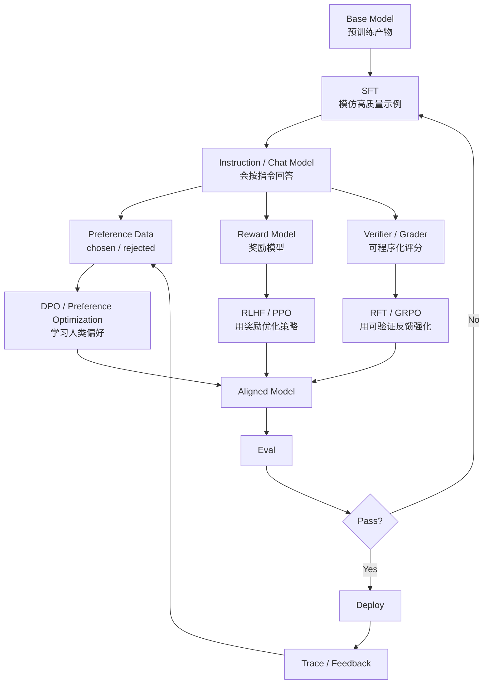

# 后训练与对齐入门：SFT、DPO、RLHF、RFT

预训练让模型“会续写文本”。

后训练让模型“更像一个可用助手”。

可以先这样理解：

```text
Pretraining：学语言、知识、代码和模式
Post-training：学怎么按人类期望做事
```

一个 base model 可能很强，但它不一定会：

- 听用户指令。
- 稳定对话。
- 输出 JSON。
- 调用工具。
- 拒绝危险请求。
- 少说废话。
- 在可验证任务上反复修正。

这些能力很多来自后训练。

## 总图



第一遍不用纠结算法细节。

先抓住四句话：

| 方法 | 一句话 |
| --- | --- |
| SFT | 给模型看“好问题 -> 好回答”，让它模仿 |
| DPO | 给模型看“同一问题下哪个回答更好”，让它偏好 |
| RLHF | 先训练奖励模型，再用强化学习让模型拿更高奖励 |
| RFT | 给模型可程序化评分器，让它在可验证任务上变强 |

## SFT：先学会按格式做事

SFT 是 Supervised Fine-Tuning，监督微调。

它的数据通常是：

```text
输入 -> 标准输出
```

聊天模型常见格式：

```json
{
  "messages": [
    {"role": "system", "content": "你是一个耐心的机器学习老师。"},
    {"role": "user", "content": "解释一下 KV Cache"},
    {"role": "assistant", "content": "KV Cache 是在推理生成时缓存历史 token 的 Key/Value..."}
  ]
}
```

SFT 主要教模型：

- 角色和语气。
- 指令跟随。
- 问答格式。
- 结构化输出。
- 工具调用样式。
- 业务流程。
- 安全拒答风格。

### SFT 学到的是什么

可以把 SFT 想成：

```text
看到这种用户输入时
更应该输出这种 assistant 回复
```

它本质上还是在训练“下一个 token 怎么预测”。

区别是数据更像真实用户任务，而不是普通网页续写。

### SFT 适合什么

| 场景 | 是否适合 SFT |
| --- | --- |
| 固定客服回复风格 | 适合 |
| 稳定 JSON 格式 | 适合 |
| 工具调用格式 | 适合 |
| 让模型知道最新政策 | 不一定，优先 RAG |
| 复杂数学推理能力 | 只靠 SFT 通常不够 |
| 主观偏好排序 | SFT 可以打底，但偏好优化更适合 |

## DPO：让模型偏好更好的回答

DPO 是 Direct Preference Optimization。

它的数据不是一个标准答案，而是一组偏好对：

```json
{
  "prompt": "解释什么是上下文工程",
  "chosen": "上下文工程是设计模型每轮应该看到什么信息...",
  "rejected": "上下文工程就是写提示词。"
}
```

模型学到的是：

```text
同一个 prompt 下
chosen 应该比 rejected 更可能出现
```

### DPO 和 SFT 的区别

| 问题 | SFT | DPO |
| --- | --- | --- |
| 数据形式 | 标准输出 | chosen / rejected |
| 主要目标 | 模仿好答案 | 偏好好答案 |
| 适合 | 格式、风格、流程 | 主观质量、帮助性、安全性 |
| 常见前置 | base model | 通常先有 SFT model 更稳 |

SFT 像是在说：

```text
请这样回答。
```

DPO 像是在说：

```text
这两个回答里，更喜欢这个。
```

### DPO 适合什么

- 回答更简洁。
- 更少幻觉。
- 更符合品牌语气。
- 更安全。
- 更愿意承认不确定。
- 更少过度解释。

例子：

```text
用户问：这个接口一定不会失败吗？

rejected：一定不会失败。
chosen：不能保证一定不会失败，需要看网络、鉴权、限流和服务状态。
```

DPO 可以让模型偏好更诚实、更稳的回答。

## RLHF：奖励模型 + 强化学习

RLHF 是 Reinforcement Learning from Human Feedback。

经典流程：

```text
SFT model
  ↓
收集多个回答的人类偏好
  ↓
训练 reward model
  ↓
用 PPO 等强化学习方法优化模型
```

Reward model 会给回答打分。

然后强化学习让模型更倾向于生成高分回答。

### 为什么 RLHF 难

RLHF 比 SFT 和 DPO 更复杂，因为它多了：

- reward model。
- policy optimization。
- KL 约束。
- 训练稳定性问题。
- reward hacking 风险。
- 更高实验成本。

reward hacking 可以理解成：

```text
模型学会讨好奖励函数
但不一定真的变好
```

例如奖励函数偏好长答案，模型可能开始无意义地变啰嗦。

## RFT：用可验证反馈训练推理

RFT 是 Reinforcement Fine-Tuning。

它适合有明确评分器的任务。

OpenAI 官方文档把 RFT 描述成：用用户定义的反馈信号或 grader 来给候选回答评分，然后训练模型提高高分输出的概率。

这和 SFT 的区别是：

```text
SFT：给模型固定正确答案，让模型模仿
RFT：给模型评分规则，让模型探索并强化高分行为
```

### RFT 适合什么

| 任务 | 为什么适合 |
| --- | --- |
| 数学 | 答案可检查 |
| 代码 | 测试可运行 |
| JSON / SQL | 语法可验证 |
| 工具调用 | 参数和结果可检查 |
| 检索问答 | 引用和答案可打分 |
| 分类任务 | 标签可比较 |

### RFT 数据长什么样

RFT 通常需要：

- 训练问题。
- 可运行的 grader。
- 验证集。
- 防过拟合评测。

例子：

```text
prompt：写一个函数判断回文字符串
model output：代码
grader：运行单元测试
score：0.0 - 1.0
```

如果测试全过，分数高。

如果语法错或边界错，分数低。

### RFT 和 Agent 的关系

Agent 里很多能力天然可验证：

- 工具参数是否合法。
- 测试是否通过。
- 是否引用了正确文档。
- 是否越权调用工具。
- 是否完成 checklist。

所以未来很多 Agent 能力提升，不只是写更长 prompt，而是：

```text
收集 trace
  ↓
定义可验证评分器
  ↓
训练或微调模型
  ↓
回到 eval
```

这和 [Agent 效果评测框架](agent-evaluation-framework.md) 是连着的。

## SFT、DPO、RLHF、RFT 怎么选

先看任务类型。

| 目标 | 优先方法 |
| --- | --- |
| 学输出格式 | SFT |
| 学业务话术 | SFT |
| 学工具调用样式 | SFT + eval |
| 偏好更诚实、更简洁 | DPO |
| 偏好更安全、更符合人类选择 | DPO / RLHF |
| 数学、代码、可验证推理 | RFT / GRPO |
| 最新知识问答 | RAG 优先，不一定微调 |
| 少量项目规则 | Context Engineering / Skills 优先 |

一个实用顺序：

```text
先试 Prompt / Context
  ↓
如果是知识问题，先试 RAG
  ↓
如果是格式和风格问题，试 SFT / LoRA
  ↓
如果是偏好问题，试 DPO
  ↓
如果是可验证推理问题，试 RFT
```

## 数据格式对比

### SFT 样本

```json
{
  "messages": [
    {"role": "user", "content": "把下面内容总结成三点：..."},
    {"role": "assistant", "content": "1. ...\n2. ...\n3. ..."}
  ]
}
```

### DPO 样本

```json
{
  "prompt": "用户问：如何处理接口超时？",
  "chosen": "先确认超时发生在哪一层：客户端、网关、服务端或下游依赖...",
  "rejected": "把超时时间调大就行。"
}
```

### RFT 样本 + grader

```json
{
  "input": "生成 SQL 查询：统计每个用户最近 7 天订单数",
  "reference": {
    "database_schema": "users(id), orders(user_id, created_at)"
  }
}
```

grader 可能做：

```text
SQL 是否能解析
是否只读
是否包含最近 7 天过滤
是否按用户聚合
是否在测试数据库上结果正确
```

## 和 LoRA / QLoRA 的关系

SFT、DPO、RFT 是训练目标或训练方法。

LoRA / QLoRA 是参数高效训练手段。

它们不是同一层概念。

```text
SFT + LoRA：用指令数据训练 adapter
DPO + LoRA：用偏好数据训练 adapter
RFT + LoRA：用评分反馈训练 adapter 或模型
```

所以不要问：

```text
我该用 SFT 还是 LoRA？
```

更准确的问题是：

```text
我要做 SFT、DPO 还是 RFT？
如果资源有限，要不要用 LoRA / QLoRA 来做？
```

## 和 RAG / 上下文工程的区别

很多问题不该先微调。

| 问题 | 优先方案 |
| --- | --- |
| 模型不知道公司最新政策 | RAG |
| 模型忘记项目规范 | Context Engineering / Skills |
| 模型输出格式不稳定 | SFT 或结构化输出 |
| 模型回答风格不符合品牌 | SFT / DPO |
| 模型工具参数经常错 | SFT + tool-call eval |
| 模型复杂推理不过关 | RFT / 更强模型 |

微调会改变模型行为。

RAG 和上下文工程更多是改变模型这一轮看到的信息。

## 评测先行

后训练前先准备 eval。

否则你不知道训练到底是变好还是变坏。

至少准备：

- 目标任务集。
- 边界样本。
- 反例样本。
- 格式检查。
- 安全检查。
- 成本和延迟记录。
- 人工抽查样本。

评测要覆盖：

| 能力 | 例子 |
| --- | --- |
| 格式 | JSON 是否合法 |
| 事实 | 是否忠于资料 |
| 推理 | 答案是否正确 |
| 安全 | 是否拒绝不该做的请求 |
| 工具 | 工具参数是否正确 |
| 泛化 | 没见过的问题是否还能处理 |
| 回归 | 原来会的能力有没有变差 |

## 常见误区

### 误区 1：后训练就是灌知识

不完全是。

后训练更适合教行为、格式、风格和偏好。

频繁变化的知识，通常优先 RAG。

### 误区 2：SFT 数据越多越好

低质量数据会教坏模型。

后训练数据要小心：

- 是否真实。
- 是否一致。
- 是否覆盖边界。
- 是否有错误答案。
- 是否泄露隐私。

### 误区 3：DPO 一定比 SFT 高级

不是。

DPO 解决偏好问题。

如果模型连基本格式都不会，先做 SFT 更稳。

### 误区 4：RFT 不需要人工设计

也不是。

RFT 的关键在 grader。

grader 写得差，模型会学会钻空子。

### 误区 5：训练好了就不用 prompt

训练和 prompt / context 是配合关系。

即使模型被后训练过，线上系统仍然需要：

- 正确 chat template。
- 工具 schema。
- 权限提示。
- RAG 证据。
- 上下文压缩。
- eval 和 trace。

## 下一步

继续读：

- [LLM 生命周期：从数据到线上模型](llm-lifecycle.md)
- [Reasoning Models 与 Test-Time Compute 入门](reasoning-models-test-time-compute.md)
- [LoRA 与 QLoRA 微调入门](lora-qlora-finetuning.md)
- [参数调优手册](parameter-tuning-handbook.md)
- [Agent 效果评测框架](agent-evaluation-framework.md)
- [上下文工程入门](context-engineering-beginner.md)

## 参考资料

- [OpenAI Model optimization](https://developers.openai.com/api/docs/guides/model-optimization)
- [OpenAI Supervised fine-tuning](https://developers.openai.com/api/docs/guides/supervised-fine-tuning)
- [OpenAI Direct Preference Optimization](https://developers.openai.com/api/docs/guides/direct-preference-optimization)
- [OpenAI Reinforcement fine-tuning](https://developers.openai.com/api/docs/guides/reinforcement-fine-tuning)
- [Hugging Face TRL DPO Trainer](https://huggingface.co/docs/trl/en/dpo_trainer)
- [Hugging Face TRL PPO Trainer](https://huggingface.co/docs/trl/en/ppo_trainer)
- [Hugging Face TRL GRPO Trainer](https://huggingface.co/docs/trl/en/grpo_trainer)
