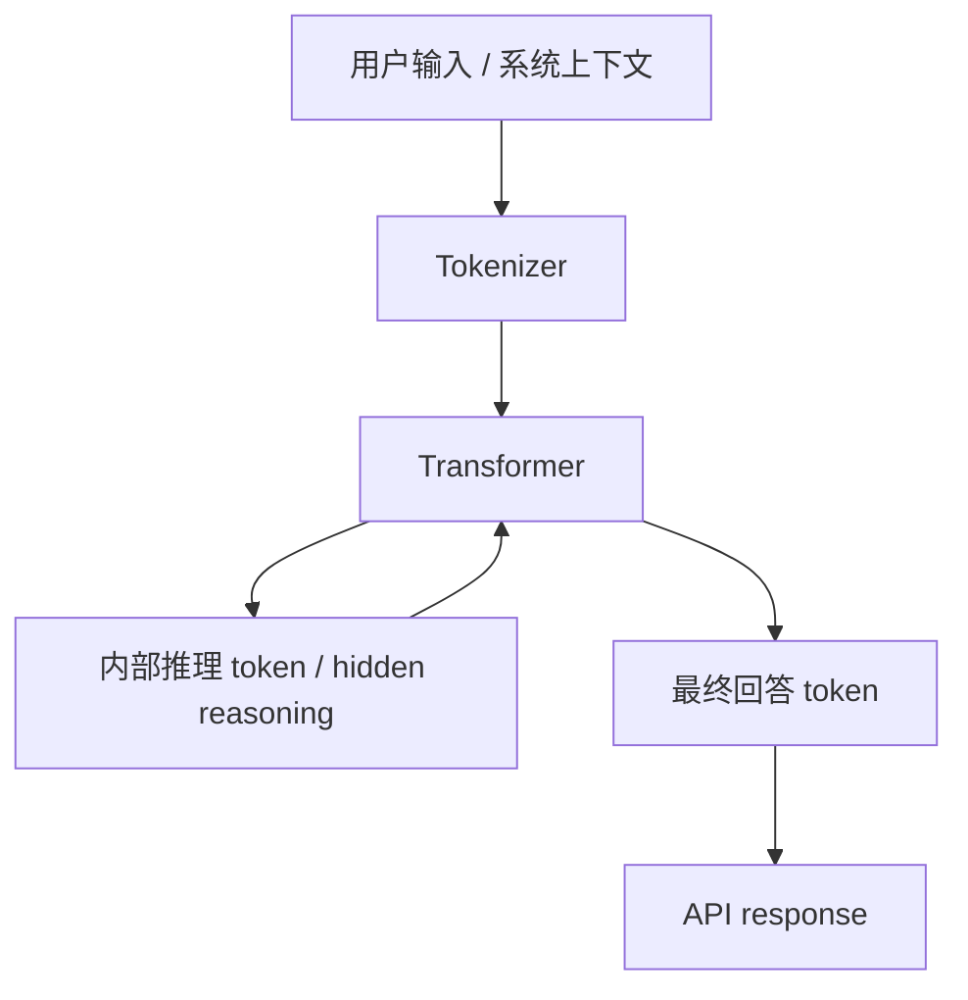
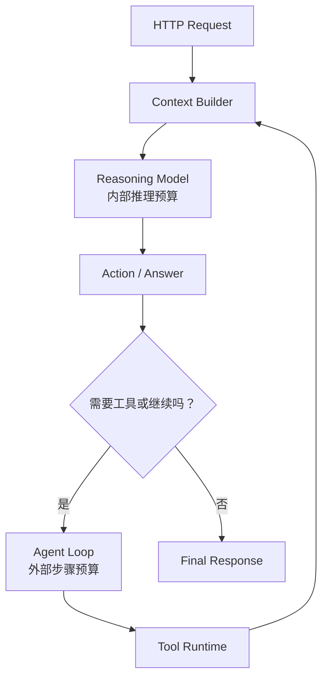
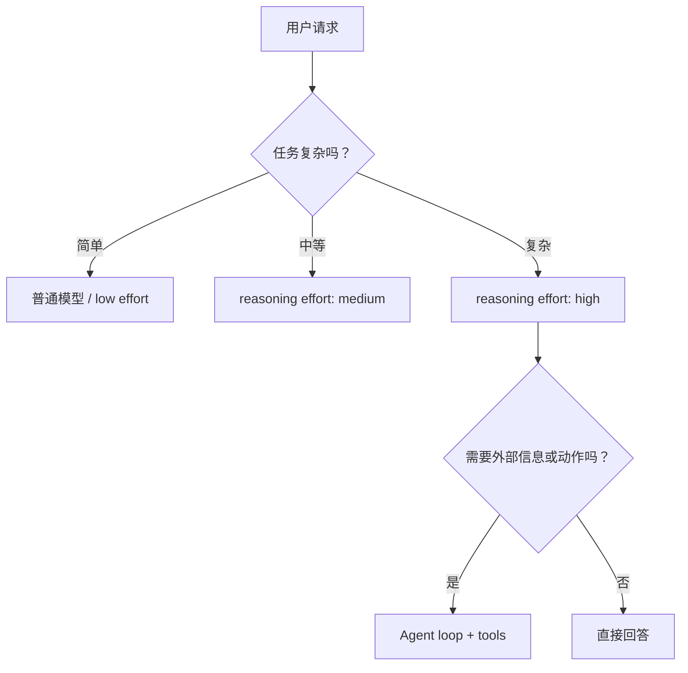

# Reasoning Models 与 Test-Time Compute 入门

很多新手会在 API 文档里看到这些词：

- reasoning model
- reasoning effort
- thinking budget
- reasoning tokens
- thought summary
- test-time compute

它们看起来像是模型突然多了一个“会思考的大脑”。

更工程化地看，其实是：

```text
模型在推理阶段多花一些计算和 token
  ↓
换取更强的规划、推理、验证和纠错能力
```

这叫 Test-Time Compute，也常被叫做 inference-time scaling。

## 先记住一句话

普通生成更像：

```text
看到 prompt
  ↓
直接生成答案
```

Reasoning 模型更像：

```text
看到 prompt
  ↓
先在内部做推理、拆解、验证或搜索
  ↓
再生成最终答案
```

对用户来说，它可能只是多了一个参数：

```json
{
  "reasoning": {
    "effort": "medium"
  }
}
```

但对系统来说，这个参数会影响：

- 输出质量。
- 首 token 延迟。
- 总生成时间。
- token 成本。
- 是否适合长任务。
- Agent loop 是否还需要额外反思。

## 它和 Transformer 是什么关系

Reasoning 模型通常仍然是 Transformer。

它不是在 Transformer 外面突然接了一个传统搜索引擎。

可以这样理解：



底层仍然是：

```text
token ids -> embedding -> attention -> logits -> sampling / decoding
```

不同点在于：

- 模型可能被训练成先做中间推理，再输出答案。
- API 可能把“推理预算”作为单独参数。
- 服务端可能会隐藏完整推理，只返回 summary。
- 计费和延迟可能把 reasoning tokens 算进去。

所以 Reasoning 不是脱离 Transformer 的魔法。

它更像是在推理阶段多走了一段“内部草稿和验证”的过程。

## Test-Time Compute 是什么

Test-Time Compute 指的是：

```text
模型参数不变
但在每次推理时投入更多计算
从而提升答案质量
```

它和训练阶段不同。

| 阶段 | 改变什么 | 例子 |
| --- | --- | --- |
| Pretraining | 改模型权重 | 学语言、知识、代码 |
| Post-training | 改模型行为 | 学指令、偏好、工具、安全 |
| Test-Time Compute | 改这一轮推理花多少计算 | reasoning effort、thinking budget、多候选验证 |

一个直觉例子：

```text
同一个人答题

10 秒钟直接回答
  vs
5 分钟打草稿、检查、再回答
```

人没有重新训练。

但多花时间后，复杂题可能答得更好。

Reasoning 模型就是把这件事产品化、参数化。

## 常见形式

Test-Time Compute 不只有一种形态。

| 形式 | 直觉 | 适合场景 |
| --- | --- | --- |
| Internal reasoning | 模型内部先推理再回答 | 数学、代码、复杂规划 |
| Reasoning effort | 用低、中、高等档位控制推理强度 | API 产品常见 |
| Thinking budget | 显式限制思考 token 数 | 想控制成本和延迟 |
| Self-check | 先生成答案，再检查是否矛盾 | 需要稳定性 |
| Best-of-N | 生成多个候选，选最好的 | 评测、代码、数学 |
| Tree search / graph search | 探索多条解题路径 | 难题、规划任务 |
| Tool-assisted reasoning | 推理中调用计算器、代码、搜索 | 事实和计算密集任务 |
| Agent loop | 多轮行动、观察、修正 | 软件工程、研究、办公自动化 |

这些形式的共同点是：

```text
不是只追求“一次生成完”
而是允许模型或系统多走几步
```

## API 里的 reasoning 参数

不同厂商叫法不完全一样。

### OpenAI Responses API

OpenAI 的 reasoning models 可以在 Responses API 中设置 reasoning effort。

HTTP 形态可以先这样理解：

```http
POST /v1/responses
Authorization: Bearer $OPENAI_API_KEY
Content-Type: application/json

{
  "model": "reasoning-model",
  "input": "证明为什么二分查找的时间复杂度是 O(log n)",
  "reasoning": {
    "effort": "medium",
    "summary": "auto"
  },
  "max_output_tokens": 800
}
```

这里几个点要分清：

| 字段 | 作用 |
| --- | --- |
| `reasoning.effort` | 控制模型花多少推理努力 |
| `reasoning.summary` | 请求返回推理摘要，不等于完整内部思考 |
| `max_output_tokens` | 控制最终输出上限，具体是否包含 reasoning tokens 要看接口和模型 |

为什么不建议把完整 chain-of-thought 暴露出来？

因为完整内部推理可能包含：

- 不稳定草稿。
- 被攻击内容影响的中间片段。
- 策略或安全相关细节。
- 不适合作为用户可见解释的内容。

工程上更常见的是返回：

```text
简短推理摘要 + 最终答案
```

而不是完整内部草稿。

### Anthropic extended thinking

Anthropic 的 Claude API 有 extended thinking / adaptive thinking。

请求形态大致是：

```json
{
  "model": "claude-model",
  "max_tokens": 1600,
  "thinking": {
    "type": "enabled",
    "budget_tokens": 4000
  },
  "messages": [
    {
      "role": "user",
      "content": "帮我分析这个系统设计方案的风险"
    }
  ]
}
```

新模型可能使用 adaptive thinking。

所以读文档时不要死记字段值，要抓住核心：

```text
它允许开发者给模型一个思考预算
```

### Gemini thinking budget

Gemini 文档里会看到 thinking budget / thinking level。

可以先这样理解：

```json
{
  "contents": [
    {
      "parts": [
        {
          "text": "解决这个数学题，并给出简洁解释"
        }
      ]
    }
  ],
  "generationConfig": {
    "thinkingConfig": {
      "thinkingBudget": 1024
    }
  }
}
```

有些新模型会从 `thinkingBudget` 过渡到 `thinkingLevel`。

这说明一个趋势：

```text
推理预算正在变成 API 层的重要参数
```

## reasoning effort、temperature、max tokens 的区别

这些参数很容易混。

| 参数 | 控制什么 | 更像在调 |
| --- | --- | --- |
| `reasoning_effort` / `thinking_budget` | 推理前或推理中的思考计算 | 解题时间 |
| `max_output_tokens` | 最终最多输出多少 token | 答案长度上限 |
| `temperature` | 从 logits 采样时有多随机 | 表达和选择的随机性 |
| `top_p` | 候选 token 集合有多大 | 采样范围 |
| `max_steps` | Agent 最多行动多少轮 | 外部循环预算 |
| `max_tool_calls` | 最多调用多少次工具 | 工具预算 |

例子：

```text
reasoning_effort 高
  -> 可能更认真推理，但更慢、更贵

temperature 高
  -> 输出更发散，但不代表更会推理

max_output_tokens 高
  -> 能输出更长，但不代表思考更深

max_steps 高
  -> Agent 能多轮行动，但也更容易失控
```

不要用提高 temperature 来弥补推理能力不足。

也不要无限提高 max tokens 来假装模型在思考。

## 它和 Agent Loop 的关系

Reasoning 模型和 Agent loop 都在“多花计算换质量”。

但位置不同：



可以这样分：

| 能力 | 发生在哪里 | 例子 |
| --- | --- | --- |
| Reasoning model | 单次模型调用内部 | 解题、写代码前分析 |
| Agent loop | 多次模型调用之间 | 搜索、读文件、运行测试、修改代码 |
| Harness | 管理上下文、工具、状态和权限 | Codex / Claude Code 这类产品 |
| Loop Engineering | 控制循环停止、重试、预算和恢复 | 防止一直行动 |

一个代码 Agent 可能同时使用两层预算：

```json
{
  "model_reasoning_effort": "medium",
  "agent_max_steps": 20,
  "max_tool_calls": 50,
  "timeout_seconds": 600
}
```

这意味着：

- 每次模型调用可以适度推理。
- 整个任务最多行动 20 步。
- 工具调用不能无限增长。
- runtime 会强制停止。

## 为什么 Reasoning 模型不总是更好

Reasoning 模型适合复杂任务，但不是所有请求都需要。

不适合的场景：

- 简单 FAQ。
- 短文本改写。
- 固定格式抽取。
- 低延迟客服首响。
- 大批量低价值分类。
- 已经有确定性工具能解决的问题。

原因很简单：

```text
思考需要成本
```

可能带来：

- 更高延迟。
- 更高 token 成本。
- 更低吞吐。
- 更难预测的输出时间。
- 对部署队列造成压力。

所以工程上常见做法是路由：



## 怎么判断该开多大 reasoning

可以先用这个经验表。

| 任务 | 建议 |
| --- | --- |
| 问候、摘要、改写 | 低 effort 或普通模型 |
| 简单问答、分类 | 低 effort |
| 代码解释、SQL 生成 | medium |
| 数学、算法、复杂代码修改 | medium 到 high |
| 多文件代码任务 | medium reasoning + Agent loop |
| 长规划、系统设计评审 | high 或更大 thinking budget |
| 有工具和真实副作用 | reasoning 不是重点，Guardrails 更重要 |

要注意：

```text
高 reasoning 不能替代资料、工具和权限
```

如果问题需要最新事实，应该检索。

如果问题需要计算，应该用代码或计算器。

如果问题涉及真实操作，应该走工具权限和审批。

## 一个服务端路由示例

假设你做的是 OpenAI-compatible 后端，可以把 reasoning 当成模型路由参数。

```java
record LlmRequest(
    String input,
    String taskType,
    Integer maxOutputTokens
) {}

record ReasoningPolicy(
    String model,
    String effort,
    int maxSteps
) {}

class ReasoningRouter {
    ReasoningPolicy route(LlmRequest request) {
        return switch (request.taskType()) {
            case "rewrite", "summary" ->
                new ReasoningPolicy("fast-chat-model", "low", 1);

            case "code_explain", "sql_generation" ->
                new ReasoningPolicy("reasoning-model", "medium", 3);

            case "multi_file_code_task", "architecture_review" ->
                new ReasoningPolicy("reasoning-model", "high", 20);

            default ->
                new ReasoningPolicy("general-chat-model", "low", 1);
        };
    }
}
```

这个例子里，路由器没有让所有任务都走最强 reasoning。

因为线上系统要同时考虑：

- 质量。
- 延迟。
- 成本。
- 并发。
- 是否需要工具。
- 是否需要审批。

## 和上下文工程的关系

Reasoning 模型更需要干净上下文。

因为它会“认真思考”你给它的内容。

如果上下文里混入噪声或 prompt injection，它也可能认真分析错误材料。

所以：

```text
reasoning effort 越高
越要重视上下文质量
```

典型做法：

- 把任务目标写清楚。
- 把外部内容标成不可信数据。
- 把工具结果结构化。
- 删除无关历史。
- 给模型明确的输出契约。
- 对长任务做阶段性总结。
- 用 evaluator 检查中间结果。

Reasoning 不是替代上下文工程。

它会放大上下文工程的好坏。

## 和后训练的关系

Reasoning 模型通常不是只靠 prompt 变出来的。

它往往和后训练有关：

- 用推理数据教模型分解问题。
- 用偏好数据教模型选择更可靠答案。
- 用可验证任务做强化训练。
- 用蒸馏把长推理压到更小模型里。
- 用工具使用数据教模型何时调用工具。

所以这条链路是：

```text
Pretraining 学基础能力
  ↓
Post-training 学指令、偏好、工具和推理行为
  ↓
Test-Time Compute 在推理时多花计算
  ↓
Agent loop 把模型接入外部世界
```

## 常见误区

### 误区 1：Reasoning 模型一定要展示完整思考过程

不一定。

很多 API 更推荐返回 summary，而不是完整内部思考。

完整内部草稿不是稳定产品接口。

### 误区 2：reasoning effort 越高越好

不是。

高 effort 适合复杂任务，但简单任务会浪费成本和延迟。

### 误区 3：Reasoning 能替代工具

不能。

模型可以推理，但不能凭空知道最新事实，也不应该凭空执行真实动作。

### 误区 4：Agent loop 越多越聪明

也不是。

没有 evaluator、停止条件和工具反馈，更多 loop 可能只是更多重复。

### 误区 5：长上下文 + 高 reasoning 就一定靠谱

不一定。

如果上下文质量差，模型会花更多力气在错误信息上。

## 学习检查清单

读完这篇，你应该能解释：

- Reasoning 模型仍然建立在 Transformer 和 token 生成上。
- Test-Time Compute 是推理时多花计算，不是重新训练模型。
- `reasoning_effort` / `thinking_budget` 和 `temperature` 不是一回事。
- 高 reasoning 会提升复杂任务表现，但增加延迟和成本。
- Agent loop 是外部多步行动，reasoning 是单次调用内部推理。
- Reasoning 模型更依赖干净上下文、工具边界和 eval。

## 下一步

继续读：

- [Transformer 入门](transformer-beginner.md)
- [LLM 推理与架构优化入门](llm-inference-architecture.md)
- [LLM API：从 HTTP 到 Transformer](openai-api-beginner.md)
- [参数调优手册](parameter-tuning-handbook.md)
- [Loop Engineering：Agent 循环、停止条件与恢复](loop-engineering.md)
- [上下文工程入门](context-engineering-beginner.md)

## 参考资料

- [OpenAI Reasoning models](https://developers.openai.com/api/docs/guides/reasoning)
- [OpenAI Responses API reference](https://developers.openai.com/api/reference/resources/responses/methods/create/)
- [Anthropic: Building with extended thinking](https://platform.claude.com/docs/en/build-with-claude/extended-thinking)
- [Google Gemini thinking](https://ai.google.dev/gemini-api/docs/thinking)
- [A Survey on Test-Time Scaling in Large Language Models](https://arxiv.org/abs/2503.24235)
